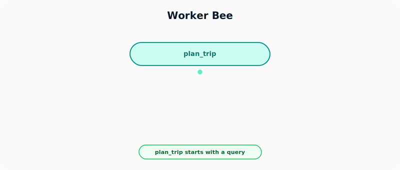
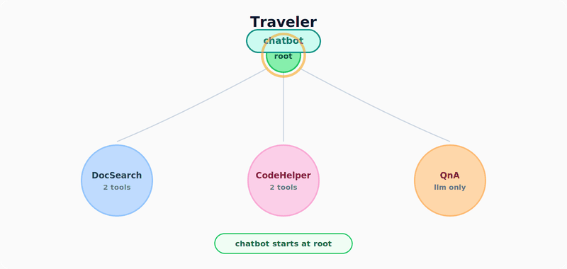
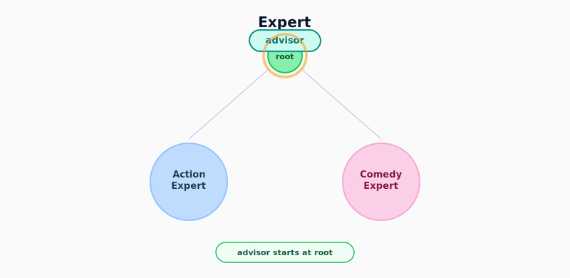
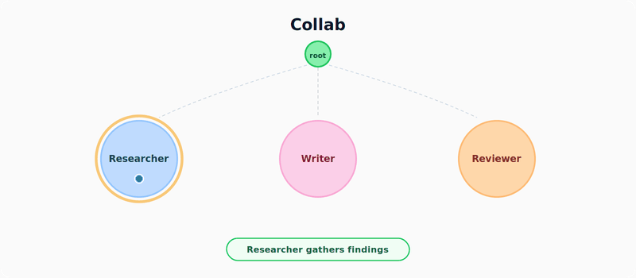

# Your AI Agent Needs a Graph, Not a Chain

*Four architecture patterns for AI agents that build context over time*

What makes an agent different from a chatbot? Not the model. Not the tools. **The context.**

<!-- more -->

A chatbot responds to what you just said, while an agent builds on everything it has ever seen. This context includes every query, every tool result, and every failure, allowing its understanding to *grow*. Over time, that accumulated context is what makes it intelligent.

But this context has to live somewhere. And where it lives changes everything: how the agent reasons, how it scales, how it recovers from failure.

We started with a single question:

!!! quote ""

    If an agent is a context that builds over time, **what shape does that context take?**

That question led us to **Object-Spatial Programming** and four architecture patterns that answer it in very different ways.

---

Before diving into these patterns, let's cover the building blocks they all share.

## Object-Spatial Programming

Object-Spatial Programming (OSP) gives context a shape. Instead of flat prompt strings, you get a graph. Instead of function chains, you get spatial relationships. Code and data live *where they belong* in the graph.

Three primitives:

| Primitive | Role | Think of it as... |
|---|---|---|
| **Walkers** | Move through the graph, carry context, trigger actions at every node | Agents with legs - they *travel* |
| **Nodes** | Locations in the graph that hold state and host abilities | Places where work happens |
| **Edges** | Connect nodes, define who can reach whom | The topology of your agent system |

Jac is the language built for OSP. With Jac, this is all it takes:

```jac
node TaskNode { 
    has memory: list[str] = [];
}
walker agent { 
    has query: str;
}

root ++> TaskNode();  # connect a node to the graph
agent(query="plan my trip") spawn root;  # launch a walker
```

That's it. A node with state, a walker that traverses to it, and an edge connecting them. You don't need a framework or routing middleware; the code structure directly describes the agent architecture.

---

## `by llm()` - When Functions Think

Any function in Jac can delegate its implementation to an LLM. You write the signature - the LLM fills in the logic:

```jac
def recommend(query: str, preferences: list[str]) -> str by llm();
```

The function name, parameter names, and types *are* the prompt. No templates. No string manipulation. You describe what you want through code, and the LLM delivers.

When you add tools to the function, it becomes a ReAct agent that can reason, call tools, and observe results - all in a single line:

```jac
def research(topic: str) -> str by llm(
    tools=[search_web, fetch_docs]
);
```

This is what we call **Meaning-Typed Programming**. The semantics of your code *are* the instructions to the LLM.

---

## `visit by llm()` - When Navigation Thinks

This is where OSP becomes truly agentic. Instead of writing routing logic with switch statements, enum-based dispatchers, or chain configurations, the walker asks the LLM to choose where to go:

```jac
visit [-->] by llm(
    incl_info={"User query": self.query}
);
```

One line. The LLM reads every connected node, understands what each one does, and chooses the right destination. Add a new capability tomorrow? Just connect a new node to the graph. The LLM discovers it automatically.

You don't write routing tables or orchestration code - the graph topology handles that for you.

!!! info "Independent of the patterns below"

    `visit by llm()` is syntax sugar that provides agentic decision-making for traversal. It can be combined with **any** of the four architecture patterns.

---

## Four Patterns, One Question

With walkers, nodes, edges, `by llm()`, and `visit by llm()`, four architecture patterns emerge. Each answers the same question differently:

!!! quote ""

    **Where does the agent's context live, and how does it grow?**

!!! note "Reading the diagrams"

    **Rounded rectangles** are agents that move. **Circles** are locations where work happens. **Arrows** show the flow. The **amber highlight** marks whichever element is currently active.

---

### 1. Worker Bee { #worker-bee }

!!! abstract ""

    *Walkers spawn walkers. No custom nodes. Results bubble up.*

To demonstrate this, we built a **trip planner**. Give it a city and it spawns separate walkers to research food, sights, and transit, then combines everything into a complete itinerary. The entire pattern lives in walker-space - no graph edges, only spawn relationships.

<figure markdown="span">
  { loading=lazy }
  <figcaption>A parent walker spawns child walkers, each carrying its own tools</figcaption>
</figure>

Children work independently, report back, and the parent synthesizes everything into a final result.

??? example "Worker Bee - Code Sketch"

    ```jac
    # Each child walker - does one job, carries its own tools
    walker research_food {
        has city: str, result: str = "";

        def find(city: str) -> str by llm(
            tools=[search_restaurants]
        );
        can start with Root entry {
            self.result = self.find(self.city);
        }
    }

    # same as research_food walker
    walker research_sights { ... }
    walker research_transit { ... }

    # The parent walker - spawns children, merges results
    walker plan_trip {
        has city: str = "Tokyo",
            result: str = "";

        def build_itinerary(food: str, sights: str, transit: str) -> str by llm();

        can start with Root entry {
            # Spawn three child walkers
            food    = research_food(city=self.city) spawn root;
            sights  = research_sights(city=self.city) spawn root;
            transit = research_transit(city=self.city) spawn root;

            # Merge results into a final itinerary
            self.result = self.build_itinerary(food.result, sights.result, transit.result);
        }
    }
    ```

`plan_trip` is a walker. `research_food` is a walker. The whole hierarchy is just walkers spawning walkers - no graph edges needed. If your task can be split into independent subtasks that get merged at the end - research pipelines, multi-source analysis, multi-part generation - this is the pattern.

!!! success "Where context lives"

    **Context builds in walkers**, split and merged across layers. Each child adds its own specialized research. The parent's final context is richer than any individual child's because it synthesizes across all branches.

---

### 2. Traveler { #traveler }

!!! abstract ""

    *One walker carries all context through stateless toolbox nodes.*

Picture a **developer assistant chatbot**. You ask it a Python question and it routes to the right toolbox - DocSearch for concepts, CodeHelper for running and linting code, or QnA for general conversation. The `chatbot` walker starts at root and the LLM picks which toolbox node to visit next. The walker's context grows at every stop.

<figure markdown="span">
  { loading=lazy }
  <figcaption>The walker moves through tool-nodes, building context at every stop</figcaption>
</figure>

Each node is a *toolbox* with a focused set of 2–3 related tools. The node does the work when the walker visits, but doesn't store any state between visits. The walker is the agent that remembers everything.

??? example "Traveler - Code Sketch"

    ```jac
    # The walker - carries all context, LLM picks where to go
    walker chatbot {
        has query: str, context: list[str] = [], response: str = "";

        can route with Root entry {
            visit [-->] by llm(incl_info={
                "User query": self.query,
                "Context so far": str(self.context)
            });
        }
    }

    # A toolbox node - stateless, does work when visited
    node DocSearch {
        def respond(query: str, context: list) -> str by llm(
            tools=[search_docs, fetch_example]
        );
        can process with chatbot entry {
            visitor.response = self.respond(visitor.query, visitor.context);
            visitor.context.append(f"[Docs] {visitor.response}");
        }
    }

    node CodeHelper { ... }  # same shape, different tools
    node QnA { ... }

    with entry {
        # Wire up the graph - each node becomes a reachable toolbox
        root ++> DocSearch();
        root ++> CodeHelper();
        root ++> QnA();

        # Launch
        chatbot(query="How do I parse JSON in Python?") spawn root;
    }
    ```

The walker's journey through the graph *is* the chain-of-thought. The path taken is the reasoning trace.

Why not give one agent all tools in a flat list? Because the graph acts as **guardrails**. Tools are spatially separated into focused toolboxes, so the LLM first picks the right toolbox, then works with just 2–3 tools instead of everything at once. In practice, this means fewer wrong tool calls.

!!! success "Where context lives"

    **Context builds in the walker** as it travels. Nodes are stateless - they process what the walker brings and forget. The walker is the memory.

!!! tip "When to use"

    Tool-heavy agents, chatbots with diverse capabilities, any system where spatially organizing tools improves reliability.

> **Full implementation:** [jac-gpt-fullstack](https://github.com/jaseci-labs/Agentic-AI/tree/main/jac-gpt-fullstack) — a multi-mode Jac chatbot with RAG, Q&A, coding, and debugging toolbox nodes, routed via `visit [-->] by llm()`.

---

### 3. Expert { #expert }

!!! abstract ""

    *Domain nodes get smarter with every visit. The walker is just a courier.*

We tried this with a **personal movie advisor**. Ask it for film recommendations and it routes to genre-specific experts: an ActionExpert for thrillers and martial arts, a ComedyExpert for rom-coms and satire. Each expert remembers every past recommendation *and* user feedback, so its suggestions genuinely adapt over time.

<figure markdown="span">
  { loading=lazy }
  <figcaption>Expert nodes remember every interaction and deepen their knowledge</figcaption>
</figure>

Unlike Traveler where nodes forget, Expert nodes *remember*. Every visit enriches them. The walker brings a query and can also carry a rating of a previous suggestion. This means the node reasons using accumulated knowledge that includes real user preferences, not just logged history.

??? example "Expert - Code Sketch"

    ```jac
    # Courier walker - carries query in, response out, optionally a rating
    walker advisor {
        has query: str = "", rating: str = "", response: str = "";

        can route with Root entry {
            visit [-->] by llm(incl_info={"User query": self.query});
        }
    }

    # Expert node - remembers recommendations AND user feedback
    node ActionExpert {
        has knowledge: list[str] = [];

        def recommend(query: str, preferences: list[str]) -> str by llm();

        can advise with advisor entry {
            if visitor.rating {
                self.knowledge.append(f"Feedback: {visitor.rating}");
            }
            response = self.recommend(visitor.query, self.knowledge);
            self.knowledge.append(f"Q: {visitor.query} | Rec: {response}");
            visitor.response = response;
        }
    }

    node ComedyExpert { ... }  # same shape, different domain

    with entry {
        # Wire up the graph - each expert is reachable from root
        root ++> ActionExpert();
        root ++> ComedyExpert();

        # Launch
        advisor(query="Recommend something like John Wick") spawn root;
    }
    ```

Here's the difference that makes. Visit 1, the node knows nothing:

> **Q:** "Recommend something like John Wick"
> **A:** "Try *The Raid* - intense martial arts action."

Visit 10, after several ratings and queries:

> **Q:** "Something for tonight?"
> **A:** "Based on your preference for choreography over gore, try *Ip Man* - clean martial arts with a strong storyline. You rated similar films highly."

The node *is* the expert. Not the walker. Not the model. Use this for recommendation systems, personalized assistants, or any domain-specific advisor that should get sharper the more it's used.

!!! success "Where context lives"

    **Context builds in the nodes.** A node visited fifty times is far more capable than one visited once. The walker is a courier that triggers and feeds the nodes.

---

### 4. Collab { #collab }

!!! abstract ""

    *Peer nodes own their own logic. The graph edges define the workflow. Feedback loops let the system self-correct.*

Here's what this looks like as a **blog post creator**. Drop a topic and the Researcher gathers information, the Writer drafts a post, and the Reviewer evaluates quality. If the draft isn't good enough, the Reviewer sends feedback back to the Writer for revision - the Reviewer→Writer edge in the graph creates a feedback loop that allows iterative refinement. There is no central orchestrator managing this flow; each peer's ability contains its own routing logic.

<figure markdown="span">
  { loading=lazy }
  <figcaption>Peer nodes connected in a pipeline with a feedback loop - each peer owns its routing logic</figcaption>
</figure>

The graph edges define who talks to whom: Researcher→Writer→Reviewer, with Reviewer looping back to Writer when revisions are needed. Each peer owns its own logic - what to do with incoming work and where to send it next. This is different from frameworks like CrewAI or LangGraph where routing is defined in a central orchestrator separate from the agents.

??? example "Collab - Code Sketch"

    ```jac
    # Structured review decision - the type system enforces the choice
    enum Decision { APPROVED, NEEDS_REVISION }
    obj ReviewResult { has decision: Decision, feedback: str = ""; }

    # Message walker - traverses between peers
    walker message { has content: str = "", sender: str = ""; }

    # Researcher - researches, then sends walker to Writer
    node Researcher {
        def research(topic: str) -> str by llm();

        can handle with message entry {
            visitor.content = self.research(visitor.content);
            visitor.sender = "Researcher";
            visit [-->](?:Writer);
        }
    }

    # Writer - writes/revises, tracks revision history
    node Writer {
        has draft: str = "", revision_history: list[str] = [];
        def write(research: str) -> str by llm();
        def revise(draft: str, feedback: str, revision_history: list[str]) -> str by llm();

        can handle with message entry {
            if visitor.sender == "Researcher" {
                self.draft = self.write(visitor.content);
            } elif visitor.sender == "Reviewer" {
                self.draft = self.revise(self.draft, visitor.content, self.revision_history);
                self.revision_history.append(visitor.content);
            }
            visitor.content = self.draft;
            visitor.sender = "Writer";
            visit [-->](?:Reviewer);
        }
    }

    # Reviewer - structured decision, remembers past feedback
    node Reviewer {
        has review_count: int = 0, past_feedback: list[str] = [];
        def review(draft: str, past_feedback: list[str]) -> ReviewResult by llm();

        can handle with message entry {
            self.review_count += 1;
            result = self.review(visitor.content, self.past_feedback);
            self.past_feedback.append(result.feedback);

            if result.decision == Decision.APPROVED or self.review_count >= 3 {
                print(f"=== Final Blog Post ===\n{visitor.content}");
            } else {
                visitor.content = result.feedback;
                visitor.sender = "Reviewer";
                visit [-->](?:Writer);
            }
        }
    }

    with entry {
        # Wire up the pipeline - edges define who talks to whom
        researcher = Researcher();
        writer = Writer();
        reviewer = Reviewer();

        root ++> researcher;
        researcher ++> writer;
        writer ++> reviewer;
        reviewer ++> writer;  # the feedback loop

        # Launch
        message(content="Write about AI agents") spawn root;
    }
    ```

Three things to notice. First, each peer's routing logic lives inside its own ability - `visit [-->](?:Writer)` and `visit [-->](?:Reviewer)` are written in the nodes themselves, not in a separate orchestrator. Adding a new role (say, an Editor between Writer and Reviewer) means adding a node, connecting edges, and writing its ability. Second, the Reviewer's `review` function returns a `ReviewResult` with an explicit `Decision` enum, not free text - the type system enforces the choice. Third, every peer builds its own context: the Writer accumulates `revision_history`, the Reviewer accumulates `past_feedback`. The system's knowledge is distributed, not centralized.

!!! success "Where context lives"

    **Context builds distributed across all peers.** No single node has the full picture. Together, they do.

!!! tip "When to use"

    Multi-step workflows where different roles need to pass work to each other - content pipelines, code review systems, or any process where iterative feedback improves the output.

---

## Where Does Context Live?

Four patterns. One question. Four answers.

| Pattern | Context lives in | How it grows | Shape | Jac feature |
|---|---|---|---|---|
| **Worker Bee** | Multiple walkers | Split and merge across layers | Tree | `spawn` |
| **Traveler** | The walker | Accumulates at each stop | Path | `visit by llm()` |
| **Expert** | The nodes | Deepens with every visit | Depth | node state |
| **Collab** | All peers | Lateral sharing between equals | Pipeline + loop | peer-to-peer `visit` |

Each pattern captures a fundamentally different shape of context. Worker Bee builds a tree. Traveler builds a path. Expert builds depth. Collab builds a pipeline with feedback loops.

These patterns also compose well together. You could build a Collab network where each peer is an Expert that remembers, or a Worker Bee whose children are Travelers navigating tool graphs. Most real systems will start with one pattern and mix in others as they grow.

The real design decision isn't which model to use or which framework to pick. It's what shape your agent's context should take. Object-Spatial Programming gives you the primitives to make that decision explicit and composable, and each pattern above fits in fewer lines of code than most config files - the code reads like a direct description of the architecture.
