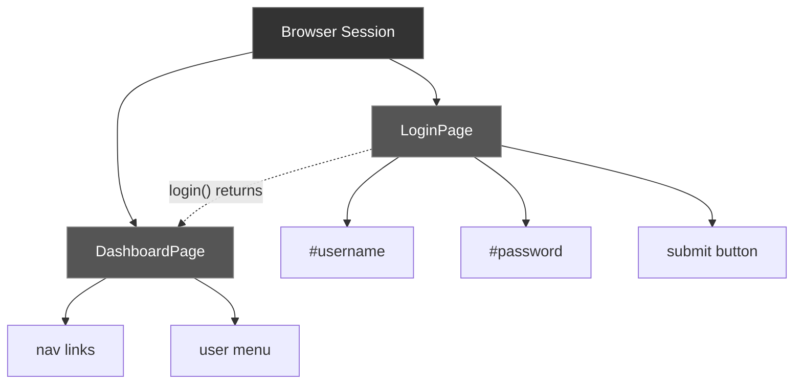
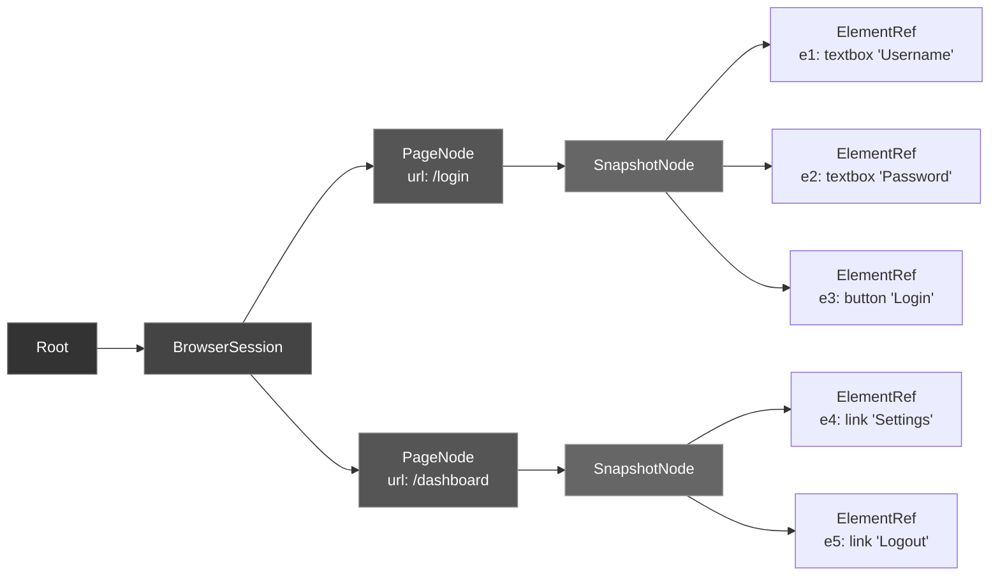
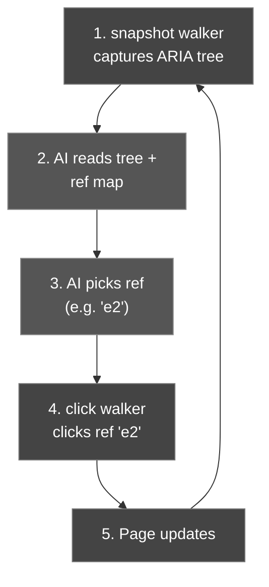
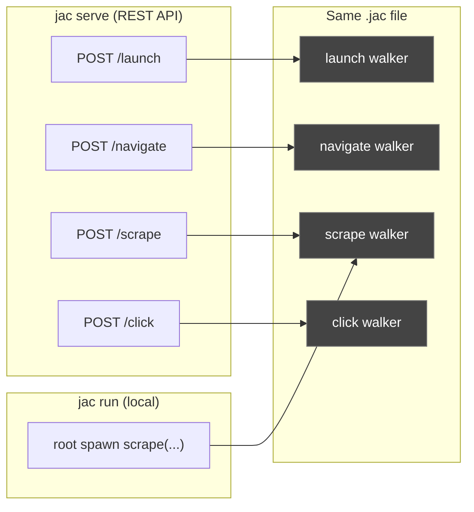
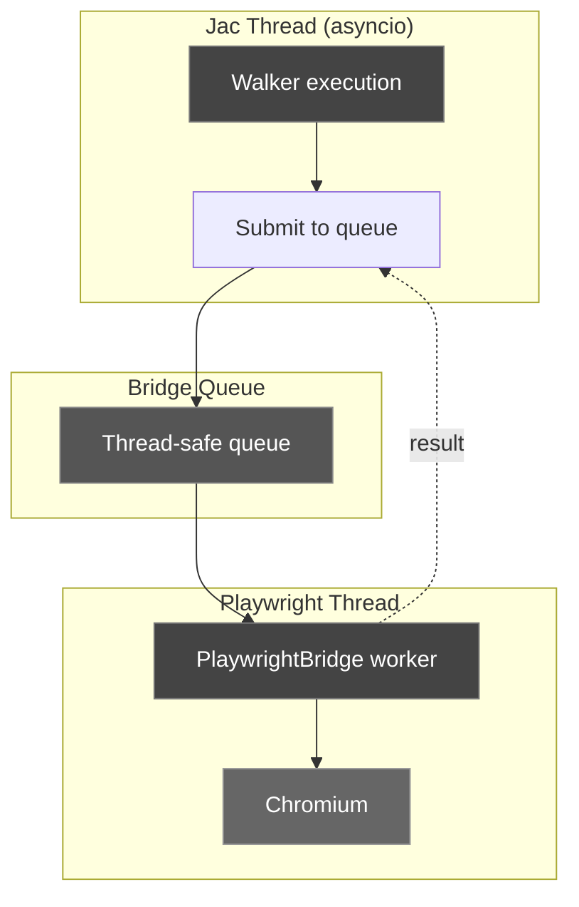

# Browser Automation Has a Data Model Problem. Walkers Fix It.

Every browser automation script you've written has the same hidden bug: it doesn't know what it's doing. It knows the steps. It doesn't know the structure.

You write `page.goto()`, then `page.fill()`, then `page.click()`. Each call succeeds or fails on its own. The script has no idea that it just navigated to a login page, that the text field it filled was a username input, or that the button it clicked submits a form. It's running commands against a stateless API. The moment the page structure changes, a new modal shows up, an element gets renamed, there's an extra redirect, the script breaks. Not because you got the logic wrong. There just wasn't any logic. Just steps.

This is where browser automation sits in 2026. Playwright, Selenium, Browser-use, Stagehand, they all give you good primitives. None of them give you a model for what a browser session actually *is*. State lives in local variables. Context evaporates between function calls. The relationship between a session, its pages, and their elements exists only in your head.

I built [jac-browser](https://github.com/jaseci-labs/jac-agentbrowser) to try to fix this. It's a browser automation library written entirely in Jac, 153 walkers that wrap Playwright. But the wrapper isn't really the point. The point is that browser sessions are graphs, and Jac gives you graphs as a first-class language construct. The result is a library where the data model *is* the automation framework.

<!-- more -->

---

## Four tools, one problem

Let's be fair to the existing tools. They're good at what they do.

**Playwright** is fast, reliable, and has the best auto-wait system out there. **Selenium** has ecosystem reach that nothing else touches, every language, every CI system, every tutorial. **Browser-use** and **Stagehand** are doing interesting work: they let LLMs drive browsers using vision models and natural language, which opens up automation to people who can't write selectors.

But they all make the same architectural assumption: the browser is a stateless function call target. You call methods on page objects. The page objects are opaque handles. There's no structured representation of what's on the page, how pages relate to each other, or what happened three steps ago.

This is the root of the fragility that makes browser automation painful at scale.

| Feature | Playwright | Selenium | Browser-use | Stagehand | jac-browser |
|---------|-----------|----------|-------------|-----------|-------------|
| Actions | ~50 methods | ~40 methods | LLM-driven | LLM-driven | 153 walkers |
| Data model | None (handles) | None (handles) | None | None | Session graph |
| AI agent support | Manual | Manual | Vision model | Vision model | ARIA snapshot-ref |
| Multi-step patterns | DIY | DIY | Prompt-based | Prompt-based | 8 composite walkers |
| Cost per action | Free | Free | LLM API call | LLM API call | Free |
| REST API mode | No | Selenium Grid | No | No | `jac serve` (zero code changes) |

The "Data model" row is the one worth paying attention to. Everything else follows from it.

---

## You built a graph and called it a class

If you've done serious browser automation, you've probably used the Page Object Model. Standard pattern: create a class for each page, store element locators as properties, expose actions as methods.

```python
class LoginPage:
    def __init__(self, page):
        self.page = page
        self.username = page.locator("#username")
        self.password = page.locator("#password")
        self.submit = page.locator("button[type='submit']")

    def login(self, user, pwd):
        self.username.fill(user)
        self.password.fill(pwd)
        self.submit.click()
        return DashboardPage(self.page)

class DashboardPage:
    def __init__(self, page):
        self.page = page
        self.nav_links = page.locator("nav a")
        self.user_menu = page.locator("#user-menu")
```

Look at what this code actually models. `LoginPage` holds references to elements. It returns a `DashboardPage`, a navigation relationship. `DashboardPage` holds its own elements. The `page` handle threads through everything, representing a session.

This is a graph. Sessions contain pages. Pages contain elements. Pages connect to other pages through navigation. You modeled a graph and encoded it in class hierarchies because your language didn't give you a better option.



The Page Object Model is basically an ad-hoc, poorly-modeled graph. Every PageObject class is a node. Every element locator is a child node. Every method that returns another PageObject is an edge. The "pattern" is just OOP compensating for the lack of spatial data structures.

What if you just made the graph explicit?

---

## Sessions contain pages. Pages contain elements. That's a graph.

Jac is a programming language built around the idea that some problems are naturally graph-shaped, and your language should make graphs as easy to work with as lists or dictionaries. Nodes and edges are first-class types. Walkers, mobile units of computation, traverse the graph, executing logic at each node they visit.

If you haven't seen Jac before, here's the short version: instead of calling methods on objects (OOP), you send walkers to visit nodes arranged in a graph (Object-Spatial Programming). The walker carries the logic. The nodes carry the data. The graph defines the structure.

Browser automation maps onto this pretty naturally.

<div class="code-block">

```jac
node BrowserSession {
    has id: str = "",
        headless: bool = True,
        is_launched: bool = False,
        created_at: str = "",
        url: str = "";
}

node PageNode {
    has page_id: str = "",
        url: str = "",
        title: str = "",
        is_active: bool = True;
}

node SnapshotNode {
    has tree: str = "",
        ref_map: dict = {},
        taken_at: str = "",
        origin_url: str = "";
}

node ElementRef {
    has ref_id: str = "",
        role: str = "",
        name: str = "",
        selector: str = "",
        nth: int = -1;
}
```

</div>

Four node types. That's the entire data model. A `BrowserSession` connects to `PageNode`s. Each `PageNode` connects to `SnapshotNode`s (accessibility tree captures). Each `SnapshotNode` connects to `ElementRef`s (individual interactive elements).



This isn't a visualization. This is the actual runtime data structure. When you run `root spawn navigate(url="/dashboard")`, a walker traverses from Root to the BrowserSession, finds the active PageNode, and performs the navigation. The graph persists between walker invocations. State doesn't live in variables, it lives in the graph.

---

## `root spawn navigate(url='...')`

Every browser action in jac-browser is a walker. Here's `launch`, the one that starts a browser session:

<div class="code-block">

```jac
walker launch {
    has headless: bool = True;

    can start with Root entry {
        bridge = PlaywrightBridge();
        try {
            bridge.launch(headless=self.headless);
            session = get_or_create_session(here);
            session.is_launched = True;
            session.headless = self.headless;

            pw_page = bridge.new_page();
            page_node = PageNode();
            session ++> page_node;
            store_page_object(page_node, pw_page);

            report {
                "success": True,
                "session_id": session.id,
                "page_id": page_node.page_id
            };
        } except Exception as e {
            report {"success": False, "error": str(e)};
        }
        disengage;
    }
}
```

</div>

The walker enters at `Root`, creates a `BrowserSession` node (or finds an existing one), launches the browser through the Playwright bridge, creates a `PageNode`, and connects it to the session with `session ++> page_node`, Jac's edge-creation operator. The `report` statement returns data to the caller. `disengage` stops traversal.

Every subsequent walker, `navigate`, `click`, `fill`, `snapshot`, follows the same shape: enter at Root, traverse to the active page, do the thing, update the graph. State accumulates as you work.

Now compare a scraping task. In Playwright Python:

```python
from playwright.sync_api import sync_playwright

with sync_playwright() as p:
    browser = p.chromium.launch(headless=True)
    page = browser.new_page()
    page.goto("https://quotes.toscrape.com")
    page.wait_for_load_state("load")

    quotes = page.evaluate("""
        Array.from(document.querySelectorAll('.quote')).map(q => ({
            text: q.querySelector('.text').innerText,
            author: q.querySelector('.author').innerText
        }))
    """)

    for q in quotes:
        print(f"{q['author']}: {q['text'][:50]}...")

    browser.close()
```

In jac-browser:

<div class="code-block">

```jac
import from jac_browser.composites {scrape};

with entry {
    js = "Array.from(document.querySelectorAll('.quote')).map(q => ({text: q.querySelector('.text').innerText, author: q.querySelector('.author').innerText}))";
    w = root spawn scrape(
        url="https://quotes.toscrape.com",
        extract_script=js
    );
    for q in w.reports[0]["data"] {
        print(q["author"] + ": " + q["text"][:50] + "...");
    }
}
```

</div>

The Playwright version is 15 lines. The jac-browser version is 10. But the line count difference isn't the interesting part. The jac-browser version created a session graph behind the scenes. The session, the page node, the URL, the title are all persisted in the graph. If you spawn another walker after `scrape`, it picks up exactly where this one left off. In Playwright, you'd need to pass the `page` handle around yourself.

---

## Your AI agent shouldn't parse HTML

This is where jac-browser starts to look really different from everything else. AI agents that browse the web have a basic problem: how does the model "see" the page?

**Option 1: Raw HTML.** Send the full DOM to the LLM. This works, but HTML is verbose. A typical page is 50-200KB of markup. That's thousands of tokens of context, most of it irrelevant styling, scripts, and layout wrappers. Expensive and slow.

**Option 2: Vision models.** Take a screenshot, send it to a multimodal model. Browser-use and Stagehand use this approach. It's more intuitive since the model sees what a human sees. But it costs $0.01-0.03 per screenshot for vision model inference, and the model still needs a way to *act* on what it sees. "Click the Login button" requires mapping visual coordinates back to DOM elements. Fragile.

**Option 3: ARIA accessibility tree with stable refs.** This is what jac-browser does.

The ARIA accessibility tree is the browser's own structured representation of page content. It's what screen readers use. It contains the semantic roles (button, textbox, link, heading), names, and states of every interactive element, without any HTML noise. A page that's 100KB of HTML might be 2KB of ARIA tree.

jac-browser's `snapshot` walker captures this tree and assigns stable reference IDs to each interactive element:

```
[e1] heading "Quotes to Scrape"
[e2] link "Login"
[e3] link "Goodreads"
[e4] link "Albert Einstein" (author)
[e5] link "Tag: inspirational"
...
```

The ref IDs (`e1`, `e2`, etc.) map directly to Playwright locators internally. An AI agent can read this snapshot, decide "I want to click the Login link," and issue `root spawn click(selector="e2")`. No CSS selectors. No XPath. No coordinate mapping. The ref ID is the interface.



Here's the full agent loop pattern:

<div class="code-block">

```jac
import from jac_browser.walkers {
    launch, navigate, close_browser,
    snapshot, click, fill
};

with entry {
    root spawn launch(headless=True);
    root spawn navigate(url="https://quotes.toscrape.com/");

    # Step 1: See the page
    w = root spawn snapshot();
    snap = w.reports[0];
    ref_map = snap["refs"];

    # Step 2: Find the target (AI reasoning goes here)
    target_ref = "";
    for ref_id in ref_map {
        el = ref_map[ref_id];
        if el["role"] == "link" and "Login" in str(el["name"]) {
            target_ref = str(ref_id);
        }
    }

    # Step 3: Act on the ref
    if target_ref {
        root spawn click(selector=target_ref);
    }

    # Step 4: Re-snapshot to see the result
    w = root spawn snapshot();
    snap2 = w.reports[0];
    ref_map2 = snap2["refs"];

    # Step 5: Find and fill form fields by ref
    for ref_id in ref_map2 {
        el = ref_map2[ref_id];
        if el["role"] == "textbox" {
            if "username" in str(el["name"]).lower() {
                root spawn fill(selector=str(ref_id), value="testuser");
            }
            if "password" in str(el["name"]).lower() {
                root spawn fill(selector=str(ref_id), value="testpass");
            }
        }
    }

    root spawn close_browser();
}
```

</div>

The snapshot is free, it's a local Playwright call, not an LLM inference. The ref map is structured data, not raw HTML. The entire cycle (snapshot, reason, act, re-snapshot) costs zero API calls for the browser interaction part. Compare that to Browser-use, where every action involves a vision model call. Over a 20-step workflow, that's $0.20-0.60 in API costs just for the browser to "see" itself. jac-browser: $0.00.

And because snapshots are stored as `SnapshotNode`s in the graph, the agent has history. It can compare the current snapshot to the previous one. It can see what changed after an action. The graph is the agent's memory.

---

## `login` is a walker, not a script

The 145 primitive walkers cover individual browser actions: click, fill, navigate, screenshot, evaluate, and so on. But real automation tasks involve sequences of actions that always go together. You don't just "fill a field", you log in. You don't just "click next", you paginate.

jac-browser includes 8 composite walkers that encode these patterns:

| Composite | What it does |
|-----------|-------------|
| `login` | Navigate + fill username + fill password + submit + optionally save session state |
| `fill_form` | Fill multiple text fields + check boxes + select dropdowns + submit |
| `scrape` | Navigate + wait for selector + extract data via JS + optional screenshot |
| `paginate` | Navigate + extract + click next + repeat across N pages |
| `smart_click` | Snapshot + find element by text/role + click (no CSS selectors needed) |
| `crawl` | BFS link traversal + extract data from each page + respect depth limits |
| `retry` | Evaluate JS expression with retries and configurable delay |
| `observe` | Snapshot + screenshot + metadata, everything an AI agent needs in one call |

Each composite replaces 10-30 lines of manual automation with a single walker spawn:

| Pattern | Manual (Playwright) | jac-browser | Lines saved |
|---------|---------------------|-------------|-------------|
| Login flow | goto + fill + fill + click + wait | `login(...)` | ~15 -> 1 |
| Paginate 5 pages | while loop + click + wait + extract | `paginate(max_pages=5)` | ~25 -> 1 |
| Fill a form | fill + check + select + click | `fill_form(fields={...})` | ~12 -> 1 |
| Crawl with depth | BFS queue + visited set + goto + extract | `crawl(max_depth=2)` | ~30 -> 1 |

Here's what these look like in practice. Paginating across multiple pages of quotes, extracting authors from each:

<div class="code-block">

```jac
import from jac_browser.composites {paginate};

with entry {
    extract_js = "Array.from(document.querySelectorAll('.quote .author')).map(a => a.textContent)";
    w = root spawn paginate(
        url="https://quotes.toscrape.com",
        extract_script=extract_js,
        next_selector="li.next a",
        max_pages=3
    );
    r = w.reports[0];
    print("Pages scraped:", r["pages_scraped"]);
    for page_data in r["data"] {
        print("  Page", page_data["page"], ":", len(page_data["data"]), "authors");
    }
}
```

</div>

That's 13 lines. The equivalent Playwright code needs a while loop, next-button detection, error handling for when the next button disappears, and manual aggregation of results across pages. Typically 25-35 lines, plus edge cases you'll discover in production.

Smart-clicking by text instead of CSS selectors:

<div class="code-block">

```jac
import from jac_browser.composites {smart_click};

with entry {
    w = root spawn smart_click(text="Login");
    print("Clicked:", w.reports[0]["clicked_name"]);
}
```

</div>

The `smart_click` walker takes a snapshot, searches the ref map for elements matching the text (and optionally a role), and clicks the match. No selectors to break when the frontend team renames a CSS class.

Crawling a site with depth control:

<div class="code-block">

```jac
import from jac_browser.composites {crawl};

with entry {
    w = root spawn crawl(
        url="https://quotes.toscrape.com",
        link_pattern="/author/",
        extract_script="document.title",
        max_pages=3,
        max_depth=1
    );
    r = w.reports[0];
    print("Pages crawled:", r["pages_crawled"]);
    for entry in r["data"] {
        print("  depth=" + str(entry["depth"]), entry["url"][:50], "->", entry["data"]);
    }
}
```

</div>

The `crawl` walker does BFS traversal with a visited set, depth tracking, regex-based link filtering, and per-page data extraction. In Playwright, this is 30+ lines of careful loop management. Here it's a single walker with five parameters.

---

## `jac run` or `jac serve`. Same file.

There's a nice property of Jac walkers that has a useful consequence: because every walker is a named, typed unit of computation with declared inputs and outputs, the Jac runtime can automatically expose them as REST endpoints.

<div class="code-block">

```jac
# jac_browser/main.jac -- the entry point
import from jac_browser.walkers {*}
import from jac_browser.composites {*}
```

</div>

Run it locally:

```bash
jac run examples/01_hello_browser.jac
```

Serve it as an API:

```bash
jac serve jac_browser/main.jac
```

That's it. No Flask, no FastAPI, no route definitions, no request/response serialization. All 153 walkers become POST endpoints. The walker parameters become the request body. The `report` output becomes the response.



The curl workflow:

```bash
# Launch a browser
curl -X POST http://localhost:8000/launch \
  -H "Content-Type: application/json" \
  -d '{"headless": true}'

# Navigate
curl -X POST http://localhost:8000/navigate \
  -H "Content-Type: application/json" \
  -d '{"url": "https://example.com"}'

# Scrape
curl -X POST http://localhost:8000/scrape \
  -H "Content-Type: application/json" \
  -d '{"url": "https://quotes.toscrape.com", "extract_script": "document.title"}'

# Close
curl -X POST http://localhost:8000/close_browser
```

So any language, any framework, anything that can make HTTP requests can drive jac-browser. Python scripts, Node.js apps, shell scripts, even another AI agent running in a different process. You get a browser automation API server for free.

---

## Why a queue, not asyncio

One engineering detail worth covering: how jac-browser bridges Jac and Playwright without deadlocks.

Jac runs on an asyncio event loop internally. Playwright's synchronous API also wants to own the event loop. Running both in the same thread causes conflicts. The typical fix, `asyncio.run_in_executor` or similar, adds complexity and doesn't play well with Jac's walker execution model.

jac-browser takes a simpler approach: a queue-based worker thread.



`PlaywrightBridge` runs a dedicated background thread that owns the Playwright instance. Every bridge method, `launch`, `goto`, `click`, `fill`, submits a task to a thread-safe queue and blocks until the result comes back. The worker thread processes tasks sequentially, so Playwright calls are always single-threaded.

State is stored in a global `_state` dictionary (not instance variables) so it persists across walker invocations. The bridge itself is essentially stateless. Each walker creates a `PlaywrightBridge()` instance, but they all share the same underlying state and worker thread.

This means walkers can't accidentally interleave Playwright calls, there's no async/await to reason about, and the bridge works the same whether you're running `jac run` or `jac serve`.

---

## Scraping quotes: 28 lines of Jac

Let's put it all together with a realistic example. Scrape quotes from multiple pages, follow author links, aggregate the results.

<div class="code-block">

```jac
import from jac_browser.walkers {
    launch, navigate, close_browser,
    get_text, click, element_count, evaluate,
    wait_for, get_title, get_url
};

with entry {
    root spawn launch(headless=True);
    root spawn navigate(url="https://quotes.toscrape.com");

    # Extract all quotes from page 1
    js = "Array.from(document.querySelectorAll('.quote')).map(q => ({text: q.querySelector('.text').innerText, author: q.querySelector('.author').innerText, tags: Array.from(q.querySelectorAll('.tag')).map(t => t.innerText)}))";
    w = root spawn evaluate(script=js);
    quotes_p1 = w.reports[0]["result"];

    # Navigate to page 2
    root spawn click(selector="li.next a");
    root spawn wait_for(selector=".quote");
    w = root spawn evaluate(script=js);
    quotes_p2 = w.reports[0]["result"];

    # Follow an author link
    root spawn click(selector=".quote:first-child a[href*='/author/']");
    root spawn wait_for(selector=".author-title");
    w = root spawn get_text(selector=".author-title");
    print("Author:", w.reports[0]["text"]);

    # Aggregate
    all_quotes = quotes_p1 + quotes_p2;
    print("Total quotes:", len(all_quotes));

    root spawn close_browser();
}
```

</div>

28 lines. Two pages of quotes scraped, an author detail page visited, results aggregated. Each `root spawn` call traverses the same session graph, picking up where the last walker left off.

Here's the same task in Playwright Python:

```python
from playwright.sync_api import sync_playwright

with sync_playwright() as p:
    browser = p.chromium.launch(headless=True)
    page = browser.new_page()

    # Page 1
    page.goto("https://quotes.toscrape.com")
    page.wait_for_load_state("load")
    quotes_p1 = page.evaluate("""
        Array.from(document.querySelectorAll('.quote')).map(q => ({
            text: q.querySelector('.text').innerText,
            author: q.querySelector('.author').innerText,
            tags: Array.from(q.querySelectorAll('.tag')).map(t => t.innerText)
        }))
    """)

    # Page 2
    page.locator("li.next a").click()
    page.wait_for_selector(".quote")
    quotes_p2 = page.evaluate("""
        Array.from(document.querySelectorAll('.quote')).map(q => ({
            text: q.querySelector('.text').innerText,
            author: q.querySelector('.author').innerText,
            tags: Array.from(q.querySelectorAll('.tag')).map(t => t.innerText)
        }))
    """)

    # Author detail
    page.locator(".quote:first-child a[href*='/author/']").click()
    page.wait_for_selector(".author-title")
    author = page.locator(".author-title").inner_text()
    print(f"Author: {author}")

    # Aggregate
    all_quotes = quotes_p1 + quotes_p2
    print(f"Total quotes: {len(all_quotes)}")

    browser.close()
```

The Playwright version is about 35 lines. Not dramatically longer. But notice the structural difference: in Playwright, the `page` handle gets threaded through every call manually. There's no record of what happened. If this script crashes between page 1 and page 2, the state is gone. In jac-browser, the graph persists. If a walker fails, the next walker still has access to the session and the last successful state.

The gap widens with complexity. Multi-tab workflows, conditional navigation, retry logic, error recovery, that's where graph-based state management actually saves you from spaghetti.

Or you could skip the manual approach entirely and use the `paginate` composite:

<div class="code-block">

```jac
import from jac_browser.composites {paginate};

with entry {
    js = "Array.from(document.querySelectorAll('.quote')).map(q => ({text: q.querySelector('.text').innerText, author: q.querySelector('.author').innerText}))";
    w = root spawn paginate(
        url="https://quotes.toscrape.com",
        extract_script=js,
        next_selector="li.next a",
        max_pages=5
    );
    print("Total pages:", w.reports[0]["pages_scraped"]);
}
```

</div>

11 lines. Five pages of structured data. The `paginate` walker handles navigation, next-button detection, load waiting, and data aggregation. You declare what you want. The walker figures out how.

---

## 153 walkers is just the start

jac-browser today has 145 primitive walkers and 8 composites. It covers the full surface area of Playwright's API (navigation, input, evaluation, screenshots, network interception, file operations, device emulation) plus higher-level patterns that Playwright leaves to you.

But there's a lot more room here.

**More composites.** The 8 existing ones cover the most common multi-step patterns, but there are plenty more worth building: A/B testing, checkout flows, infinite scroll handling, cookie consent automation, CAPTCHA detection (detecting and routing to a human, not solving). Each of these is a graph traversal pattern that maps naturally to a walker.

**LLM-native agent loops.** The snapshot-ref system was designed with AI agents in mind, but the current examples use simple heuristic matching. The next step is a composite walker that integrates directly with an LLM: take a snapshot, send the ARIA tree to the model, parse the model's chosen action, execute it, re-snapshot, repeat. The graph gives the agent memory for free. The only cost is the LLM call itself.

**Community walkers.** Because walkers are self-contained with declared inputs and outputs, they're naturally shareable. A walker that handles Shopify login flows, or AWS console navigation, or Google Sheets automation could be published as a standalone `.jac` file and imported by anyone.

The thesis here is pretty simple: browser automation is a graph problem, and graph-native tools give you better solutions. jac-browser is 153 walkers, a session graph, and a bridge to Playwright. It works today.

Try it:

```bash
pip install jac-browser
playwright install chromium
jac run examples/01_hello_browser.jac
```

The code is open source at [github.com/jaseci-labs/jac-agentbrowser](https://github.com/jaseci-labs/jac-agentbrowser). The examples cover everything from "hello browser" to AI agent loops. If browser automation has frustrated you (and honestly, it's frustrated all of us), this is a different way to think about the problem.

The browser isn't a function call target. It's a graph. Start treating it like one.
