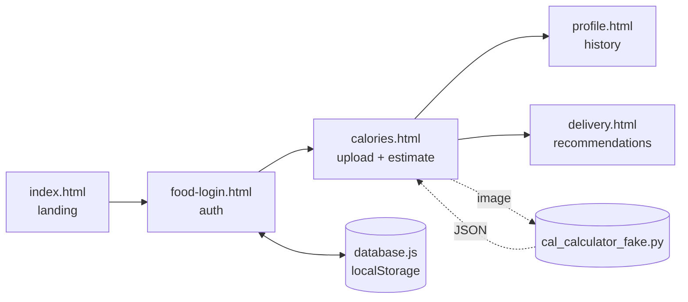

# Building FoodVision AI: A Calorie Counter That Looks at Your Plate

When our class project kicked off, I had two competing instincts. The first was
to build something genuinely useful �the kind of tool I would actually open on
a Tuesday night when I was too tired to log my dinner by hand. The second was to
keep the scope small enough that I would still sleep before the deadline. The
result was **FoodVision AI**: a small web app where you upload a photo of a
meal, and it estimates the calories and macros for you.

This is the personal story of building it �the parts that worked, the parts
that fought back, and what I would do differently next time.

<!-- more -->

## Why a food calorie app?

I have been a casual calorie-tracker for years. Every app I have tried suffers
from the same friction: the food database is huge, but searching for "the rice
bowl I just ate" still takes a half dozen taps and a guess at portion size. I
wanted to see how close I could get to "snap a picture, get a number" with the
time and skills I had.

The MVP I scoped out was deliberately tiny:

- A landing page that explains what the app does
- An auth flow so each user has their own log
- An upload screen that returns a calorie estimate and macro breakdown
- A profile page with a running history
- A stretch goal: a "delivery" page that recommends meals based on what you
  have already eaten that day

## The architecture (such as it is)

Because this was a course project, I leaned hard on a static frontend with a
tiny Python module standing in for the eventual vision model. The shape ended
up being:

The frontend is plain HTML, CSS, and vanilla JavaScript �no build step, no
framework. `database.js` wraps `localStorage` so the auth and history features
feel real without a backend. `cal_calculator_fake.py` is the placeholder for the
vision model: it pretends to look at the image and returns one of a few
hard-coded "scenes" plus a small amount of jitter so the numbers do not look
suspiciously identical between uploads.

I want to be honest about that last point: yes, the calorie estimator is fake.
But the *interface contract* is real �`analyze_image(path)` returns a dict
with `foods`, `total_kcal`, and `macros`, exactly the shape a real model would
return. Swapping the fake out for a real call is a one-function change.

## What surprised me

### 1. The UI ate more time than the "AI"

I expected to spend most of my hours wrestling with the model. Instead I spent
them nudging hover animations on cards, fighting `clamp()` values for
responsive headings, and rewriting the login modal three times. The lesson I
keep relearning: the parts you think will be hard and the parts that actually
*are* hard rarely overlap.

### 2. localStorage is a surprisingly good prototype backend

For a single-user demo, `localStorage` lets you ship auth, sessions, and a
history feature without standing up a server. It is obviously not secure �I
am storing user records in the browser �but for a class project it removes
an entire class of "the backend is down" problems during a live demo. I would
not ship this to real users without moving secrets server-side, but as a
scaffolding step it was great.

### 3. Designing the fake model forced me to design the real one

Writing `cal_calculator_fake.py` made me decide, up front, what the response
shape should be, what confidence values I would surface, and how I would deal
with multiple foods in one photo. By the time I sat down to think about a real
model, the contract was already written.

## The ugly parts

A few things I am not proud of and want to fix in a v2:

- **Error states are thin.** If the upload fails or the image is unreadable, the
  user gets a generic message. Real users deserve better.
- **Auth is client-only.** Anyone with devtools can read the user table. Fine
  for a demo, not fine for anything else.
- **The "delivery" recommendations are rule-based.** They look at remaining
  daily calories and pick from a list. There is no personalization yet.
- **Accessibility.** I added focus styles and reasonable contrast, but I have
  not run a full audit with a screen reader. That is on the list.

## What I would do differently

If I were starting over tomorrow, I would:

1. **Pick the model first, design the UI around it.** I built the UI assuming
   the model would behave a certain way, then had to soften the UI when I
   realized real vision models are noisier than my fake one.
2. **Stand up a real backend earlier.** Even a tiny FastAPI service would have
   forced me to think about sessions, rate limits, and image storage from day
   one instead of bolting them on later.
3. **Write the demo script before the demo.** Walking through the app
   end-to-end the night before a presentation always reveals one broken flow.
   I would rather find it a week earlier.

## Closing thoughts

The most satisfying moment of the whole project was not when the upload first
worked �it was when a friend used it without me explaining anything, took a
picture of their lunch, and said "huh, that's about right." Even with a fake
model behind the curtain, the *experience* of "snap, get a number" felt like
something I would use. That is the part I want to keep building toward.

If you are working on something similar �a small, opinionated tool that
scratches your own itch �I would love to hear about it. The best part of
working in public is that someone else is usually one step ahead of you on the
exact problem you are stuck on, and they are almost always happy to talk about
it.

Thanks for reading.

