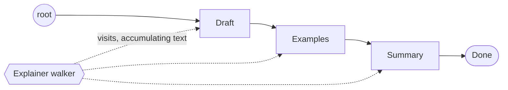
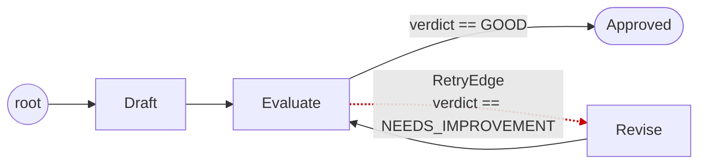
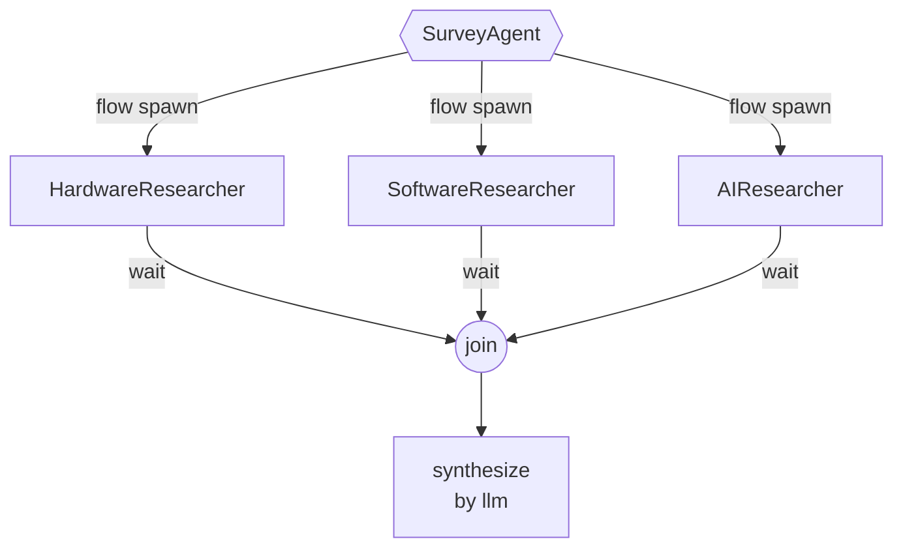

# Everyone Is Building Bloat

*Agents are first-class citizens in our lives. They aren't first-class citizens of any language we build them in. That gap is the whole story.*

LLMs draft our emails, write our code, and run our businesses. We talk to them like coworkers. We hand them our calendars.

The moment we sit down to *build* with them, they go back to being strangers.

<!-- more -->

People build agents with whatever is *abundant*: a Python decorator here, a JSON schema there, a prompt template that swelled into 800 lines and never got smaller. Every team writes its own dispatcher, its own retry loop, its own subagent spawner. Every team hides the parts the language can't see inside a `SKILL.md` file and prays the model reads it carefully.

There's a name for what comes out the other end. It's **bloat**, and it isn't an accident of style. It's what happens when a first-class concern in the world is a second-class concern in the language.

```
            ┌─────────────────────────────────────────────────┐
            │                                                 │
            │   Pipe  ─┐                                      │
            │          ├──►   █████████████████████████       │
            │   Loop  ─┤      ██  PROSE IN A PROMPT  ██       │
            │          ├──►   █████████████████████████       │
            │   Route ─┤                                      │
            │          ├──►   (the language doesn't see it,   │
            │   Spawn ─┘       so we encode it as English)    │
            │                                                 │
            └─────────────────────────────────────────────────┘
```

This blog walks the gap in three parts. First, the diagnosis. Then the half of an agent any host language *can* see (the **Mind**). Then the half it can't (the **Flow**), and what changes when the language sees that too.

!!! info "About the code"

    Every Jac snippet below is self-contained and runs with `jac run <file>.jac` against a configured model. Copy any block, save it, and you'll see the agent execute end-to-end.

---

## Diagnosis

!!! abstract ""

    *The language sees the call. It doesn't see the agent.*

Open any production agent codebase (OpenClaw, Hermes, OpenCode, pi-mono) and the agent-specific code is overwhelmingly *plumbing for things the host language has no idea exist*: a skill loader, a tool registry, a subagent spawner, a router, a retry loop, a verdict parser, a memory store, a gateway.

None of these are application logic. They are **the language doing impressions of features it doesn't have.**

Here's what an LLM call looks like to a Python program:

```
   ┌───────────┐                              ┌───────────┐
   │  caller   │  ──── prompt: str ────────►  │   LLM     │
   │           │  ◄──── reply: str ─────────  │           │
   └───────────┘                              └───────────┘
         ▲
         │
   the language sees this: a function call and a return.
   it does not see what comes next.
```

Two strings cross a wire. As far as Python is concerned, nothing agentic has happened.

But an agent is **not one call.** An agent is dozens of calls strung together with structure: *this output feeds that input*, *try again if the verdict is bad*, *spawn three workers and merge*, *let the model pick which expert to ask*. All of that structure is *agent code*, and none of it lives where the host language can typecheck it.

So it leaks. There are exactly two places it can leak to, and every agent codebase picks some mix of both:

```
                  ┌─────────────────────────────────────────────────┐
                  │                                                 │
                  │      Bleed Path A         │     Bleed Path B    │
                  │      ─────────────        │     ─────────────   │
                  │      into the PROMPT      │     into ad-hoc     │
                  │                           │     HARNESS CODE    │
                  │      (workflow as         │                     │
                  │       paragraph,          │     (allowed-tools, │
                  │       schema as           │      dispatch tables│
                  │       sentence,           │      retry runners, │
                  │       rules as            │      session stores,│
                  │       bullet list)        │      manifests...)  │
                  │                           │                     │
                  │      flexible, fragile    │     rigid, brittle  │
                  │                           │                     │
                  └─────────────────────────────────────────────────┘
```

Path A is what prose-heavy agents do: everything is a sentence in the prompt, and the model is trusted to read and obey. Flexible, but no floor. A smaller model can violate any "rule" in the document because nothing is enforced outside the model.

Path B is what manifest-style harnesses do: the gates are real code. A tool dispatcher checks `allowed-tools` before the model gets a turn, prerequisites gate visibility, tags route requests. The floor is solid. But the harness is rigid by whole-capability: the entire skill is either structured or it isn't.

Both are real engineering. Both leave the *agent* outside what the language can see.

!!! quote ""

    When the language doesn't have a word for what you're building, it leaks. Sometimes into the prompt. Sometimes into a bespoke harness. Always somewhere outside the typechecker.

---

## The Mind

!!! abstract ""

    *Three things any LLM call does. The only surface the host language has ever been able to see.*

Before talking about what the language *can't* see, give it credit for what it can. There are exactly three things a single LLM call usefully does. And even these three things weren't really part of any host language until **byLLM** put them there: in Python or TypeScript, an LLM call is just an HTTP request with a string payload. The language never learned what an LLM *is*. Every team writes the same glue.

### Generate

!!! abstract ""

    *LLM → free text. The function signature IS the prompt.*

```python
# ─── Python: an LLM call is an HTTP request with a string ────
from openai import OpenAI
client = OpenAI()

def answer(question: str) -> str:
    response = client.chat.completions.create(
        model="gpt-4o-mini",
        messages=[
            {"role": "system", "content": "You answer questions about any topic."},
            {"role": "user", "content": question},
        ],
    )
    return response.choices[0].message.content
```

```jac
# Jac: an LLM call is a function
"""Answer a question about any topic."""
def answer(question: str) -> str by llm();

with entry {
    q = "What are three interesting facts about computer architecture?";
    print(f"Q: {q}\n");
    print(f"A: {answer(q)}");
}
```

This isn't a code-golf gag. The Python version has *no information* in it that the Jac version doesn't: model name, system prompt, question, return type all live in the Jac signature, docstring, and runtime config. Python is paying tax to a language that doesn't know what an LLM is.

To change the agent's behavior in Jac, change the signature. Not a YAML file. Not a `PromptTemplate("...")` string. Not a system prompt buried three indentation levels deep in another function. The *semantics* of the code *are* the prompt. We call this **Meaning-Typed Programming.**

### Extract

!!! abstract ""

    *LLM → typed data. The compiler enforces the schema.*

The instant you want structured output, every other language hands you back a string and tells you to write a parser. Even with Pydantic and the modern `response_format` API doing most of the work:

```python
# ─── Python: schema-as-side-channel ──────────────────────────
from pydantic import BaseModel
from enum import Enum
from openai import OpenAI

class Topic(str, Enum):
    HARDWARE = "HARDWARE"; SOFTWARE = "SOFTWARE"
    NETWORKS = "NETWORKS"; AI = "AI"; OTHER = "OTHER"

class PaperClassification(BaseModel):
    topic: Topic
    one_line_summary: str
    key_contributions: list[str]

def classify_paper(title: str, abstract: str) -> PaperClassification:
    response = OpenAI().beta.chat.completions.parse(
        model="gpt-4o-mini",
        messages=[
            {"role": "system", "content": "Classify a research paper..."},
            {"role": "user", "content": f"Title: {title}\n\nAbstract: {abstract}"},
        ],
        response_format=PaperClassification,
    )
    return response.choices[0].message.parsed   # may be None, must check
```

The schema is declared *twice*: once in the type system, and once again as a runtime argument to the API. The language never connects the two. If the model returns malformed JSON, you get `None` and have to retry yourself.

In Jac:

```jac
enum Topic { HARDWARE, SOFTWARE, NETWORKS, AI, OTHER }

obj PaperClassification {
    has topic: Topic;
    has one_line_summary: str;
    has key_contributions: list[str];
}

def classify_paper(title: str, abstract: str) -> PaperClassification by llm();
sem classify_paper = "Classify a research paper by its title and abstract.";

with entry {
    result = classify_paper(
        title="Attention Is All You Need",
        abstract="The dominant sequence transduction models are based on..."
    );
    print(f"Topic:   {result.topic}");
    print(f"Summary: {result.one_line_summary}\n");
    print("Key contributions:");
    for c in result.key_contributions {
        print(f"  - {c}");
    }
}
```

The return type *is* the schema. The compiler knows about it. If the model produces something malformed, the runtime retries with the validation error in scope, automatically. The `try / json.loads / KeyError / pydantic.ValidationError` layer that lives in every production agent today simply does not exist.

### Invoke

!!! abstract ""

    *LLM → tool calls. ReAct in one line.*

Tool use is the worst of the three to write by hand. The ReAct loop, the JSON schemas for every tool, the dispatch table, the message accumulation, the stop condition. None of it is the language's idea:

```python
# ─── Python: hand-rolled ReAct (sketch) ──────────────────────
TOOLS = [
    {"type": "function", "function": {
        "name": "search_papers",
        "description": "Search for academic papers by query.",
        "parameters": {"type": "object",
            "properties": {"query": {"type": "string"}},
            "required": ["query"]}}},
    # ... two more, declared by hand
]
DISPATCH = {"search_papers": search_papers, ...}

def research(query: str) -> str:
    messages = [{"role": "system", "content": "Research..."},
                {"role": "user",   "content": query}]
    while True:                                          # the loop, by hand
        msg = client.chat.completions.create(...).choices[0].message
        messages.append(msg.model_dump(exclude_none=True))
        if not msg.tool_calls: return msg.content        # the stop, by hand
        for call in msg.tool_calls:                      # the dispatch, by hand
            args = json.loads(call.function.arguments)
            result = DISPATCH[call.function.name](**args)
            messages.append({"role": "tool",
                             "tool_call_id": call.id,
                             "content": str(result)})
```

Most of that is the language doing impressions of features it doesn't have. The dispatch table re-declares functions that already exist. The tool schema re-declares parameters that are already typed. The while-loop re-implements the ReAct cycle every team in the world is re-implementing this week.

In Jac:

```jac
# Tool stubs (in a real app these'd hit an API)
def search_papers(query: str) -> str { return f"3 papers found for '{query}'"; }
def get_citations(paper_id: str) -> int { return len(paper_id) * 100; }
def summarize_abstract(text: str) -> str { return f"Summary of: {text[:30]}..."; }

def research(query: str) -> str by llm(
    tools=[search_papers, get_citations, summarize_abstract]
);
sem research = "Research a topic by searching papers, checking citations, and summarizing findings.";

with entry {
    q = "Recent papers on transformer architectures and their citation impact";
    print(f"Q: {q}\n");
    print(f"A: {research(q)}");
}
```

Tools are just functions. The runtime introspects their signatures, exposes them to the model, runs the ReAct loop, and only returns when the model says it's done. The reason it's two lines instead of fifty isn't that something is hidden. It's that **the language knows what an LLM call is.**

### Three primitives, one surface

```
              ──────────────  the visible surface  ──────────────

                            Python / TS              Jac
                            ────────────             ─────────────
              Generate  →   ~15 lines of glue        1 line
              Extract   →   schema declared twice    1 line
              Invoke    →   ~50 lines of ReAct       1 line

              ────────  even this much wasn't really in the  ────
              ────────  language until something made it so  ────
```

These three primitives have *always been technically possible* in any language with an HTTP client. The difference isn't capability. It's whether the language ever knew you were doing it. byLLM is the first time a function declaration is enough to make an LLM call a real language construct: typed, composable, refactorable, statically meaningful.

With these in hand, you can convince yourself for a while that this is the whole picture.

Then you try to build a real agent.

!!! quote ""

    The work begins to **bleed.**

A real agent doesn't make one LLM call. It chains five. It retries when a verdict comes back wrong. It branches when the user's intent shifts. It spawns parallel investigations and merges them. The moment you wire two Mind primitives together with a `for` loop, an `if` statement, or a thread pool, *that wiring is doing work the language can't see.*

It isn't Mind work anymore. It's **Flow** work. And in every language that doesn't know the difference, Flow work bleeds back into the prompt.

---

## The Bleed

A real agent is two layers, not one. There are the LLM calls themselves, and there's the control logic *between* the calls: when to retry, who to route to, when to fan out, how partial results compose.

The host language sees the first layer. It can't see the second.

So the second layer has to live somewhere else. In every language but one, that somewhere is the prompt: re-read by the model on every turn at a cost of thousands of tokens. In a manifest-style harness it's ad-hoc dispatcher code wrapped around the call. Either way, the actual program logic of the agent lives outside the language.

The fix isn't a smarter prompt. It's a language that sees the second layer.

---

## The Flow

!!! abstract ""

    *Four things that happen between calls. The half the host language has never been able to see, and what they look like when it can.*

There are exactly four Flow primitives. Each is something every agent codebase already does, badly, in prose.

### Pipe: a chain of nodes

!!! abstract ""

    *A walker carries state forward through a sequence of nodes connected by edges.*

In most agent codebases today, Pipe is a sentence in the prompt:

```
                  prose in the prompt
              ┌──────────────────────────────┐
              │  "First, draft an            │
              │   explanation. Then add      │
              │   examples. Then condense    │
              │   into a 2-3 sentence        │
              │   summary. Be sure to..."    │
              └──────────────────────────────┘
                            ▼
                  one giant LLM call that
                  hopes the model follows
                  the steps in order
```

In Jac, Pipe is a **graph**: a literal chain of nodes wired by edges, with a walker that visits each in turn and carries state forward.



```jac
node Draft    { def run(topic: str) -> str by llm(); }
node Examples { def run(draft: str) -> str by llm(); }
node Summary  { def run(detail: str) -> str by llm(); }
node Done     {}

walker Explainer {
    has topic: str;
    has text: str = "";

    can do_draft with Draft entry {
        self.text = here.run(self.topic);
        print(f"[1/3 Draft]\n{self.text}\n");
        visit [-->];
    }
    can do_examples with Examples entry {
        self.text = here.run(self.text);
        print(f"[2/3 + Examples]\n{self.text}\n");
        visit [-->];
    }
    can do_summary with Summary entry {
        self.text = here.run(self.text);
        print(f"[3/3 Summary]\n{self.text}");
        visit [-->];
    }
}

with entry {
    draft = Draft();  ex = Examples();  summ = Summary();  done = Done();
    root ++> draft;  draft ++> ex;  ex ++> summ;  summ ++> done;
    root spawn Explainer(topic="How cache coherence works in multicore processors");
}
```

Each step is a small, scoped prompt living *on its node*. None of them ever see the others' instructions, only the typed data the walker carries forward on `self.text`. The pipeline isn't a sentence in a prompt and it isn't a sequence of function calls in `main()`. **It's a topology.** To insert a "fact-check" stage tomorrow, you don't edit a function or rewrite a prompt: you connect a new node. The graph *is* the pipeline.

### Route: choosing where to go next

!!! abstract ""

    *The LLM reads the graph and picks where the walker goes.*

This is where Jac stops looking like decorated Python and starts looking like something genuinely new.

In every other agent codebase, Route looks like one of two things: an if/elif chain over keywords, or a giant prompt that says *"you have access to the following experts: hardware, software, AI. Pick one and reply with its name."* The output is a string the surrounding code parses with prayer.

In Jac, Route is a single line. The same logic written two ways:

```jac
# ─── routing as prose (the bleed) ─────────────────────────────
def pick_expert(query: str) -> str by llm();
sem pick_expert = """
You have access to three experts:
- HardwareExpert: CPU, GPU, memory hierarchies, chip fabrication
- SoftwareExpert: compilers, operating systems, runtimes
- AIExpert: neural networks, LLMs, machine learning systems
Pick one and respond with its name only. Do not include any other text.
""";

choice = pick_expert(query);            # → "HardwareExpert" (hopefully)
if choice == "HardwareExpert" { ... }   # parse-and-pray dispatch
elif choice == "SoftwareExpert" { ... }
elif choice == "AIExpert"      { ... }
```

```jac
# ─── routing as code ──────────────────────────────────────────
node HardwareExpert {
    has description: str = "Expert in CPU, GPU, memory hierarchies, chip fabrication";
    def answer(q: str) -> str by llm();
    can respond with ResearchAssistant entry {
        print("→ routed to HardwareExpert");
        visitor.response = self.answer(visitor.query);
    }
}
node SoftwareExpert {
    has description: str = "Expert in compilers, operating systems, runtimes";
    def answer(q: str) -> str by llm();
    can respond with ResearchAssistant entry {
        print("→ routed to SoftwareExpert");
        visitor.response = self.answer(visitor.query);
    }
}
node AIExpert {
    has description: str = "Expert in neural networks, LLMs, machine learning systems";
    def answer(q: str) -> str by llm();
    can respond with ResearchAssistant entry {
        print("→ routed to AIExpert");
        visitor.response = self.answer(visitor.query);
    }
}

walker ResearchAssistant {
    has query: str;
    has response: str = "";
    can route with Root entry {
        visit [-->] by llm(incl_info={"User query": self.query});
    }
}

with entry {
    root ++> HardwareExpert();
    root ++> SoftwareExpert();
    root ++> AIExpert();

    q = "How do branch predictors work in modern CPUs?";
    print(f"Q: {q}");
    r = root spawn ResearchAssistant(query=q);
    print(f"\nA: {r.response}");
}
```

The whole left-hand version (prose, parse, dispatch) collapses into one line:

```
                       visit [-->] by llm()
                              │
                              ├── reads the graph topology
                              ├── reads each node's description
                              ├── picks the right one(s)
                              └── walks the walker there
```

To add a new expert tomorrow, add a `node` with a `description`. No prompt edit. No parser edit. **The graph is the routing table.**

### Loop: a typed edge that closes a cycle

!!! abstract ""

    *The loop isn't a `while`. It's an edge in the graph that says "go back."*

When the loop lives in the prompt, it sounds like this: *"After writing the draft, evaluate it. If it has weaknesses, revise it. Repeat up to 3 times or until you are satisfied."* The model decides when to stop. You hope it stops.

You *could* express this as a `while` inside a walker ability. But a `while` is a generic Python-shaped construct. It could be anything. It doesn't say to a reader *"this is an agentic self-correction cycle."* The OSP-native way to say that is to put the cycle **in the graph itself**, as a typed edge that closes the loop:



The cycle in the graph **is** the loop. The walker walks the edge or it doesn't. The exit condition rides on a typed verdict:

```jac
enum Quality { GOOD, NEEDS_IMPROVEMENT }

obj Review {
    has quality: Quality;
    has weaknesses: list[str];
    has suggestion: str;
}

# A typed edge that names the loop. Not "an edge", a RetryEdge.
edge RetryEdge {
    has reason: str = "Verdict was NEEDS_IMPROVEMENT";
    has max_retries: int = 3;
}

node Draft    { def run(topic: str) -> str by llm(); }
node Evaluate { def run(draft: str, topic: str) -> Review by llm(); }
node Revise   { def run(draft: str, feedback: str) -> str by llm(); }
node Approved {}

walker TutorialWriter {
    has topic: str;
    has draft: str = "";
    has feedback: str = "";
    has version: int = 1;

    can do_draft with Draft entry {
        self.draft = here.run(self.topic);
        print(f"[Draft v{self.version}]\n{self.draft}\n");
        visit [-->];
    }

    can do_evaluate with Evaluate entry {
        review = here.run(self.draft, self.topic);
        print(f"[Review] verdict = {review.quality}");
        if review.quality == Quality.GOOD {
            print("→ approved, exiting loop\n");
            visit [-->][?:Approved];                     # exit the loop
        } else {
            self.feedback = f"{review.weaknesses}. {review.suggestion}";
            print(f"→ retry: {self.feedback}\n");
            visit [->:RetryEdge:->];                     # take the retry edge
        }
    }

    can do_revise with Revise entry {
        self.version += 1;
        self.draft = here.run(self.draft, self.feedback);
        print(f"[Draft v{self.version}]\n{self.draft}\n");
        visit [-->];                                     # back to Evaluate
    }
}

with entry {
    draft = Draft();   eval_n = Evaluate();
    revise = Revise(); done   = Approved();

    root ++> draft ++> eval_n;
    eval_n ++> done;                # exit edge (verdict GOOD)
    eval_n +>:RetryEdge:+> revise;  # the retry cycle, named
    revise ++> eval_n;              # back around

    root spawn TutorialWriter(topic="How cache coherence works in multicore processors");
}
```

`RetryEdge` is a **typed** edge with a name and its own fields. A reader scanning the graph sees `eval_n +>:RetryEdge:+> revise` and immediately knows what kind of loop this is. A `while` in a function body could be anything; a `RetryEdge` is one specific thing.

The loop body lives where it belongs, distributed across the nodes the walker visits. `Evaluate` evaluates. `Revise` revises. The cycle isn't a procedural detail buried inside a function; it's a structural feature of the program you can *see* in the graph.

**Loop + Extract = self-correction with an honest stopping criterion. Loop + typed edge = self-correction you can draw.**

### Spawn: parallel walkers, merged results

!!! abstract ""

    *`flow spawn` and `wait`: fan out work, fan in answers.*

In Hermes, this is called *"isolated subagents for parallel workstreams."* In OpenClaw, *"delegation."* In both projects it's hundreds of lines of task-queue plumbing.

In Jac it's two keywords:

```jac
# Tool stubs
def search_papers(query: str) -> str { return f"papers on '{query}'"; }
def get_citations(paper_id: str) -> int { return 1247; }

walker HardwareResearcher {
    has topic: str;
    has result: str = "";
    def investigate(topic: str) -> str by llm(tools=[search_papers, get_citations]);
    can start with Root entry {
        print("  [HW] starting");
        self.result = self.investigate(self.topic);
        print("  [HW] done");
    }
}
walker SoftwareResearcher {
    has topic: str;
    has result: str = "";
    def investigate(topic: str) -> str by llm(tools=[search_papers, get_citations]);
    can start with Root entry {
        print("  [SW] starting");
        self.result = self.investigate(self.topic);
        print("  [SW] done");
    }
}
walker AIResearcher {
    has topic: str;
    has result: str = "";
    def investigate(topic: str) -> str by llm(tools=[search_papers, get_citations]);
    can start with Root entry {
        print("  [AI] starting");
        self.result = self.investigate(self.topic);
        print("  [AI] done");
    }
}

walker SurveyAgent {
    has topic: str;
    has response: str = "";
    def synthesize(topic: str, hw: str, sw: str, ai: str) -> str by llm();

    can start with Root entry {
        print(f"Surveying: {self.topic}\n");
        print("Spawning three researchers in parallel:");
        hw_task = flow root spawn HardwareResearcher(topic=self.topic);
        sw_task = flow root spawn SoftwareResearcher(topic=self.topic);
        ai_task = flow root spawn AIResearcher(topic=self.topic);

        hw: any = wait hw_task;
        sw: any = wait sw_task;
        ai: any = wait ai_task;

        print("\nAll researchers done. Synthesizing...\n");
        self.response = self.synthesize(self.topic, hw.result, sw.result, ai.result);
        print(f"Survey:\n{self.response}");
    }
}

with entry {
    root spawn SurveyAgent(topic="Efficient inference for large language models");
}
```

Each researcher carries **its own scoped tool list** and **its own context**. Three small focused prompts running concurrently, not one bloated prompt holding nine tools and hoping the model picks correctly.



### The bleed in the wild

The four most prominent open-source agent codebases:

| Project | Built in |
|---|---|
| [**OpenClaw**](https://github.com/openclaw/openclaw): personal assistant across 20+ chat channels | TypeScript |
| [**Hermes**](https://github.com/NousResearch/hermes-agent) (Nous Research): self-improving agent | Python |
| [**OpenCode**](https://github.com/anomalyco/opencode): open-source coding agent | TypeScript |
| [**pi-mono**](https://github.com/badlogic/pi-mono): coding agent + toolchain | TypeScript |

Each is excellent. Each has picked its own point on the prose-vs-harness spectrum. The manifest-style harnesses (openclaw, hermes, pi-mono) get a lot right: they encode real invariants in code, gate tool access in the dispatcher, degrade gracefully on smaller models. That's the *floor* a prose-only skill never has.

But every one stops at the same place. They raise the floor for the whole capability or none of it. Workflow, schema, loops, fan-out, fan-in (all four Flow primitives) still get implemented by hand with whatever the host language could spare:

```
   What every agent codebase                       In Jac
   has to build by hand:                           it's:
   ─────────────────────────────────               ──────────────────
   capability loader   (injects rules           →  by llm(tools=[...])
                        into prompt,
                        manages tool registry)

   subagent spawner   (task queue,              →  flow spawn / wait
                       context isolation,
                       result merging)

   router   (switch on classifier,              →  visit [-->] by llm()
             prompt that returns a name,
             dispatch table)

   loop runner   (while-loop over               →  Loop + typed verdict
                  string verdicts,                 closing the cycle
                  parse-and-pray exits)            in the graph

   self-extension   (agent writes more          →  add a node
                     English prose to its          add an edge
                     own capability file)
```

It isn't just the agent loop. **jac-cloud** is the runtime under all of this: every walker is already an HTTP endpoint, the graph is already the persistence layer, scheduled walkers are already the cron system, the user session is already a sub-root. So the *other* things these projects ship (gateways, schedulers, session stores) are runtime features too.

The pattern repeats across all four codebases: most of the agent-specific code is the language doing impressions of features it doesn't have.

---

## The Dial

!!! abstract ""

    *Selective rigidity. Pick how strict you want to be, per concept, not per capability.*

There's a recurring objection to "agent-as-graph": *agents are supposed to be flexible; if you over-structure them, you lose the very thing that made the LLM useful.* It's fair, and worth taking seriously.

It lands cleanly against the two existing approaches. Prose skills give you total flexibility and zero invariants. Manifest harnesses give you hard invariants and zero flexibility. Picking either is picking a side in a trade-off that shouldn't have to be a binary.

OSP doesn't ask you to pick. It gives you a **dial**, set per concept:

```
                              ── strictness, per concept ──

   typed node + schema    ─►   ███████████   hard invariants
                                              (things you can't
                                               afford to get wrong)

   typed node + freeform  ─►   ██████        invariants on structure,
   slots                                      freedom on content

   freestyle walker       ─►   ███           "do something useful here"
                                              with the full tool surface

   raw passthrough        ─►   ░             prose path, untyped
                                              (escape hatch for the
                                               last 5% of cases)
```

The same agent, in the same program, can have a hard-typed `Theme` node (font ≥ 36pt, palette validated against contrast rules) sitting next to a freestyle slide node that hands the LLM a paintbrush. The graph encodes *which parts you care about being correct* and *which parts you want the model to be clever about* separately, per node, in the same file.

|  | Prose-style | Manifest harness | OSP + byLLM |
|---|---|---|---|
| Default behavior | Free-form, model decides | Structured, harness gates | Structured, graph gates |
| Opt-in flexibility | N/A (all flexible) | N/A (all rigid) | Per node, escape hatches |
| Invariants enforced | By the model | By the harness | By the graph schema |
| Stateful operations | None | Manual | Free (graph persists) |
| Per-user isolation | None | Manual | Free (`walker:priv`) |
| HTTP endpoints | None | Manual wiring | Free (auto-exposed) |
| Same API for human + LLM | No | Sometimes | Yes (walkers are tools) |

That last row is easy to miss and matters a lot. In Jac, the walkers you write for end-users *are* the tools your LLM calls. The byLLM orchestrator and a human REST client hit the same endpoint with the same arguments and get the same typed result. There is exactly one API; only the caller differs. Harnesses that do this well spend significant code on it. In Jac it falls out of the runtime.

---

## The seven, on one page

| | Primitive | One line |
|---|---|---|
| **Mind** | Generate | `def f(...) -> str by llm()` |
| | Extract  | `def f(...) -> TypedObj by llm()` |
| | Invoke   | `by llm(tools=[...])` |
| **Flow** | Pipe     | a chain of nodes, walker carries state |
| | Route    | `visit [-->] by llm(...)` |
| | Loop     | a typed edge closing a cycle in the graph |
| | Spawn    | `flow spawn` + `wait` |

Three the language always could see. Four it never could, until now.

Everyone is building bloat because the bleed has to go *somewhere*. Give it a language and it goes into the code instead.

---

**Where to start.**

- **Workshop tutorial**: [jaseci-labs/asplos-26-tutorial](https://github.com/jaseci-labs/asplos-26-tutorial). Seven exercises, seven solutions, one composed agent.
- **Jac docs**: [docs.jaseci.org](https://docs.jaseci.org).