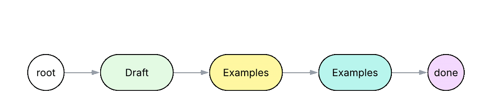
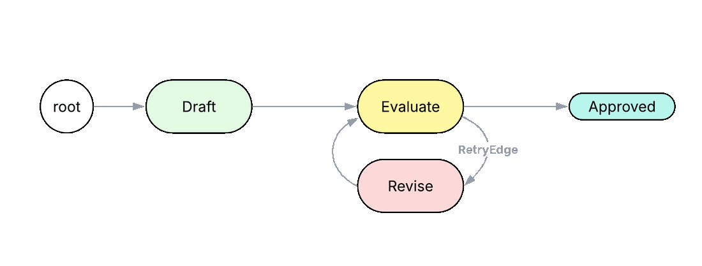

# Building Agents in a Language That Knows What an Agent Is

Most of an agent codebase is not the agent. It is the supporting code every developer writes from scratch, because the languages we use were never designed for agents.

<!-- more -->

---

## The Problem

**You write the prompt by hand.** Every LLM call starts with a prompt you compose yourself, a paragraph describing what you want, even though your code already says it. The name you give the function, its parameters, and its return type already describe the task; then you turn around and describe that same task again in English for the model. Now the intent lives in two places, and they drift the moment you change one and forget the other, rename the function, add a parameter, swap a return type, and the prompt still asks for the old shape. Nothing in the build catches the mismatch, because the link between the code and the prompt only exists in your head, and it stays silent until the model misbehaves at runtime.

**And then you hand-build the plumbing around the call.** Once the model replies, you write the code that interprets it: parse the text into a typed object, validate it against your schema, retry when the JSON comes back malformed, declare each tool a second time as a JSON schema, run the ReAct loop that calls a tool and feeds the result back. None of this is your agent, it's the same input/output plumbing every project re-implements from scratch, and bugs in it are hard to tell apart from bugs in the agent. This is the same problem as the prompt: intent your code already expresses, restated by hand because the language can't read the code and do it for you.

**The agent's workflow lives in prose.** When an agent should follow a specific sequence, like *"first search, then summarize, then if the summary is too long, revise it,"* that workflow ends up inside a system prompt as English, or scattered across a hand-rolled `for` loop, a router that dispatches on a classifier's label, and a threadpool that fans work out and merges it. Either way the control flow that *defines* the agent is invisible to the language: no code can enforce the steps or check that the model followed them.

These problems share a root cause. The parts that *are* the agent, its tools, its workflow, its retries, its parallelism, live in two places the language can't see: as strings inside prompts, and as supporting code every team writes from scratch. Neither is something the language understands as an agent. So a question:

!!! quote ""

    *If agents were a feature of the language itself, instead of being built from prompts and code that developers need to write from scratch, what would the language need to provide?*

The answer is already in the [**Jac**](https://docs.jaseci.org/) programming language. Two ideas power it. **Meaning-Typed Programming** ([MTP](https://dl.acm.org/doi/10.1145/3763092)), brought in by the [**byLLM**](https://docs.jaseci.org/reference/plugins/byllm/) plugin, builds the prompt from your code and handles the input/output plumbing in the runtime, so you stop writing prompts by hand and stop re-inventing the wheel for parsing, validation, and retries. **[Object-Spatial Programming](https://docs.jaseci.org/reference/language/osp/)** (OSP), Jac's native model for organizing computation around a graph, lets you express the agent's workflow as structure the language can see and check, instead of prose. Together they give us **seven patterns** for building agents: three for what happens inside a single iteration (the **Mind**), and four for how work moves between iterations (the **Flow**). Every agent codebase already implements all seven, just by hand. The rest of this post is what those seven look like when the language has words for them.

!!! info "About the code"

    Every Jac snippet below is self-contained and runs with `jac run <file>.jac` against a configured model. Copy any block, save it, and you'll see the agent execute end-to-end.

<!-- ---

## The Gap

Two places agent logic actually ends up today:

**In the prompt.** *"First do X, then if Y do Z, retry up to three times."* Flexible, fast to write, completely unverified. A typo fails silently. A smaller model defects without warning. The prose costs thousands of tokens on every turn because the model has to re-read it to know what comes next.

**In glue code.** A tool dispatcher checks `allowed-tools` before the model gets a turn. A retry runner re-invokes on parse failure. A session store holds memory. Real code, with real types, but every team writes its own, and it's rigid per-capability: a skill is either fully structured or fully prose. There is no in-between.

Either way, the things developers care about are out of reach: type-checked workflows, refactor-safe agents, testable control flow, predictable behavior on smaller models. That's the gap the seven patterns are designed to close. -->

---

## The Mind

An agent's work splits in two: what happens *inside* a single iteration, one turn of thinking, deciding, or acting, and how those iterations *connect* into a larger workflow. We call the first the **Mind** and the second the **Flow**. The Mind is where a single call to the model does something useful. Three things it usefully does:

1. **Generate**: LLM returns free text from a function signature.
2. **Extract**: LLM returns typed data validated against a schema.
3. **Invoke**: LLM calls tools in a ReAct loop until it has an answer.


### 1. Generate

<div class="collapse" data-lines="10">

```python
# Python: an LLM call is an HTTP request with a string
from openai import OpenAI
client = OpenAI()

def answer(question: str) -> str:
    response = client.chat.completions.create(
        model="gpt-4o-mini",
        messages=[
            {"role": "system", "content": "You answer questions about any topic."},
            {"role": "user", "content": question},
        ],
    )
    return response.choices[0].message.content
```

</div>

The Python snippet above describes one function in two places. The signature `def answer(question: str) -> str` says what the function returns. The system prompt string `"You answer questions about any topic."` says what it actually does. Rename `answer` to `respond` and the prompt still describes the old function. This is exactly the problem we named earlier: *you write the prompt by hand*, restating intent the signature already carries.

```jac
# Jac: an LLM call is a function
def answer(question: str) -> str by llm();

with entry {
    response = answer("What are three interesting facts about computer architecture?");
}
```

In Jac, the intent is written once. The signature `def answer(question: str) -> str by llm();` is what the LLM sees. The function name `answer`, the parameter `question`, and the return type `str` together tell the model what to do. Rename the function or the parameter, and the prompt updates with it. byLLM builds the prompt automatically from these code semantics. Jac calls this **Meaning-Typed Programming**.

### 2. Extract

<div class="collapse" data-lines="10">

```python
# Python: schema declared twice, once as a type, once as an API argument
from pydantic import BaseModel
from enum import Enum
from openai import OpenAI

class Topic(str, Enum):
    HARDWARE = "HARDWARE"; SOFTWARE = "SOFTWARE"
    NETWORKS = "NETWORKS"; AI = "AI"; OTHER = "OTHER"

class PaperClassification(BaseModel):
    topic: Topic
    one_line_summary: str
    key_contributions: list[str]

def classify_paper(title: str, abstract: str) -> PaperClassification:
    response = OpenAI().beta.chat.completions.parse(
        model="gpt-4o-mini",
        messages=[
            {"role": "system", "content": "Classify a research paper..."},
            {"role": "user", "content": f"Title: {title}\n\nAbstract: {abstract}"},
        ],
        response_format=PaperClassification,
    )
    return response.choices[0].message.parsed   # may be None, must check
```

</div>

The Python snippet above needs several moving parts just to return a typed object. The schema lives in a Pydantic class, `PaperClassification`. OpenAI's beta parse endpoint takes that same class again as `response_format=`. The return value is still optional, so every caller writes a defensive check (`# may be None, must check`). Malformed JSON forces a hand-rolled try/except and retry loop on top of all that. The schema, the beta endpoint, the optional check, the retry, every developer rebuilds this wrapper for every structured-output call.

In Jac:

```jac
enum Topic { HARDWARE, SOFTWARE, NETWORKS, AI, OTHER }

obj PaperClassification {
    has topic: Topic;
    has one_line_summary: str;
    has key_contributions: list[str];
}

def classify_paper(title: str, abstract: str) -> PaperClassification by llm();
sem classify_paper = "Classify a research paper by its title and abstract.";

with entry {
    result = classify_paper(
        title="Attention Is All You Need",
        abstract="The dominant sequence transduction models are based on..."
    );
    # result.topic is a Topic enum member, result.key_contributions is list[str]
}
```

In Jac, the return type `PaperClassification` is the schema. The runtime introspects it, sends it to the model, validates the response, and retries automatically with the validation error in scope. The developer never writes the `try / json.loads / pydantic.ValidationError` block by hand, because the runtime handles it.

### 3. Invoke

<div class="collapse" data-lines="10">

```python
# Python: hand-rolled ReAct
TOOLS = [
    {"type": "function", "function": {
        "name": "search_papers",
        "description": "Search for academic papers by query.",
        "parameters": {"type": "object",
            "properties": {"query": {"type": "string"}},
            "required": ["query"]}}},
    # ... two more, declared by hand
]
DISPATCH = {"search_papers": search_papers, ...}

def research(query: str) -> str:
    messages = [{"role": "system", "content": "Research..."},
                {"role": "user",   "content": query}]
    while True:                                          # the loop, by hand
        msg = client.chat.completions.create(...).choices[0].message
        messages.append(msg.model_dump(exclude_none=True))
        if not msg.tool_calls: return msg.content        # the stop, by hand
        for call in msg.tool_calls:                      # the dispatch, by hand
            args = json.loads(call.function.arguments)
            result = DISPATCH[call.function.name](**args)
            messages.append({"role": "tool",
                             "tool_call_id": call.id,
                             "content": str(result)})
```

</div>

The Python snippet above shows both halves of the byLLM problem at once. `search_papers` is declared three times: once as the actual function, once in the `TOOLS` list as a JSON schema, and once in the `DISPATCH` dict as a string key. Renaming the function means manually updating it in all three places. The developer also has to write the entire tool-use loop by hand, repeatedly calling the model, running the tool it requests, sending the result back, and continuing until the model is done. Every developer building a tool-using agent writes this same loop themselves.

In Jac:

```jac
# Tool stubs (in a real app these'd hit an API)
def search_papers(query: str) -> str { return f"3 papers found for '{query}'"; }
def get_citations(paper_id: str) -> int { return len(paper_id) * 100; }
def summarize_abstract(text: str) -> str { return f"Summary of: {text[:30]}..."; }

def research(query: str) -> str by llm(
    tools=[search_papers, get_citations, summarize_abstract]
);
sem research = "Research a topic by searching papers, checking citations, and summarizing findings.";

with entry {
    findings = research("Recent papers on transformer architectures and their citation impact");
}
```

In Jac, tools are ordinary functions. The runtime introspects their signatures, exposes them to the model, runs the tool-use loop, and returns when the model is done. The developer never declares a JSON schema, never maintains a dispatch dict, and never writes the tool-use loop by hand.

---

Together, these three patterns cover the byLLM half of the story for anything that happens inside a single iteration: the prompt you no longer write by hand, and the input/output plumbing you no longer rebuild. The moment two iterations need to coordinate, the wiring between them becomes the agent. One iteration's output feeds the next, a retry triggers a rerun, or several workers run in parallel.

In Python or TypeScript, this wiring lives inside a generic `for` loop or inside a system prompt with numbered steps. That is the remaining problem, *the workflow lives in prose*, and the next four patterns address it with OSP.

---

## The Flow

Four kinds of wiring between Mind iterations:

1. **Pipe**: sequential composition. One call's output is the next call's input.
2. **Route**: pick which handler runs based on what came in.
3. **Loop**: repeat until a typed quality check passes.
4. **Spawn**: fan out parallel work, fan in the results.


### 1. Pipe

<figure markdown="span">
  { loading=lazy }
</figure>

```jac
node Draft    { def run(topic: str) -> str by llm(); }
node Examples { def run(draft: str) -> str by llm(); }
node Summary  { def run(detail: str) -> str by llm(); }
node Done     {}

walker Explainer {
    has topic: str;
    has text: str = "";

    can do_draft with Draft entry {
        self.text = here.run(self.topic);
        visit [-->];
    }
    can do_examples with Examples entry {
        self.text = here.run(self.text);
        visit [-->];
    }
    can do_summary with Summary entry {
        self.text = here.run(self.text);
        visit [-->];
    }
}

with entry {
    draft = Draft();  ex = Examples();  summ = Summary();  done = Done();
    root ++> draft;  draft ++> ex;  ex ++> summ;  summ ++> done;
    root spawn Explainer(topic="How cache coherence works in multicore processors");
}
```

In Python or TypeScript, a workflow like this normally lives inside one system prompt with numbered steps, and the model is left to decide on its own whether each step was followed. In the Jac code above, each step is its own node (`Draft`, `Examples`, `Summary`), connected by the edges `root ++> draft ++> ex ++> summ ++> done`. The walker `Explainer` visits each node in order, calling its `run` method and carrying the result forward in `self.text`. Each step has its own scoped prompt that only sees the data the walker carries. Inserting a new step means adding a node and an edge instead of editing a prompt.

### 2. Route

```jac
node HardwareExpert {
    has description: str = "Expert in CPU, GPU, memory hierarchies, chip fabrication";
    def answer(q: str) -> str by llm();
    can respond with ResearchAssistant entry {
        visitor.response = self.answer(visitor.query);
    }
}
node SoftwareExpert {
    has description: str = "Expert in compilers, operating systems, runtimes";
    def answer(q: str) -> str by llm();
    can respond with ResearchAssistant entry {
        visitor.response = self.answer(visitor.query);
    }
}
node AIExpert {
    has description: str = "Expert in neural networks, LLMs, machine learning systems";
    def answer(q: str) -> str by llm();
    can respond with ResearchAssistant entry {
        visitor.response = self.answer(visitor.query);
    }
}

walker ResearchAssistant {
    has query: str;
    has response: str = "";
    can route with Root entry {
        visit [-->] by llm(incl_info={"User query": self.query});
    }
}

with entry {
    root ++> HardwareExpert();
    root ++> SoftwareExpert();
    root ++> AIExpert();

    q = "How do branch predictors work in modern CPUs?";
    r = root spawn ResearchAssistant(query=q);
}
```

In Python or TypeScript, branching between specialists normally requires three pieces: a classifier prompt that picks a label, a dispatch dictionary that maps each label to a handler function, and the handler functions themselves with their own prompts. Adding a new specialist means updating these three pieces. In the Jac code above, each specialist is a node with a `description` field (`HardwareExpert`, `SoftwareExpert`, `AIExpert`). The line `visit [-->] by llm(incl_info={"User query": self.query})` lets the model read each connected node's description and pick which one to visit. Adding a new specialist means adding one node with a description, without touching a prompt or a dispatch table.

### 3. Loop

<figure markdown="span">
  { loading=lazy }
</figure>

```jac
enum Quality { GOOD, NEEDS_IMPROVEMENT }

obj Review {
    has quality: Quality;
    has weaknesses: list[str];
    has suggestion: str;
}

edge RetryEdge {
    has reason: str = "Verdict was NEEDS_IMPROVEMENT";
    has max_retries: int = 3;
}

node Draft    { def run(topic: str) -> str by llm(); }
node Evaluate { def run(draft: str, topic: str) -> Review by llm(); }
node Revise   { def run(draft: str, feedback: str) -> str by llm(); }
node Approved {}

walker TutorialWriter {
    has topic: str;
    has draft: str = "";
    has feedback: str = "";
    has version: int = 1;

    can do_draft with Draft entry {
        self.draft = here.run(self.topic);
        visit [-->];
    }

    can do_evaluate with Evaluate entry {
        review = here.run(self.draft, self.topic);
        if review.quality == Quality.GOOD {
            visit [-->][?:Approved];
        } else {
            self.feedback = f"{review.weaknesses}. {review.suggestion}";
            visit [->:RetryEdge:->];
        }
    }

    can do_revise with Revise entry {
        self.version += 1;
        self.draft = here.run(self.draft, self.feedback);
        visit [-->];
    }
}

with entry {
    draft = Draft();   eval_n = Evaluate();
    revise = Revise(); done   = Approved();

    root ++> draft ++> eval_n;
    eval_n ++> done;
    eval_n +>:RetryEdge:+> revise;
    revise ++> eval_n;

    root spawn TutorialWriter(topic="How cache coherence works in multicore processors");
}
```

In Python or TypeScript, this normally takes a `while` loop with an exit condition that matches against a substring in the model's reply (`if 'GOOD' in response: break`) and a magic number for the maximum retry count. The intent of the loop, that this is a critique-and-revise cycle, lives only in a comment. In the Jac code above, the loop is a named edge `RetryEdge` between the `Evaluate` and `Revise` nodes, declared as `eval_n +>:RetryEdge:+> revise`. A reader scanning the graph immediately sees what kind of loop this is. The exit condition rides on a typed `Quality` verdict returned by `Evaluate`, not on a string match, and the maximum retry count is a typed field on the edge rather than a magic number in a function body.

### 4. Spawn

<figure markdown="span">
  { loading=lazy }
  <figcaption>The orchestrator fans out to parallel workers, then synthesizes their merged results</figcaption>
</figure>

```jac
def search_papers(query: str) -> str { return f"papers on '{query}'"; }
def get_citations(paper_id: str) -> int { return 1247; }

walker HardwareResearcher {
    has topic: str;
    has result: str = "";
    def investigate(topic: str) -> str by llm(tools=[search_papers, get_citations]);
    can start with Root entry {
        self.result = self.investigate(self.topic);
    }
}
walker SoftwareResearcher {
    has topic: str;
    has result: str = "";
    def investigate(topic: str) -> str by llm(tools=[search_papers, get_citations]);
    can start with Root entry {
        self.result = self.investigate(self.topic);
    }
}
walker AIResearcher {
    has topic: str;
    has result: str = "";
    def investigate(topic: str) -> str by llm(tools=[search_papers, get_citations]);
    can start with Root entry {
        self.result = self.investigate(self.topic);
    }
}

walker SurveyAgent {
    has topic: str;
    has response: str = "";
    def synthesize(topic: str, hw: str, sw: str, ai: str) -> str by llm();

    can start with Root entry {
        hw_task = flow root spawn HardwareResearcher(topic=self.topic);
        sw_task = flow root spawn SoftwareResearcher(topic=self.topic);
        ai_task = flow root spawn AIResearcher(topic=self.topic);

        hw: any = wait hw_task;
        sw: any = wait sw_task;
        ai: any = wait ai_task;

        self.response = self.synthesize(self.topic, hw.result, sw.result, ai.result);
    }
}

with entry {
    root spawn SurveyAgent(topic="Efficient inference for large language models");
}
```

In Python or TypeScript, parallel work usually collapses into either a single bloated prompt holding all the tools and asking the model to manage them itself, or a hand-rolled threadpool with manual result merging. In the Jac code above, `SurveyAgent` spawns three independent walkers (`HardwareResearcher`, `SoftwareResearcher`, `AIResearcher`) using `flow root spawn`, then collects their results with `wait`. Each researcher carries its own scoped tool list and its own context, so three focused prompts run concurrently rather than one bloated prompt holding nine tools. The synthesis step `self.synthesize(...)` only runs after all three workers have completed.

---

Together, these four patterns address the remaining problem: workflows that live inside a prompt as a string and cannot be verified or observed by the surrounding code. In Jac, the workflow is the graph itself, where the steps, branches, retries, and parallelism are all visible as connections between nodes. The seven patterns, three for what happens inside an iteration and four for how iterations connect, cover what every agent codebase rebuilds by hand in Python or TypeScript.

---

## The Takeaway

The seven Mind and Flow patterns map directly onto the problems we started with, along two axes: byLLM handles the prompt and the plumbing around a single call; OSP handles the workflow between calls.

| The problem | How Jac addresses it |
|---|---|
| **You write the prompt by hand.** Intent your code already expresses, restated in English for the model, with nothing keeping the two in sync. | **byLLM** builds the prompt from the code. The function signature itself becomes the prompt the model receives, the return type defines the schema for structured output, and tools are ordinary functions whose signatures the runtime introspects. Rename the code and the prompt follows. |
| **And then you hand-build the plumbing.** Every team writes its own validation-and-retry, its own JSON tool schemas, its own ReAct loop, and ships its own bugs in them. | **byLLM** handles this in the runtime. Parsing the reply into a type, validating it, retrying malformed output, and running the tool-use loop are all features of the language rather than code every team writes from scratch. |
| **The agent's workflow lives in prose.** Sequencing, routing, retry conditions, and parallelism end up inside system prompts as English, where no code can verify whether the model followed them. | **OSP** expresses the workflow as graph structure. Pipelines, branches, retries, and parallel fan-outs are all visible as connections between nodes, observable by the runtime and readable by the developer. |

None of this means the patterns are new. Frameworks like [**LangChain**](https://github.com/langchain-ai/langchain), [**CrewAI**](https://github.com/crewAIInc/crewAI), and [**AutoGen**](https://github.com/microsoft/autogen) already give Python and TypeScript developers tools, structured output, routing, and multi-agent orchestration. The difference is *where the patterns live*. In a framework they're library abstractions layered on top of a language that doesn't know what an agent is, so you still declare a tool to the framework and describe it again to the model, and still express a workflow as objects the compiler can't check. In Jac the same patterns are properties of the language itself, so the duplication and the unverifiable prose don't arise in the first place.

The agents people are actually shipping aren't here yet. The most prominent open-source projects are all in Python or TypeScript:

- [**OpenClaw**](https://github.com/openclaw/openclaw): personal assistant across 20+ chat channels (TypeScript)
- [**Hermes**](https://github.com/NousResearch/hermes-agent) (Nous Research): self-improving agent (Python)
- [**OpenCode**](https://github.com/anomalyco/opencode): open-source coding agent (TypeScript)

Those languages weren't chosen because they fit agents. They were chosen for ecosystem maturity. The cost is that every team rebuilds the same supporting code, and the codebase bloats around the missing patterns.

!!! quote ""

    **With these patterns in the language, building an agent is just building the agent.**
