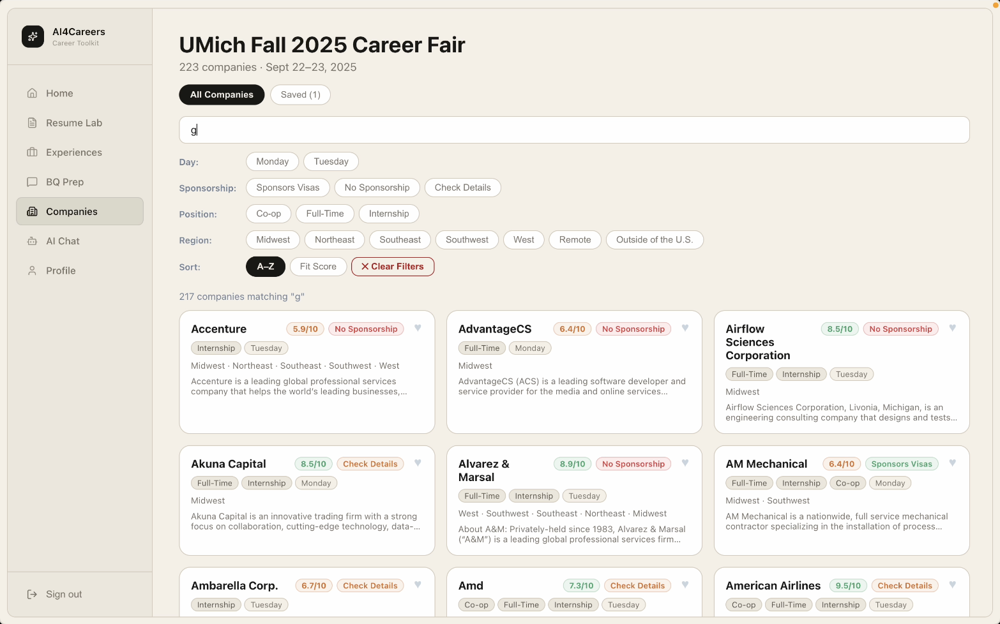
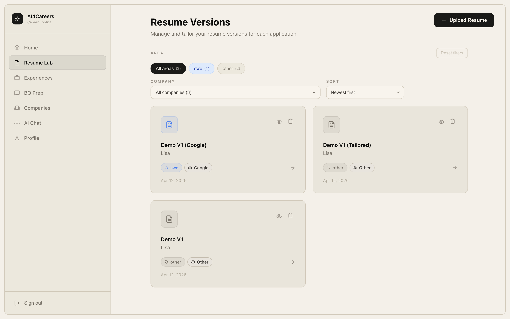
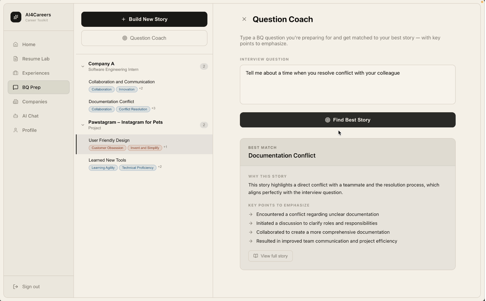
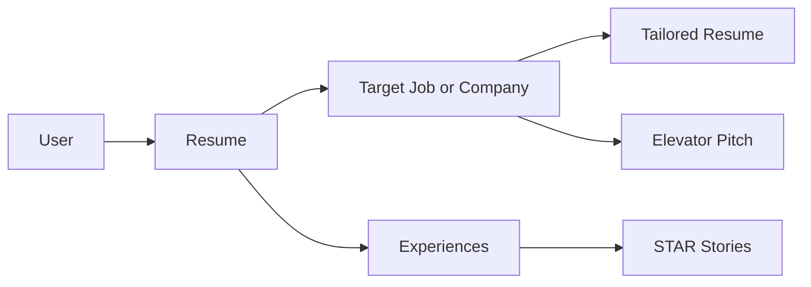

# From a Class Tutorial to a Full Product: Building AI4Careers with Jac

I first encountered Jac in EECS 449 at the University of Michigan. At the beginning, it felt like one more new language I would need to learn for class. Then I worked through the tutorial project, a task organizer with AI categorization, and I had one of those rare moments where a tool immediately clicks. I was surprised by how approachable it felt, especially because it connected ideas I already knew from Python, JavaScript, and AI workflows in a way that felt natural instead of forced.

The moment that really sold me was the first time I defined an LLM-powered function in just a few lines and watched it actually work inside the application flow. It did not feel like I was bolting AI onto my project from the outside. It felt like AI was just another capability the language already knew how to support.

That experience is what made me excited to use Jac for our final project.

<!-- more -->

Our project became **AI4Careers**, which started as a career fair support app and gradually evolved into something much bigger: a connected toolkit for job hunting. By the end, it combined our original company-matching and pitch-prep workflow with **Resume Lab**, **behavioral interview prep**, and other job application support features including a supportive **AI Chatbot**.

*AI4Careers began with focused career fair support.*

I am especially proud of two parts:

- **Resume Lab**, where users can upload resumes, create versions, tailor them to specific job descriptions, and even fine-tune individual bullet points with custom commands to the LLM.
- **Behavioral question prep**, where users can extract experiences from their background and turn a few rough sentences into polished STAR stories they can actually use in interviews, and find the story and experience that best match an interview question in question coach.

*Resume Lab helps users tailor resumes and rewrite bullets with AI.*

*Interview prep turns experience notes into polished STAR stories and connect them with interview questions.*

What I like most about these features is that they are not isolated demos. They connect to each other. A student can start from a resume, tailor it for a company, explore that company, generate a pitch, and prepare stories for the interview, all inside one workflow.

That connected flow is also where Jac started to feel especially well-suited for the project. One of the ideas that stood out to me while building was that walkers fit our application naturally. We were constantly moving through connected entities like:

`user -> resume -> company -> pitch`

That is a very different feeling from writing disconnected helper functions and manually passing state around everywhere. Jac let us think more in terms of relationships and flow.

## What Felt Different About Building with Jac

The biggest strength for our project was definitely the AI integration.

AI4Careers relies on a lot of LLM-backed features: ranking companies, tailoring resume bullets, generating summaries, helping with interview prep, and supporting AI chat. In many stacks, wiring that up can become its own mini-project. You spend time deciding how to structure prompts, connect models, route calls, and keep the application logic readable.

With Jac, that part felt much lighter.

Instead of fighting infrastructure every time we wanted to add one more AI-powered workflow, we could focus more on the user experience:

- what the feature should do,
- where it should fit in the student workflow,
- how to make it feel useful rather than gimmicky,
- and how to connect it with the rest of the application.

That saved us a surprising amount of time. One of the things I appreciated most was how easy it was to switch models or adjust the AI flow without feeling like we had to redesign the whole system around it.

I also liked that Jac encouraged a way of thinking that matched our product. AI4Careers is not just a page with isolated buttons that call an LLM. It is a workflow application. Students move between resumes, jobs, companies, stories, and outputs. Jac made that style of application feel more natural.

## The Hard Part

The hardest part for me was not that Jac was impossible to learn. It was more that we were working while Jac was still evolving, and our team sometimes had version mismatches. That created friction in syntax and debugging, especially when one person had working code in one environment and someone else was seeing slightly different behavior or language expectations. So our main challenge was more "we need to sync our tooling and keep up with a moving target."

I still had to learn the language, of course, but that felt manageable. The frustrating part was when debugging and version differences slowed down momentum.

At the same time, that experience also made me optimistic. Jac still feels actively alive. It is changing because people are building with it, pushing it, and improving it.

## The Moment I Was Proud of the Project

Going into the semester, I honestly worried we would have to cut features and narrow the scope hard. Our team thought maybe we would only get the career fair part working and leave ideas like resume tailoring for "future work."

That did not happen.

Instead, we ended up building a much more complete application than I expected:

- career fair support,
- elevator pitch generation,
- resume tailoring and versioning,
- AI-assisted bullet rewriting,
- skill matching analysis,
- cover letter generation,
- behavioral interview prep,
- STAR story generation,
- and a broader job application workflow.

That was the moment I felt most proud. We did not just make a proof of concept. We made something that felt like a real product, something polished enough that we are actually preparing to launch it.

As a last-semester college student, that means a lot to me. There is something very special about ending college by building an application end-to-end with your team that actually addresses students' frustration and seeing it become real.

## What I Would Tell Another Student About Jac

If another student asked me whether Jac is worth trying, I would say this:

Jac helped me go from a class tutorial to a real project faster than I expected.

If your project involves AI workflows, connected data, or multi-step user journeys, Jac can feel surprisingly natural. It lets you spend less time wiring everything together manually and more time thinking about the product you actually want to build.

I am grateful to Professor Jason Mars, Jayanaka, the EECS 449 staff, and my teammate for making this such a meaningful experience. AI4Careers started as a class project, but it gave me one of the most memorable engineering experiences of my time at Michigan.
