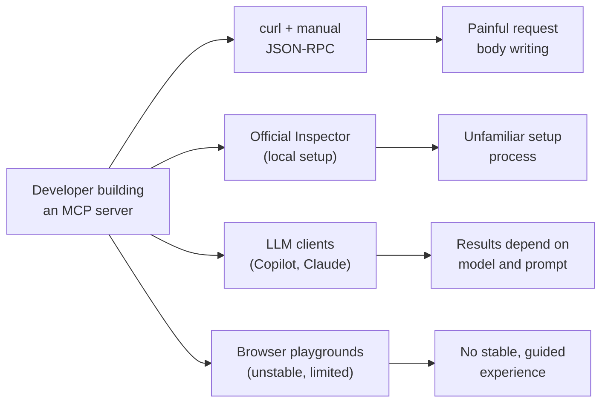
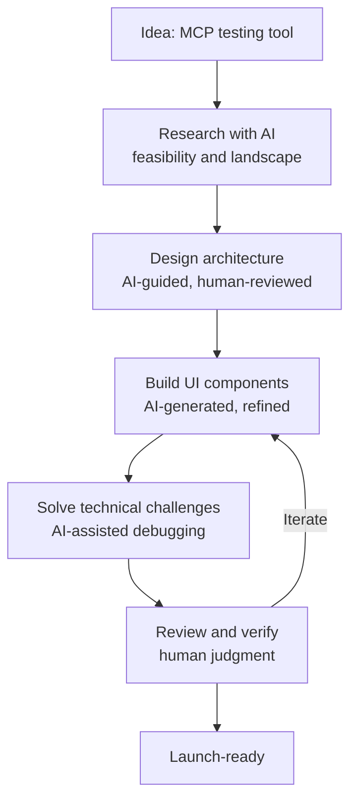

# I Built a Postman for MCP Servers. Here's the Story.

It started in a Jaseci weekly sync. We were discussing the jac-mcp server when brought up the idea of an MCP playground, a place to test MCP servers the way Postman lets you test REST APIs. The idea stuck with me, but it didn't feel real until I ran into the problem myself.

I was connecting the jac-mcp server to GitHub Copilot, trying to understand how tools were being called, what parameters they needed, what results they returned, whether the server was actually behaving the way I expected. The answer was I had no idea. Copilot would call tools based on whatever prompt and model it chose, and I was left guessing. When I started building the jac-shadcn MCP server and needed to test it, I hit the same wall. Testing through an LLM client meant my results depended on the selected model and the prompt I gave it, not on the server itself. That's not testing. That's hoping.

That's when I thought, if I had a Postman-style tool where I could connect to any MCP server, see its tools, fill in the parameters myself, and hit execute, I could actually see what my server was doing. So I went looking for one.

<!-- more -->

## The Problem Isn't That Tools Don't Exist

I searched. Tools exist. But every option I tried felt like a partial solution.

I started with `curl`. That lasted a while. MCP uses JSON-RPC, which means every request needs a carefully structured body with the right fields in the right format. If the server requires authentication, it gets worse. I found myself digging into codebases just to figure out what to put in the request. It works technically. It's also one of the least productive ways to spend time.

I looked at the official MCP Inspector. The setup process wasn't intuitive for me. `npx` commands and local Node.js configuration that I wasn't familiar with. I couldn't get comfortable with it fast enough to make it useful for my workflow.

Other browser-based playgrounds I found were either unstable, didn't support locally running MCP servers, or required spinning up yet another local project just to test. None of them gave me what I actually wanted, which was to open a browser tab, paste a URL, connect, and start testing. The way Postman felt the first time I used it for REST APIs.



What I wanted was a single, stable, browser-first tool built specifically for MCP. Not adapted from REST tooling. Not dependent on an LLM's interpretation. Not requiring a local Node.js setup. It didn't exist the way I needed it to, so I decided to build it.

## What I Built

MCP ProtoLab is an interactive playground for the Model Context Protocol. Connect to any MCP server, explore its capabilities, execute tools, invoke prompts, browse resources, all from the browser.


The core experience is a three-panel workspace. The left sidebar lists your connected servers. The center panel lets you browse and search through tools, prompts, and resources. The right panel shows a real-time log of every request and response with timing data, status indicators, and full payload inspection.


When you select a tool, MCP ProtoLab reads its schema and auto-generates a form with the right input fields. Fill them in, hit execute, and see the raw response immediately. No guessing what the LLM decided to send. You control exactly what goes to the server.


There is also a built-in registry of official MCP servers. Browse by transport type, search by name, and connect with one click.

| Capability | What it does |
|---|---|
| Multi-server connections | Connect to multiple MCP servers simultaneously |
| Tool execution | Auto-generated forms, direct execution |
| Prompt invocation | Fill arguments, invoke prompts, inspect results |
| Resource browsing | Browse resources with MIME type detection |
| Request history | Real-time logs with timing, status badges, full JSON payloads |
| Server registry | Pre-configured list of official MCP servers, one-click connect |
| Auth support | Bearer token, API key, Basic auth |
| Dual transport | Streamable HTTP and SSE |

## The Build Story

**Investigating before building**

I didn't start coding immediately. I spent more time on research than I expected, understanding how MCP server testing works, what tools already existed, and whether building a browser-based testing platform was actually feasible. I used AI extensively for that investigation. I debated architecture decisions with ChatGPT and Claude, asked them to challenge my approach, and used them to map out the technical landscape. After reviewing what AI suggested, I verified facts by browsing documentation and existing projects myself. That research phase gave me the confidence that the gap was real and the approach was worth pursuing.

**Why I chose Jac**

I had been working with Jac and had built projects using jac-client before. What made Jac the obvious choice for MCP ProtoLab is that I could build the entire application in one language. Frontend components, backend proxy, routing, state management, all in Jac. No switching between JavaScript and Python. No separate frontend and backend repos with their own configurations. One `jac.toml` file covers everything.

This matters more than it sounds. When I am debugging a request flow from a button click all the way through the backend and out to the MCP server, I am reading one language the whole time. I understand the full picture without any mental translation. And when working with AI to generate or refactor code, the single-language context means the suggestions stay consistent across the stack.

```jac
def:pub mcp_proxy(
    url: str,
    body: dict = {},
    headers: dict = {},
    transport: str = "streamable-http"
) -> dict;
```

A typical full-stack project comes with `package.json`, `tsconfig.json`, `vite.config.ts`, `requirements.txt`, and a pile of other config files. MCP ProtoLab has `jac.toml`. Dependencies, build config, deployment settings, PWA metadata, all in one place. Less configuration means less friction, and less friction means faster iteration.

**Building with AI as a collaborator**

AI was not just a code generator for this project. It was more like a design partner that I kept interrogating.

For the initial design, I guided Claude through the requirements, described what I wanted, challenged its proposals, and iterated until the architecture felt right. Then I reviewed the output and cross-checked the facts by reading documentation myself.

For the UI, AI was genuinely fast. I had reference designs in mind, the Postman layout, the dark-themed developer tool aesthetic. I described these and AI generated components that were close to what I had in my head. Where a UI component might have taken me hours of CSS trial and error, AI got me most of the way there in minutes. I refined the rest.

For technical problems, AI often surprised me with clean, direct solutions. When I was working through the CORS challenge, we debated approaches and landed on something elegant. Rather than fight the browser's restrictions, the Jac backend acts as a relay, forwarding requests to the MCP server and passing the response back. The browser only ever talks to the backend. AI suggested this quickly and it held up.

But I reviewed everything, especially the backend logic. AI accelerated the build. The judgment calls were still mine.



**Technical challenges**

The hardest problem was CORS. Browsers block requests made to arbitrary external URLs, which means a browser-based tool cannot talk directly to an MCP server hosted somewhere else. The fix was building a proxy into the Jac backend. Every request from the browser goes to the backend first, the backend forwards it to the MCP server, and the response comes back through the same path. Simple idea, and it worked cleanly.

The forms were a satisfying problem to solve. Each MCP tool describes its parameters in a standard schema format. MCP ProtoLab reads that schema and builds the right input fields automatically, text inputs for strings, number fields, toggle switches for booleans, and even a full code editor when it detects the parameter is code. No manual configuration needed.

**How it came together quickly**

From idea to something launch-ready took about a week. But more of that time went into research and design than into actual coding. Understanding the landscape, checking feasibility, and finalizing the architecture before writing a line of code made the build phase move fast.

The Jaseci team helped throughout. They shared ideas, pointed me to resources, and gave feedback that made the project sharper than what I would have built on my own.

## What's Next

MCP ProtoLab today is the initial release, a solid foundation to build on. There is more coming.

**Coming Soon**

| Feature | What it enables |
|---|---|
| LLM agent integration | Test MCP servers with real AI model calls and see how an actual LLM interacts with your tools |
| Saved collections | Persist connections and parameter presets across sessions |
| Desktop agent | Connect to localhost and stdio MCP servers directly from the browser |

**On the Horizon**

| Feature | What it enables |
|---|---|
| Desktop app | Native application for offline-first, zero-CORS testing |
| Request history diffing | Compare responses across runs to catch regressions |
| Protocol compliance scorecard | One-click validation of your server against the MCP spec |
| OAuth 2.1 flow support | Visual auth flow testing for remote MCP servers |

This is an open source project. The initial release is the starting point, not the finish line. If any of these features interest you, or if you have ideas I have not thought of, contributions are welcome.

**Try MCP ProtoLab:** [jac-mcp-playground.jaseci.org](https://jac-mcp-playground.jaseci.org/)

**GitHub:** [github.com/jaseci-labs/jac-mcp-playground](https://github.com/jaseci-labs/jac-mcp-playground)

Pick an issue, open a PR, or just try it and tell me what is missing. The goal is to build the MCP testing tool that developers actually want to use.
