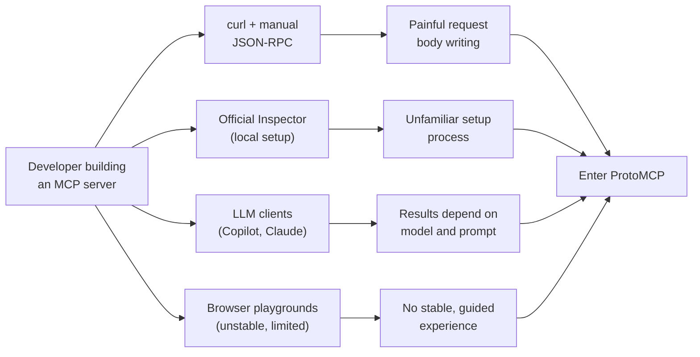
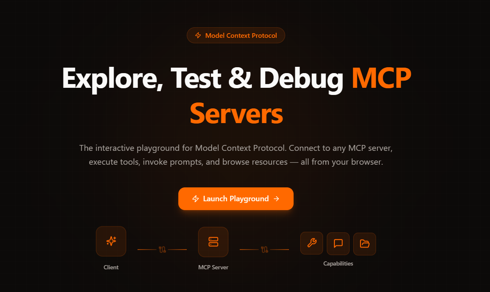
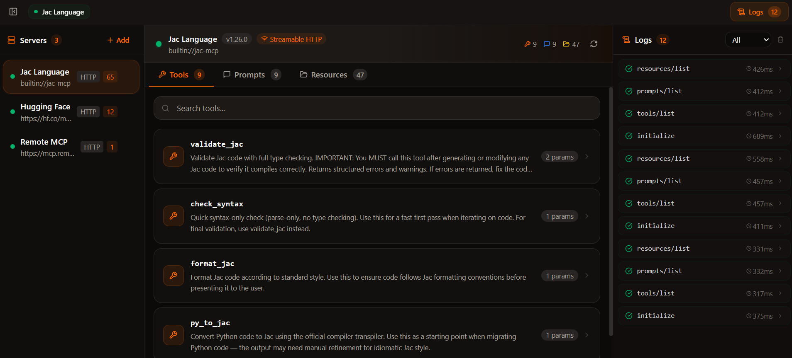
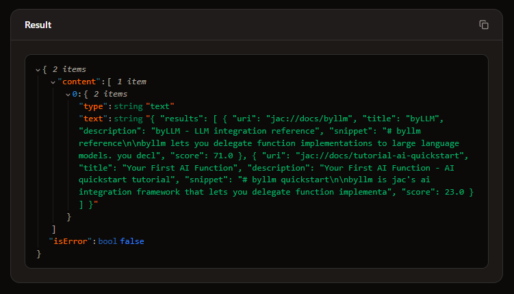

# I Built a Postman for MCP Servers. Here's the Story.

It started in a Jaseci weekly sync. We were discussing the jac-mcp server when someone brought up the idea of an MCP playground — a place to test MCP servers the way Postman lets you test REST APIs. The idea stuck with me, but it didn't feel real until I ran into the problem myself.

I was connecting jac-mcp to GitHub Copilot, trying to understand how tools were being called and what they returned. The answer was: I had no idea. Copilot called tools based on whatever prompt and model it chose, and I was left guessing.

When I started building the jac-shadcn MCP server, I hit the same wall. Testing through an LLM client meant my results depended on the model and prompt, not the server itself. That's not testing. That's hoping.

<!-- more -->

I went looking for a better way. What I found was:
- curl and hand-written JSON-RPC
- MCP Inspector (powerful, but rough)
- Browser playgrounds (unstable, limited)

That's when I realized: if I wanted a Postman for MCP, I'd have to build it.

So I built **[ProtoMCP](https://protomcp.io/)**.



| Tool Type            | Example Tool   | Local MCP Servers                                  | Browser UI                                        | Auth Support                    | Request / Message Inspection                 | MCP-Aware |
| -------------------- | -------------- | -------------------------------------------------- | ------------------------------------------------- | ------------------------------- | -------------------------------------------- | --------- |
| CLI HTTP Client      | Curl           | ✅                                                  | ❌                                                 | ✅                               | Raw (verbose / trace output)                 | ❌         |
| MCP Debugging Tool   | MCP Inspector  | ✅                                                  | Partial (UI runs in browser but launched locally) | ✅                               | Basic (tool calls, payloads, logs)           | ✅         |
| API Testing Platform | Postman        | ✅                                                  | ✅                                                 | Strong (tokens, OAuth, headers) | Strong (request/response inspector, history) | ❌         |
| API Testing Platform | Insomnia       | ✅                                                  | ❌ (desktop app)                                   | Strong                          | Strong                                       | ❌         |
| Web MCP Playground   | MCP Playground | Mixed (often requires hosted endpoints or proxies) | ✅                                                 | Varies                          | Minimal–Moderate                             | Partial   |


None of them gave me everything I needed.

## What I Wanted Instead

I didn’t want another CLI.

I didn’t want another JSON editor.

What I wanted was something that felt like Postman for MCP — a place where you could connect to a server instantly, see all available tools, run them without writing JSON, inspect requests and responses, and debug everything visually.

Basically:

*A proper developer UI for MCP.*

## Introducing ProtoMCP

After a few late nights of debugging MCP servers, I realized the tool I wanted didn't exist.

So I built ProtoMCP, a browser-based playground for connecting to MCP servers and seeing everything they expose without writing JSON.



Once connected, ProtoMCP automatically discovers tools, prompts, and resources. Each tool generates an interactive form from its schema, so you can run it instantly. No scripts, no curl commands, no guessing the payload format.



There's also a built-in registry of official MCP servers. Browse by transport type, search by name, and connect with one click.




| Capability | What it does |
|---|---|
| Multi-server connections | Connect to multiple MCP servers simultaneously |
| Tool execution | Auto-generated forms, direct execution |
| Prompt invocation | Fill arguments, invoke prompts, inspect results |
| Resource browsing | Browse resources with MIME type detection |
| Request history | Real-time logs with timing, status badges, full JSON payloads |
| Server registry | Pre-configured list of official MCP servers, one-click connect |
| Auth support | Bearer token, API key, Basic auth |
| Dual transport | Streamable HTTP and SSE |

## What Using ProtoMCP Actually Feels Like

The workflow becomes dramatically simpler.

1. Connect to a server
2. Explore everything the server exposes
3. Run tools without writing JSON
4. Inspect every request and response

One of the most useful parts of ProtoMCP is something simple:

**transparent request logging.**

Every request the UI sends is visible.

So when something fails, you can instantly see the exact JSON-RPC request, the server response, whether streaming broke, and how long execution took.

That visibility completely changes the debugging process.
Instead of guessing what's wrong, you can actually see it.

## Built Entirely in Jac

Another interesting part of this project is how it was built.

ProtoMCP is written entirely in Jac, the full-stack language from the Jaseci ecosystem. The same language powers the frontend UI, backend logic, and MCP transport handling. In practice this removed an entire layer of complexity — there's no separate React frontend, Python backend, or API glue layer. Everything lives in one coherent system.

This matters more than it sounds. When I'm debugging a request flow from a button click all the way through the backend and out to the MCP server, I'm reading one language the whole time. I understand the full picture without any mental translation.

A typical full-stack project comes with `package.json`, `tsconfig.json`, `vite.config.ts`, `requirements.txt`, and a pile of other config files. ProtoMCP has `jac.toml`. Dependencies, build config, deployment settings — all in one place. Less configuration means less friction.

```jac
def:pub mcp_proxy(
    url: str,
    body: dict = {},
    headers: dict = {},
    transport: str = "streamable-http"
) -> dict;
```

For this project, UI components are written in Jac, backend proxy walkers handle CORS and sessions, and MCP transport logic runs directly in the runtime. It made building the whole playground much faster than expected.

## Building with AI as a Collaborator

AI was more than a code generator for this project — it was like a design partner that I kept interrogating.

For the initial design, I guided Claude through the requirements, described what I wanted, challenged its proposals, and iterated until the architecture felt right. For the UI, I had reference designs in mind - the Postman layout, the dark-themed developer tool aesthetic, and AI generated components that were close to what I had in mind. Where a UI component might have taken me hours of CSS trial and error, AI got me most of the way there in minutes.

For technical problems, AI often surprised me with clean, direct solutions. When I was working through the CORS challenge, we debated approaches and landed on something elegant. Rather than fight the browser's restrictions, the Jac backend acts as a relay, forwarding requests to the MCP server and passing the response back. The browser only ever talks to the backend.

But I reviewed everything, especially the backend logic. AI accelerated the build. The judgment calls were still mine.

## The Hardest Problem: CORS

The trickiest technical challenge was CORS. Browsers block requests made to arbitrary external URLs, which means a browser-based tool cannot talk directly to an MCP server hosted somewhere else.

The solution was building a proxy into the Jac backend. Every request from the browser goes to the backend first, the backend forwards it to the MCP server, and the response comes back through the same path. Simple idea, and it worked cleanly.

## What's Next

ProtoMCP today is a solid foundation, but there's more coming.

**Coming Soon**

| Feature | What it enables |
|---|---|
| LLM agent integration | Test MCP servers with real AI model calls and see how an actual LLM interacts with your tools |
| Saved collections | Persist connections and parameter presets across sessions |
| Desktop agent | Connect to localhost and stdio MCP servers directly from the browser |

**On the Horizon**

| Feature | What it enables |
|---|---|
| Desktop app | Native application for offline-first, zero-CORS testing |
| Request history diffing | Compare responses across runs to catch regressions |
| Protocol compliance scorecard | One-click validation of your server against the MCP spec |
| OAuth 2.1 flow support | Visual auth flow testing for remote MCP servers |

## Try It Yourself

ProtoMCP is fully open source. Explore it live, or run your own instance.

**[protomcp.io](https://protomcp.io/)**

**[GitHub repository](https://github.com/SahanUday/ProtoMCP)**

This is the starting point, not the finish line. Pick an issue, open a PR, or just try it and tell me what's missing. The goal is to build the MCP testing tool that developers actually want to use.
