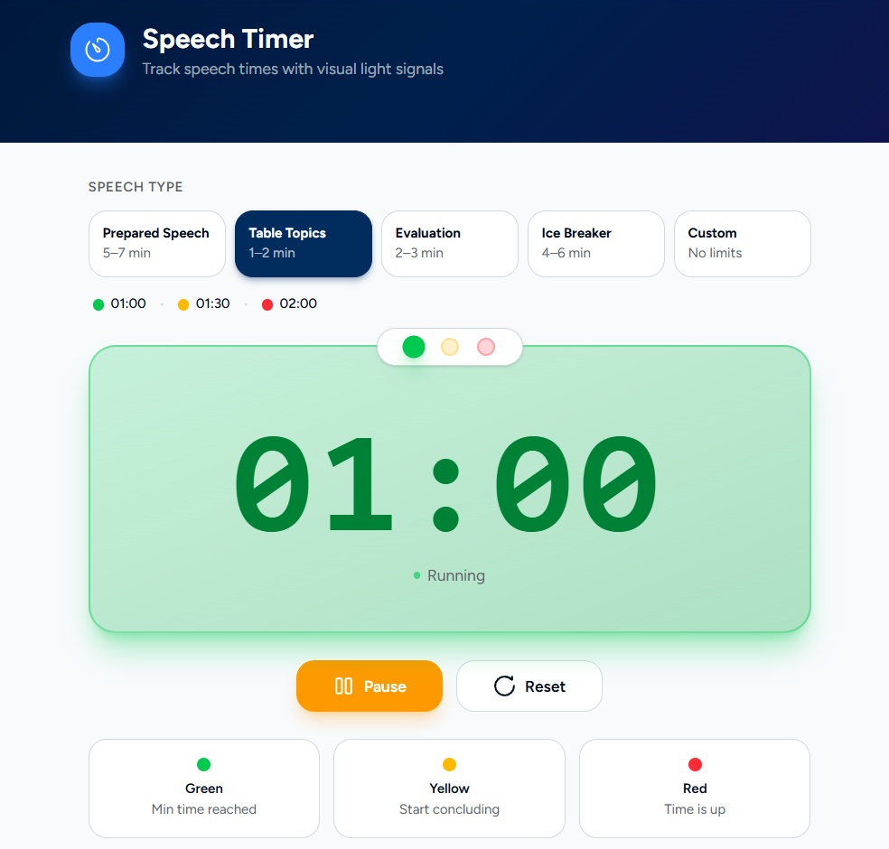
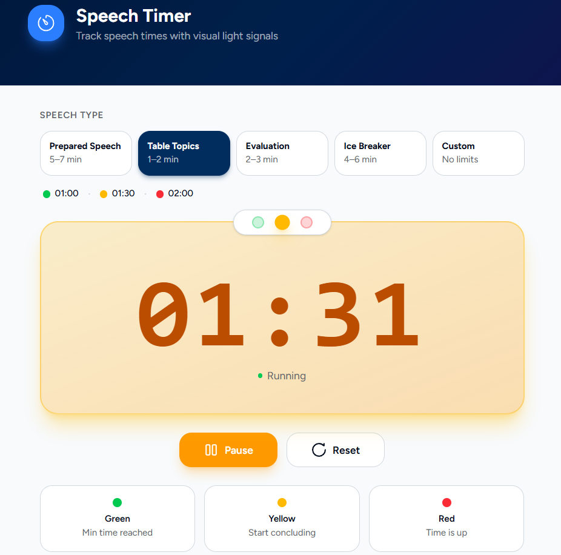
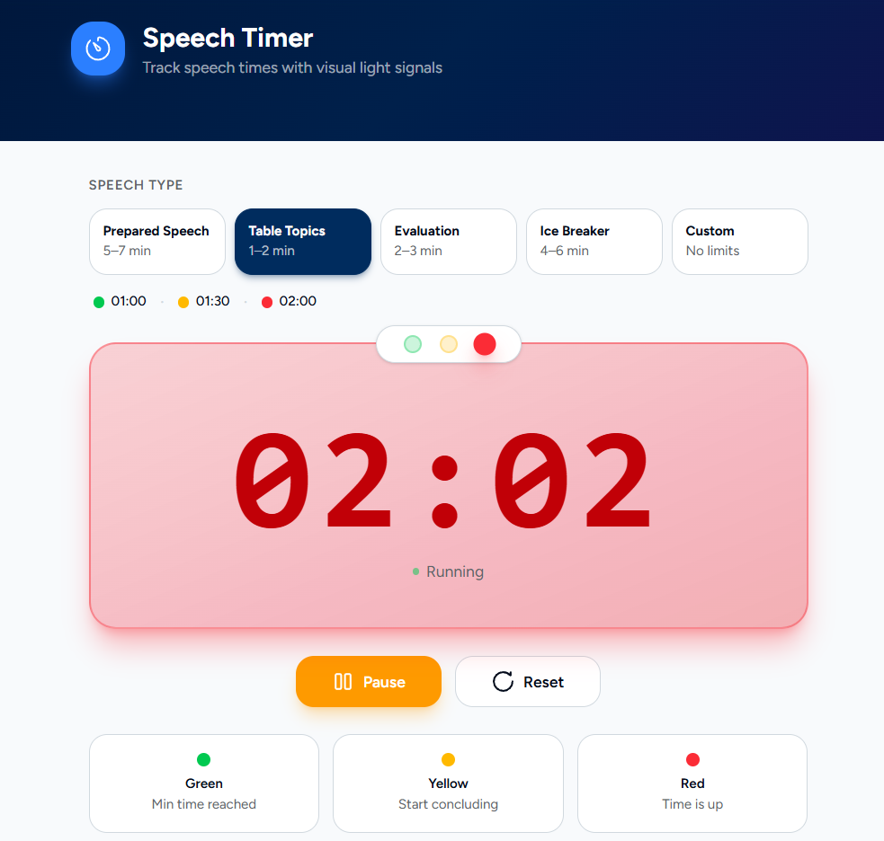
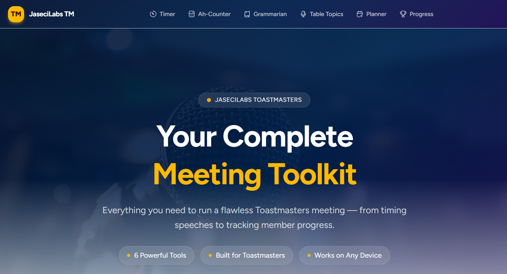

# No Time to Code. So I Described My App and It Built Itself.

It started, like most developer ideas, with a problem I wasn't supposed to solve.

Our Toastmasters club at JaseciLabs runs on paper. Multiple roles, each with their own tracking method, each managing their own notes through a live meeting. I noticed it and my brain immediately translated it into code. Then my calendar reminded me that I had a full plate. Studies, work at JaseciLabs, and a growing list of commitments that were already stretching my evenings.

So I almost let it go.

Then I remembered what I'd learned from building [ProtoMCP](https://blogs.jaseci.org/blog/posts/building-protomcp).

<!-- more -->

## The Pain Every Developer Knows

Here's the honest cost of a typical fullstack app built from scratch.

You need a frontend framework and a backend framework. Two separate languages, or at least two different runtimes. You need an API layer connecting them: endpoints, serialization, error handling across your own network boundary. You need configuration files for the frontend build tool, the backend server, the package managers for each side, and the deployment pipeline. Before you write a single line of product logic, you've already spent hours on scaffolding and made a dozen architectural decisions that have nothing to do with the actual problem you're solving.

This isn't a complaint about any specific tool. It's just what fullstack development has always asked of us.

But it means every idea that needs a real app behind it comes with a tax. Sometimes that tax is worth paying. But it's always there.

## The Tax I'd Stopped Paying

Jac is a programming language built on the premise that this tax doesn't have to exist.

With Jac and the Jaseci stack, you write the frontend and the backend in the same language. Not two files that happen to share a type definition, but one coherent project where both layers speak the same language natively. Because of that, the API glue layer between them simply doesn't need to exist. There's no serialization boundary to manage because there's no boundary to cross.

When I built ProtoMCP entirely in Jac, I felt this directly. No context switching between languages. No debugging a mismatch between what the frontend sent and what the backend expected. I could follow the full flow from a button click all the way through the backend and back, reading one language the entire time.

That's not a minor convenience. It's a fundamentally different way to think about building software.

## A Different Kind of App Builder

I've seen AI app generators before. Most of them do the same thing: take a prompt, output a React frontend and a Node or Python backend. You still end up with two languages, an API layer, two separate configurations, and all the friction that comes with them. The AI just writes the boilerplate faster. The architecture is the same.

jacBuilder is different at its foundation.

Because jacBuilder generates Jac applications, everything it creates is fullstack from a single language. When you give jacBuilder a prompt, you don't get a frontend project and a backend project that need to be wired together. You get one coherent Jac application that handles the full stack. The AI isn't just faster at filling in the old template. It's generating a different architecture entirely.

That distinction matters more than it sounds.

## I Didn't Even Know What to Build

I went to [jac-builder.jaseci.org](https://jac-builder.jaseci.org) with a problem but no clear picture of what the app should actually look like.

I'd never built anything for a club meeting before. I knew the roles existed but I didn't know what each of them actually needed in terms of tooling. So I opened jacBuilder's AI, described the whole situation, and asked what a proper tool for this would look like.

It came back with a detailed breakdown. Role-specific tools. A timer with visual color signals for speech zones. A filler word tracker per speaker. A vocabulary tracking system. A meeting planner with scheduling and role assignments. A member progress tracker across speech levels.

It had thought through the problem more completely than I had. I read through everything and found myself nodding. So I said: go build it.

## Then It Built

jacBuilder's agent started generating. A project structure appeared. Components formed. A full navigation bar, dedicated tools for each role, and a complete UI layout took shape.

I watched it work. I didn't touch a single file.

## The First Preview

When the live preview loaded, I clicked over to the Timer and hit start.

The display counted up. At one minute, the entire card turned green. At the target time, yellow. When the maximum was reached, red.

This wasn't a skeleton with stub functions. The logic was correct. The color zones were working properly. In a live preview. In an app I had not written.

That was the moment I understood what jacBuilder actually was.

## What Came Out

The app came out with seven tools on a clean navigation bar. A dashboard, a timer with the color zone system, an Ah-Counter for tracking filler words per speaker, a Grammarian tool with vocabulary tracking and grammar notes, a Table Topics tracker, a meeting planner for scheduling and role assignments, and a member progress tracker.

| Tool | What it does |
|---|---|
| Dashboard | Central view of all tools and meeting role descriptions |
| Timer | Speech timer with green, yellow, and red color zone feedback |
| Ah-Counter | Filler word tracker per speaker with a full meeting summary report |
| Grammarian | Vocabulary tracking, per-speaker usage counts, and colour-coded grammar notes |
| Table Topics | Speaker queue with integrated per-speaker timer |
| Meeting Planner | Member management, meeting scheduling, and role assignment grid |
| Member Progress | Pathways speech tracker with individual member detail views |

Nothing was placeholder. Everything worked on the first preview.

## One Language. No Boundaries.

After pushing to GitHub, I looked at the repository breakdown: 98.3% Jac.

No separate React project. No Python backend running alongside it. No API layer sitting between the frontend and the logic, because in a Jac application there isn't one. The Jaseci stack handles the full picture through a single language, and jacBuilder generates exactly that.

Most AI app generators give you velocity inside the same old architecture. jacBuilder generates a different architecture. One where the frontend and backend aren't two systems that need to agree with each other over a network boundary. They're the same system.

That's what "one language, fullstack" means when you see it in practice. Not a marketing phrase. An actual missing layer.

## One Click to GitHub

Once I was happy with the app, I connected my GitHub account inside jacBuilder and hit "Push to new repo."

Named it. One click. Done.

The repository was live at [github.com/SahanUday/toastmaster-app](https://github.com/SahanUday/toastmaster-app) in under a minute. Real source files, clean commit history, ready to share or extend.

## What the Clock Actually Said

I want to be upfront about this, because the number sounds exaggerated.

From the moment I started describing the problem to jacBuilder's AI, to the moment the app was live on GitHub: under one hour.

Not "under an hour if you skip the thinking." Total elapsed time. Problem description to working multi-tool app to GitHub repository.

For context: I've spent longer than that just setting up the scaffolding for a typical project before writing any real feature. The time saving here isn't just about the AI writing faster. It's about generating an architecture that has less to build in the first place.

The Jaseci stack means no API layer. jacBuilder means no boilerplate. Together, the distance between "I have an idea" and "the app is running" gets dramatically shorter.

## Try It

The generator is at [jac-builder.jaseci.org](https://jac-builder.jaseci.org).

I described a problem. Got a working app. Pushed it to GitHub. All before I ran out of time to think about it.

That's what the stack actually delivers when you see it in action.
