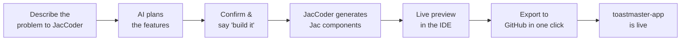

# No Time to Code. So I Described My App and It Built Itself.

Every Toastmasters meeting at JaseciLabs follows the same ritual. The Timer pulls out a tracking sheet. The Ah-Counter writes names in a notebook. The Grammarian has their own notepad. The Table Topics Master has a list. The Meeting Planner has a separate document. The General Evaluator holds all of this together in their head.

It's organized chaos, held together by paper and memory.

I noticed this a few months into our club. I'm a developer — when I see a system that runs on manual tracking and scattered notes, my first thought is always: *this is a software problem*.

My second thought was: *I don't have time for this.*

<!-- more -->

I'm working at JaseciLabs, studying, and already have more than enough going on. A new full-stack app from scratch means setting up a frontend, wiring a backend, defining an API layer, and all the config that comes with it. That's weeks of evenings, not an afternoon.

But then I remembered what I'd already learned from building [ProtoMCP](https://blogs.jaseci.org/blog/building-protomcp/).

## The One-Language Advantage I Already Knew

When I built ProtoMCP, I wrote the whole thing in Jac — frontend, backend, transport layer, everything. No separate React app. No Python service running alongside it. No REST calls stitching the two halves together. The Jaseci stack collapses the full-stack into a single coherent system through **jac-client** for the frontend layer and the rest of the Jaseci ecosystem for everything else.

That experience changed how I think about app development. The overhead I used to take for granted — config files, package managers for each layer, mental context-switching between languages — just wasn't there anymore.

So when I thought about building a Toastmasters app, Jac was the obvious choice. The time problem, though, was still real.

## Enter jacBuilder

jacBuilder is the Jaseci team's answer to that problem. Think Lovable or v0 — describe what you want, and it generates the app. The difference is what it generates: not a React + Node project, but a full-stack Jac application. One language, all the way down.

I went to [jac-builder.jaseci.org](https://jac-builder.jaseci.org), but I didn't immediately start prompting "build me a Toastmasters app." That felt like asking someone to write a book by handing them a one-line title.

Instead, I started a conversation.

## The Conversation Before the Build

jacBuilder has an AI chat called JacCoder built into the IDE. I used it before asking it to build anything.

I explained the problem: our Toastmasters club, the roles, the scattered paper trail, what I wanted to solve. Then I asked: *what kind of app should I be building here? What features actually make sense for a TM meeting?*

JacCoder came back with a full breakdown. Role-specific tools for each meeting role. A timer with visual color zones for speech timing. An Ah-Counter that tracks filler words per speaker. A Grammarian tool with a Word of the Day. Table Topics tracking with per-speaker timing. A meeting planner for scheduling and role assignments. A member progress tracker across Pathways levels.

I read through it. It was exactly right — better than what I'd sketched in my head. So I told it to go ahead and build it.

## Watching It Build

The IDE's ActivityTimeline showed what JacCoder was doing step by step. Files appeared in the sidebar. Components formed. The file tree grew from nothing into a structured Jac project — frontend components, a global CSS file, utility functions, all wired together in `.cl.jac` files.



I didn't touch a single file.

## The Moment It Clicked

When the preview loaded, I clicked over to the Timer. Hit start. Watched the MM:SS display count up.

At one minute, the background turned green.

At the target time, yellow.

At the maximum, red — with glowing indicator circles along the bottom.

That's when I stopped and stared. This wasn't a scaffold with placeholder logic. The timer color zones were working correctly, in real time, in the live preview, in an app I hadn't written a single line of.

That was the moment I understood what jacBuilder actually was.

## What Got Built

The app ended up with 7 tools accessible from a sticky navigation bar:

| Tool | What it does |
|---|---|
| Dashboard | Overview of all tools, meeting roles reference |
| Timer | Speech timer with green / yellow / red color zone feedback |
| Ah-Counter | Track 9 filler words per speaker; meeting report with highlights |
| Grammarian | Word of the Day tracker, per-speaker usage, colour-coded grammar notes |
| Table Topics | Speaker queue with integrated per-speaker timer |
| Meeting Planner | Member management, meeting scheduling, role assignment |
| Member Progress | 15-speech Pathways tracker with per-member detail view |

Every role in a Toastmasters meeting now has a dedicated tool. No paper required.

## The Jac Reality Check

After exporting, I actually looked at the code. The stats from GitHub: **98.3% Jac, 1.7% CSS**.

```jac
import from .frontend { app as ClientApp }

pub fn app() -> Any {
    return <ClientApp />;
}
```

That's the entire entry point. Every component — navigation, state management, UI rendering, event handlers, timers — lives in `.cl.jac` files. There's no separate React app, no Python backend, no API layer between the frontend and the logic. **jac-client** handles the client layer; everything speaks Jac.

When I built ProtoMCP by hand, I appreciated this because I felt it directly — one language, one mental model, no translation overhead. With jacBuilder, I got the same result without writing it. The stack did what the stack does: collapse the complexity.

## GitHub in One Click

When I was satisfied with the app, I connected my GitHub account in jacBuilder's Git panel and clicked "Push to new repo."

Named it. Clicked go. Done.

[github.com/SahanUday/toastmaster-app](https://github.com/SahanUday/toastmaster-app) was live in under a minute. A real repository with real Jac source files, clean history, ready to clone or contribute to.

## Total Time: Under an Hour

That's the part that still surprises me when I say it out loud.

I went from "I noticed a problem at our TM meeting" to "the app is on GitHub" in under an hour. No boilerplate setup. No package manager headaches. No figuring out how to connect a frontend to a backend. Just: describe the problem, confirm the plan, let it build, watch the preview, push to GitHub.

For comparison, setting up the scaffolding for a typical full-stack project — before writing a single feature — usually takes longer than that.

## What's Coming

This is a strong start, but it's not the full picture of what the Jaseci stack can do.

The app currently manages meetings in-session. What I'm planning next:

- **A chatbot, powered by byLLM** — Jac's AI-native function delegation. Instead of manually calling an LLM API, you declare a function's purpose and `byLLM` handles the prompting and response. A smart club assistant that can answer questions and summarize meeting data.
- **Persistent data, powered by jac-scale** — so member progress, meeting history, and role assignments survive across sessions. jac-scale generates REST endpoints from Jac walkers automatically — no separate backend service to build or deploy.

When those go in, I'll update this post. What's already there — the one-language fullstack, the no-API architecture, the complete role toolkit — that part is live and running.

The Jaseci stack's real promise isn't just that it's fast to build with. It's that as you add capabilities — AI, scaling, persistence — you stay in one language the whole time. That's what I wanted to show here, and we're only partway through.

---

**Try the app:** [github.com/SahanUday/toastmaster-app](https://github.com/SahanUday/toastmaster-app)

**Try jacBuilder:** [jac-builder.jaseci.org](https://jac-builder.jaseci.org)
