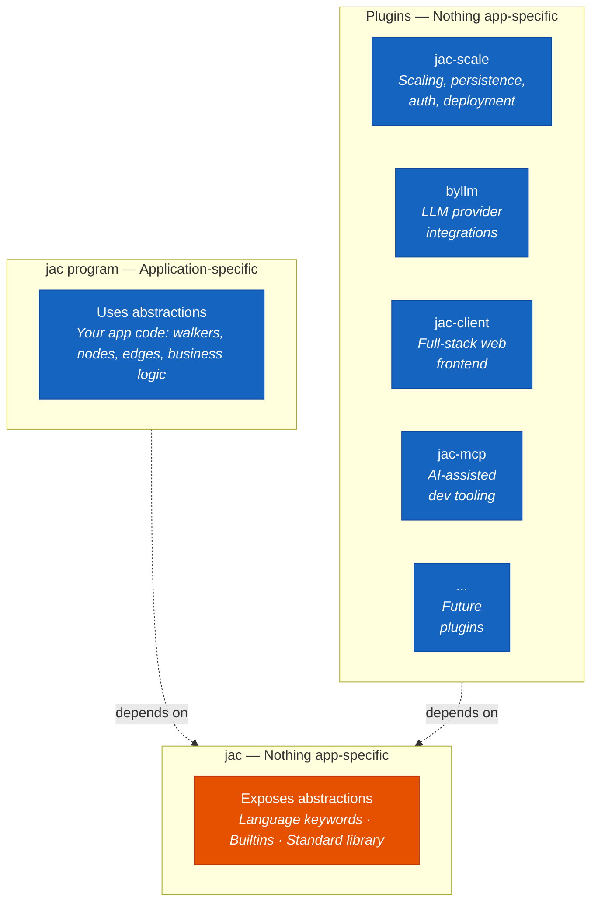
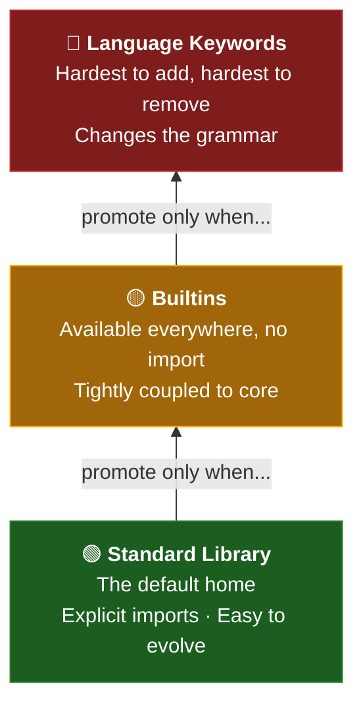
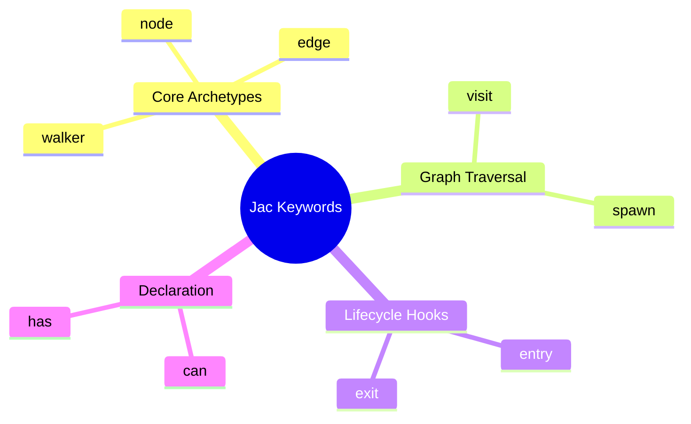
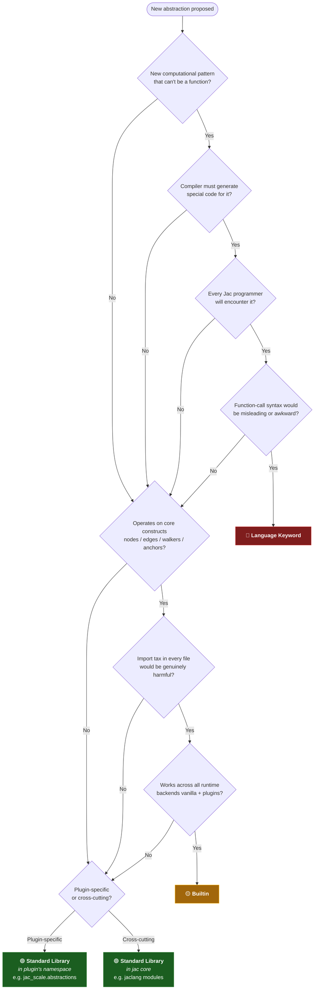

# Where Does This Abstraction Belong? A Contributor's Guide to Extending Jac

Every programming language faces the same inevitable question as it grows: *where should this new thing live?*

In Jac, this question has real architectural teeth. We don't have a single flat namespace where everything gets dumped. We have a deliberate three-layer abstraction hierarchy, and every new capability we introduce must land in exactly the right layer — or the whole design philosophy starts to erode.

This post is a deep guide for contributors to the Jaseci codebase. If you're adding a new feature to Jac, this is the framework for deciding where it belongs.

<!-- more -->

## The Three Layers

Jac's architecture is built as a stack of three distinct layers, each with a clear role:



The **top layer** is user code — the applications people build with Jac. It consumes abstractions but doesn't define them. The **middle layer** is the Jac language and runtime itself — it *defines and exposes* the abstractions that make Jac what it is. The **bottom layer** is the plugin ecosystem — packages like `jac-scale` (scaling and persistence), `byllm` (LLM integrations), `jac-client` (full-stack web), and `jac-mcp` (AI dev tooling) that provide implementations and capabilities without changing the core language semantics. All plugins register via `[project.entry-points."jac"]` and can override runtime behavior, but they never alter what keywords or builtins exist.

Notice the critical property: the two lower layers are both labeled "nothing app-specific." This means no business logic leaks into the platform layers. And the top and bottom layers are *independent of each other* — a Jac program runs identically whether `jac-scale` is installed or not.

Across the middle and bottom layers, the abstractions available to Jac programmers subdivide into three categories:

1. **Language-level keywords** — `walker`, `node`, `edge`, `can`, `has`, `spawn`, `visit`, `entry`, `exit`
2. **Builtins** — `jid()`, `jobj()`, `grant()`, `revoke()`, `allroots()`, `save()`, `commit()`, `printgraph()`
3. **Standard library** — importable modules that require explicit `import from`, provided by `jac` core *and* the standard ecosystem plugins (`byllm`, `jac-scale`, `jac-client`, `jac-mcp`, etc.)

That third category is important to understand correctly. The standard library isn't confined to the `jac` package — it spans the entire standard Jaseci ecosystem. When you `import from byllm.lib { Model }` or `import from jac_scale.abstractions { DatabaseProvider }`, you're importing from the standard library. These plugins are distributed as separate packages, but they're part of the official platform. The defining characteristic of a standard library abstraction isn't *which package* it lives in — it's that **it requires an explicit import**.

These three categories aren't arbitrary. Each one has a fundamentally different relationship with the programmer, the compiler, and the runtime. Getting the placement wrong has compounding consequences.

## The Promotion Ladder

Here's the most important mental model for this decision: **think of it as a promotion ladder, not a sorting exercise.**

Everything starts as a standard library candidate. You *promote* to builtin only under specific pressure. You *promote* to keyword only when the concept is architecturally load-bearing.



The gravity should always pull downward. Here's why: a keyword you regret is nearly impossible to remove without breaking the world. A builtin you regret is painful to deprecate. A standard library module you regret is just a deprecation notice and a migration guide. The cost of being wrong increases dramatically as you move up the ladder.

**Rule of thumb:** If the team is debating between keyword and builtin, it's probably a builtin. If debating between builtin and standard library, it's probably standard library.

## Language-Level Keywords: The Highest Bar

Keywords are reserved for things that **change how you think**, not just what you can do.

Look at what's currently in the grammar:



These aren't convenience features. They define the Object-Spatial Programming paradigm itself. Without `walker`, `node`, and `edge`, Jac is just another Python. Without `visit` and `spawn`, graph traversal becomes manual iterator management. These keywords *are* the language's identity.

### When to promote to keyword

A new keyword earns its place when **all** of the following are true:

**1. It introduces a genuinely new computational pattern.**

The concept can't be cleanly expressed as a function call or a library. `walker` isn't just a class with some methods — it's a mobile computation unit that the runtime knows how to schedule across a graph. That semantic can't be faked with a decorator.

Ask: *"If I removed this keyword and replaced it with a function/class, would programs become fundamentally harder to reason about?"*

**2. It needs special compiler support.**

The compiler has to know about it because it affects parsing, type checking, code generation, or runtime semantics. `visit` isn't just "call this function" — it alters the walker's traversal path, which the compiler and runtime cooperate to manage. `has` isn't just "declare a field" — it integrates with the anchor system for persistence and serialization.

Ask: *"Does the compiler need to generate different code for this than it would for a regular function call?"*

**3. Every Jac programmer will encounter it.**

Keywords occupy the most premium real estate in a language — they're reserved words that can't be used as identifiers. If only 5% of programs use a feature, it shouldn't be a keyword. Every entry in `constant.jac`'s keyword list is a word that no Jac programmer can use as a variable name, ever.

Ask: *"Would a beginner encounter this in their first week of writing Jac?"*

**4. It would be misleading or awkward as a function.**

Some things have semantics that function-call syntax actively obscures. `spawn Walker() on root` communicates intent clearly — it's creating a walker and initiating traversal. A hypothetical `create_and_traverse(Walker, root)` hides the fact that this is a fundamentally different operation from a normal function call.

### When NOT to make it a keyword

- "It would be convenient to not need an import" — convenience alone is never sufficient
- "Other languages have this as a keyword" — Jac isn't other languages
- "It's related to graph operations" — being related to the core paradigm doesn't automatically earn keyword status
- "It makes the code shorter" — brevity matters, but not more than a clean grammar

### Real example: why `visit` is a keyword

Consider the alternative world where `visit` is a builtin function:

```jac
# Hypothetical: visit as a builtin
walker Crawler {
    can traverse with `root entry {
        for node in self.nodes() {
            visit(node);  # What does this even mean here?
        }
    }
}
```

This doesn't work. `visit` isn't a function that *does something to* a node — it fundamentally alters the walker's execution path. It's a control flow statement, like `return` or `yield`. The compiler needs to understand it to generate correct traversal code. It *must* be a keyword.

## Builtins: Universal but Operational

Builtins are the companion layer to keywords. They're functions that operate *on* the language's core constructs and are available everywhere without import.

The current builtins in `runtimelib/builtin.jac`:

```jac
jid()         → get the Jac ID of a node/edge/walker
jobj()        → retrieve an object by its JID
grant()       → grant access to an anchor
revoke()      → revoke access from an anchor
allroots()    → get all root nodes
save()        → persist an anchor
commit()      → commit pending changes
store()       → direct storage operations
printgraph()  → visualize the graph structure
```

Notice the pattern: every single one of these operates on anchors, nodes, walkers, or the graph — the things defined by the keywords. They're the *operational interface* to the core abstractions.

### When to promote to builtin

Both of the following must be true:

**1. It needs to be available everywhere without an import.**

The friction of `import from jaclang.runtimelib.builtin { save }` at the top of every file that persists data would be genuinely harmful. When something is used in nearly every program and its absence would be immediately noticed, the import tax matters.

But be careful: "used often" isn't the same as "used everywhere." Plenty of things are common without being universal. HTTP requests are common. String manipulation is common. Neither belongs as a builtin in Jac.

**2. It directly serves the core language abstractions.**

This is the filter that keeps builtins from becoming a dumping ground. `save()` is a builtin because it operates on anchors — a concept defined by the language keywords. `grant()` is a builtin because it operates on the access control system that's intrinsic to how nodes and edges work.

If a function doesn't touch nodes, edges, walkers, anchors, or the graph, it almost certainly doesn't belong as a builtin. General utility functions — no matter how useful — belong in the standard library.

### The implementation swap test

There's a bonus criterion that validates builtin status: **builtins should work identically regardless of which plugins are installed.**

`save()` persists an anchor. On vanilla Jac, that means in-memory storage. With `jac-scale`, it means MongoDB. Similarly, `byllm` overrides the LLM runtime hooks so `by llm` abilities route to the provider of your choice. The caller doesn't know or care about the backend. This is possible because builtins are defined at the `jac` layer but their implementations are provided through `JacRuntimeInterface`, which any plugin can override.

If your proposed builtin wouldn't make sense across different runtime backends, it probably isn't a builtin — it's a plugin-specific function.

## Standard Library: The Default Home

The standard library is where **everything else** goes. This should be the presumed destination for any new abstraction unless there's a compelling argument to promote it.

Crucially, the standard library spans the entire Jaseci ecosystem — it's not just what's inside the `jac` core package. Abstractions in `byllm`, `jac-scale`, `jac-client`, `jac-mcp`, and other official plugins are all part of the standard library. They're distributed as separate packages for modularity, but from a design perspective they share the same category: **import-required abstractions provided by the standard Jaseci platform.**

This means when you're adding a new abstraction to *any* standard ecosystem plugin, you're contributing to the standard library. The same design principles apply whether the code lands in `jac/jaclang/`, `byllm/`, or `jac_scale/`.

The standard library is for:

- **Domain-specific utilities** — LLM interfaces (`byllm`), HTTP clients, file I/O, data processing
- **Platform capabilities** — scaling and persistence (`jac-scale`), full-stack web (`jac-client`), dev tooling (`jac-mcp`)
- **Features with multiple reasonable implementations** — a user might want to swap one library for another
- **Anything where not every program needs it** — if the typical Jac program doesn't use it, it shouldn't be a builtin or keyword
- **Features where explicit imports improve readability** — when you see `import from byllm.lib Model`, you immediately know this file does LLM work; that's a signal that keywords and builtins can't provide

### The surprise test

Ask: *"Would a user be surprised if this required an import?"*

If the answer is no, it's standard library. Period.

Nobody is surprised by `import from http.client { Request }`. They *would* be surprised by `import from jac.core { node }`. That surprise gap is exactly the difference between standard library and keyword/builtin territory.

### Why standard library is the safest choice

1. **Easy to evolve.** You can change APIs, deprecate modules, even remove them with a major version bump. Keywords and builtins are effectively permanent.

2. **Explicit dependencies.** When a file imports a module, you know what it depends on. This makes code review easier, refactoring safer, and the dependency graph visible.

3. **No namespace pollution.** Every builtin and keyword occupies global namespace that can never be reclaimed. Standard library modules are scoped.

4. **Lower review bar.** Adding a standard library module requires careful API design but doesn't require grammar changes, compiler modifications, or runtime interface updates. This means faster iteration.

## The Plugin Rule: Imports Required, No Exceptions

Whether a plugin is part of the standard Jaseci ecosystem or a third-party community contribution, one hard rule applies universally:

**Any new abstraction introduced by a plugin must live in the plugin's own importable namespace and require explicit imports.**

No plugin — standard or otherwise — gets to inject new builtins or keywords. The standard ecosystem plugins (`jac-scale`, `byllm`, `jac-client`, `jac-mcp`) are part of the standard library, but they're still *import-required*. Their abstractions live in their own namespaces:

```jac
import from jac_scale.abstractions { DatabaseProvider }
import from jac_scale.abstractions { DeploymentTarget }
import from byllm.lib { Model }
```

The reasoning is airtight:

**Plugins are modular by design.** Even standard ecosystem plugins aren't guaranteed to be installed in every environment. If a plugin could inject into builtins or keywords, you'd break the contract that a Jac program's core behavior is stable regardless of which plugins are present.

**Explicit imports make dependencies visible.** When you see `import from jac_scale.abstractions DatabaseProvider`, you *know* this code requires `jac-scale`. If it were a magically-appearing builtin, you'd have invisible dependencies — the worst kind of coupling. This applies equally to standard and community plugins.

**The entry-point hook is for implementations, not API surface.** Plugins register via `[project.entry-points."jac"]` in their `pyproject.toml`. This mechanism exists so plugins can *override how existing abstractions work* (like `jac-scale` replacing the execution context with `JScaleExecutionContext` backed by MongoDB, or `byllm` providing LLM runtime hooks). It does **not** exist for plugins to expand the set of builtins or keywords.

The principle: **plugins can override implementations of existing abstractions, but any new abstractions they introduce must live in their own importable namespace.** This is true for `jac-scale`. It's true for `byllm`. And it must be true for any future plugin, whether it ships from Jaseci Labs or from the community.

## Decision Framework

When you're about to introduce a new abstraction, walk through this flowchart:



### Keyword checklist — all must be true

- [ ] It introduces a fundamentally new computational pattern
- [ ] The compiler must generate special code for it
- [ ] Every Jac programmer will encounter it
- [ ] Function-call syntax would be misleading or awkward
- [ ] Removing it from the grammar would make programs fundamentally harder to reason about

### Builtin checklist — all must be true

- [ ] It operates directly on core language constructs (nodes, edges, walkers, anchors, the graph)
- [ ] The import tax in every file would be genuinely harmful
- [ ] It makes sense across all runtime backends (vanilla, jac-scale, future plugins)
- [ ] It's simple enough that a small set of well-known names covers it

### Standard library — the default home

If neither checklist above is fully satisfied, it belongs in the standard library. The remaining question is *where* within the standard library:

- **Plugin-specific?** Put it in that plugin's namespace (e.g. `jac_scale.abstractions`, `byllm.lib`). This is still standard library — just scoped to the plugin that provides it.
- **Cross-cutting?** Put it in `jac` core's importable modules, available to all programs that import it.

Either way: explicit import required, clean module API, good docs.

## Case Studies

Let's apply the framework to some real decisions in the codebase.

### `walker` → Keyword ✅

- New computational pattern? **Yes.** Mobile computation that traverses graphs is Jac's core paradigm shift.
- Compiler support? **Yes.** The compiler generates traversal scheduling, entry/exit hooks, and anchor management.
- Universal? **Yes.** Nearly every Jac program has walkers.
- Awkward as a function? **Yes.** `class MyCrawler(Walker)` loses the declarative intent that `walker MyCrawler` communicates.

Correct placement: keyword.

### `save()` → Builtin ✅

- Available everywhere? **Yes.** Any program that modifies graph state needs persistence.
- Serves core abstractions? **Yes.** It operates on anchors, which are language-level constructs.
- Works across backends? **Yes.** In-memory, SQLite, MongoDB — `save()` means the same thing everywhere.
- Would import surprise users? **Yes.** Having to import a function to persist your own nodes would feel wrong.

Correct placement: builtin.

### `DatabaseProvider` → Standard library (via `jac-scale`) ✅

- Universal? **No.** Only matters if you're deploying with `jac-scale`.
- Serves core abstractions? **No.** It's about infrastructure provisioning, not graph operations.
- Import-required? **Yes.** It lives in `jac_scale.abstractions` and requires explicit import.

Correct placement: standard library, in `jac-scale`'s namespace — `jac_scale.abstractions.DatabaseProvider`. It's part of the standard Jaseci ecosystem, but it requires an import and lives in its plugin's own namespace, exactly as it should.

### Hypothetical: `http.get()` → Standard library

Imagine someone proposes making HTTP requests a builtin because "lots of apps need it."

- Serves core abstractions? **No.** HTTP has nothing to do with nodes, edges, or walkers.
- Import tax harmful? **No.** You import HTTP at the top of files that do HTTP. That's normal.
- Works across backends? **Irrelevant.** This isn't a core abstraction being reimplemented.

Correct placement: standard library module.

### Hypothetical: new graph query syntax → Keyword candidate

Imagine a proposal for a built-in graph query DSL that lets walkers express complex traversal patterns:

- New computational pattern? **Potentially.** If it changes how traversals are expressed at a fundamental level.
- Compiler support? **Likely.** Query optimization would require compiler awareness.
- Universal? **Probably.** Most graph-heavy programs would use it.

This is a *legitimate keyword candidate* — but the burden of proof is high. Start as a standard library, let usage patterns validate demand, then consider promotion.

## The Meta-Principle

Language design is accretive. Things you add are almost impossible to remove. The cost of a premature promotion — whether from stdlib to builtin or from builtin to keyword — is paid by every user of the language for its entire lifetime.

Meanwhile, the cost of starting something in the standard library and promoting it later is... nothing. You add a keyword, keep the import working as an alias during a transition period, and eventually the import becomes unnecessary.

**The asymmetry is massive.** Being conservative about placement costs almost nothing. Being aggressive about it can cost everything.

So when in doubt: standard library. Let the usage patterns speak. Promote when the evidence is overwhelming. And never, ever let a plugin inject into the core namespace.

Build carefully. The abstractions you introduce today are the ones the community lives with forever.
