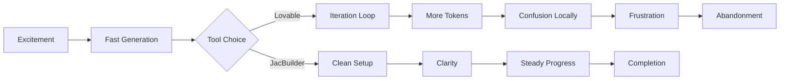
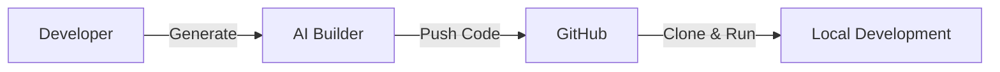

# AI App Builders Feel Fast Until You Try to Continue the Project

AI app builders feel incredibly fast, right up until the moment you try to continue the project yourself.
**That’s where everything starts to fall apart.**

### It Started With Speed

I didn’t start using AI app builders because I needed help coding.

I started because I wanted to move faster.

When I first tried Lovable, it felt like I had found exactly that. I could describe what I wanted, watch a UI appear almost instantly, tweak a few prompts, and within minutes, I had something that looked like a real product.

It didn’t feel like development. It felt like acceleration.

For a while, that was enough.

---

### The First Sign Something Was Off

The moment I tried to take that project further, things started to feel different.

Pushing to GitHub was easy. Cloning it locally was easy too.

But continuing the work was not.

What started as excitement quickly turned into a very different experience:

That flow might look simple. Living through it was not.

This is what the journey actually looked like. The same starting point leads to two very different outcomes. One path drifts into iteration loops, rising token costs, and eventual abandonment. The other stays structured, predictable, and leads to real progress and completion.

I remember opening the project and not knowing where to start.

Not because it was complex, but because it didn’t feel cohesive.

The deeper I went, the more I realized I wasn’t dealing with one system.

I was jumping between multiple languages, different frameworks, and patterns that did not quite align. What looked simple on the surface was hiding a polyglot system underneath.

It was not reducing complexity.
**It was redistributing it.**

---

### When “Simple” Requires More Knowledge

That is when another realization hit me.

To keep moving forward, I needed to understand not just one stack, but several.

Different tools. Different frameworks. Different ways of wiring things together.

The AI had generated the project, but continuing it required **broader knowledge than if I had built it myself from scratch.**

That contradiction was hard to ignore.

---

### When Progress Turns Into Iteration

At first, I thought I just needed to refine things.

So I kept prompting.

Adjusting. Regenerating. Tweaking again.

And again.

Lovable was good at getting to a decent UI, but rarely on the first try. It took multiple iterations to get something usable.

And with every iteration, something else shifted or broke.

What I did not notice immediately was the hidden cost.

Every extra iteration meant more tokens.

More prompts. More fixes. More back and forth.

I was not just spending time.
**I was spending tokens trying to stabilize something that never quite settled.**

At some point, I realized I was no longer building. I was managing the output of the tool. Minutes turned into hours, not because the problem was hard, but because the feedback loop was unpredictable. One prompt would fix the layout but break the logic. Another would clean the UI but introduce new inconsistencies. Each iteration felt like progress in isolation, but taken together, they created drift.

The original idea became harder to recognize, and the time spent trying to fix things started to outweigh the time it would have taken to build them intentionally.

The cost was not just tokens.
**It was attention, momentum, and confidence.**

---

### Losing Ownership of the Code

Eventually, I pushed through and tried to take control locally.

That is where things became even clearer.

The workflow that looked clean on paper:

started breaking down right where it mattered most.

Because once the code left the AI environment, I was not continuing a project.

**I was reverse engineering it.**

Even Git started to feel unfamiliar.

The commit history did not tell a story I could follow. Changes appeared without clear intent. Files existed without obvious purpose.

At one point, I saw a commit that looked like it was made two years ago

in a project I had created just hours earlier.

That is when Git stopped feeling like a tool
**and started feeling like noise.**

---

### The Hidden Risks

Looking closer, the issues were not just structural.

I started noticing hardcoded values in places they should not be. Things that might look harmless at first, but could easily become security problems if left unchecked.

For an experienced developer, that is something you catch.

For a beginner, it is the kind of detail that quietly exposes sensitive information to the internet.

Then came backend integration.

Trying to connect something like Supabase to the generated UI was not straightforward. The interface existed, but the path to making it fully functional was unclear.

That lack of clarity is what makes people stop.

Not because they cannot build, but because they do not know how to continue.

---

### The Breaking Point

At some point, the friction outweighs the excitement.

Progress slows down. Then it stalls.

And eventually, like many promising ideas, it gets abandoned. Not because it lacked potential, but because **the path forward became too unclear.**

And that is the part that hurts the most.

Because these are not just side projects.

They are ideas that could have turned into products, tools, or systems that solve real problems. Things that could have helped people, created opportunities, or even grown into businesses.

Instead, they stop halfway.

Not because the developer lacked skill or vision, but because the tools made continuation harder than starting.

**That is the real cost of broken workflows.**

---

### Trying Again, Differently

At that point, I was not looking for a better UI generator.

I was looking for something I could actually continue building on.

That is when I tried JacBuilder.

I expected more of the same.

But this time, the experience felt different almost immediately.

I cloned the project, opened it, and for the first time in a while, I did not feel stuck.

There was a clear path forward. Create a virtual environment, install the dependencies, and keep building.

No guesswork. No decoding.

Just development.

---

### Noticing What Was Missing Before

At first, I thought it was just better setup.

But the more I worked with it, the more I realized what had been missing all along.

**Everything was already wired together.**

I was not jumping between tools or figuring out how different pieces connected. There was no fragmentation, no scattered configurations slowing me down.

For once, the environment and the code felt aligned.

---

### When the AI Stops Guessing

Then I noticed something else.

The AI output itself felt different.

With templates guiding it, the AI was not guessing anymore.

It had direction.

Instead of generating inconsistent results that required multiple iterations, it produced something structured from the start.

I was not stuck in a loop of prompting and fixing.

I was refining.

And that changed everything.

Because fewer iterations did not just save time. It saved tokens, reduced friction, and made the process predictable.

---

### Full Stack Versus Just UI

The contrast became even clearer over time.

With Lovable, I was mostly working toward getting the UI right, often after several iterations.

With JacBuilder, I was not just getting an interface.

I was getting a full stack starting point that I could actually build on.

And all of it stayed within a single, consistent language and structure.

That consistency removed a level of cognitive overhead I had not realized I was carrying.

---

### What Changed for Me

Somewhere between those two experiences, my expectations shifted.

I stopped caring about how fast something could be generated.

And started caring about whether I could continue building without friction.

Because generating an app is one thing.

Understanding it, extending it, and trusting it is something else entirely.

---

### The Insight I Did Not Expect

Using both tools back to back made something very clear.

The real difference is not UI quality.
It is not even feature sets.

**It is continuity.**

With Lovable, I felt fast at the beginning but lost later.

With JacBuilder, I did not just start. I could keep going.

There was no guesswork. No fragmentation. No constant iteration loop draining time and tokens.

Just a clear path from idea to actual development.

---

### Final Thought

Most tools help you start.
Very few help you continue.

**Build with one that does.** Get started with [JacBuilder](https://jac-builder-studio.jaseci.org/).
