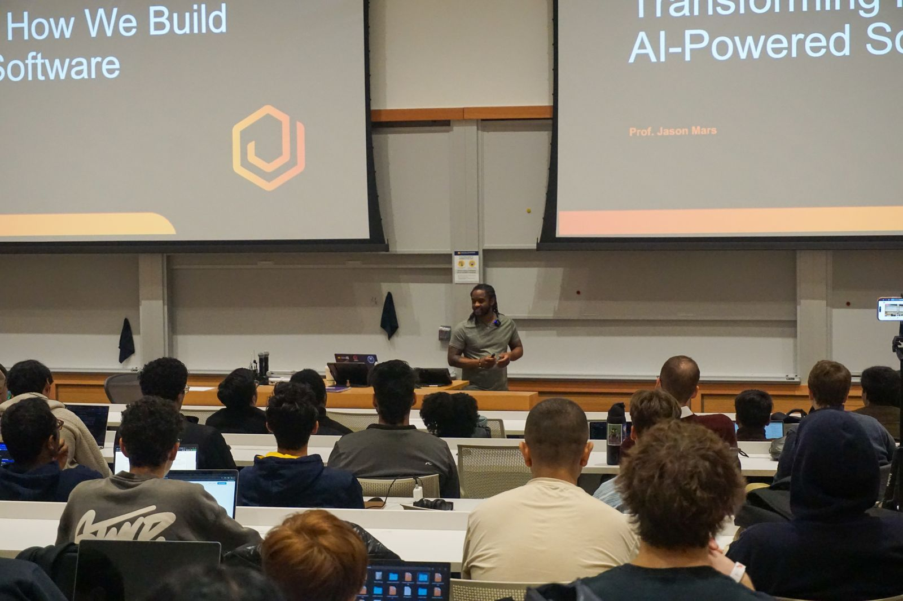
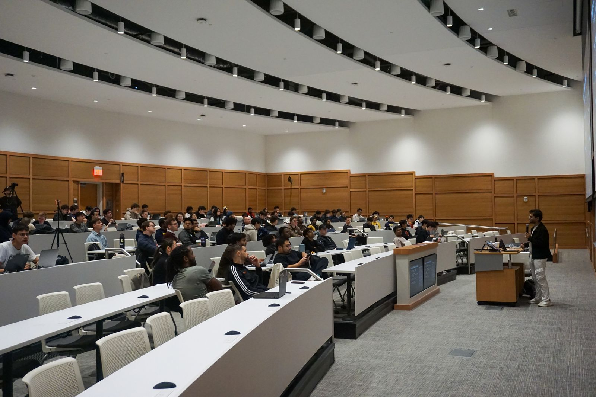

# **JacHacks: The premier AI hackathon at the University of Michigan**

Over the past six years, Jaseci has been building a unified, one-language programming stack for AI-native development. Today, with nearly 100K monthly PyPI downloads and a fast-growing global community of developers, the ecosystem is rapidly scaling into something much larger than its origins.

To engage this momentum, Jaseci launched JacHacks 2026 at the University of Michigan.

What began as a local initiative in Ann Arbor quickly grew into a nationwide event, drawing over 400 applications and bringing together 170 students and professionals. While rooted in the Michigan tech community, JacHacks ultimately attracted interest from across the United States and even internationally, signaling the reach of the Jaseci ecosystem.

The hackathon challenged participants to move from raw ideation to a finished product in just 24 hours. Teams tackled real-world problems through an intense build phase, supported by a network of mentors and a collaborative community spirit.

By the submission deadline, 66 complete projects were delivered. Each project showcased the power of the core Jaseci stack: Jac served as the foundational language, byLLM powered the agentic flows, and jac-client handled the frontends all organized through Object Spatial Programming (OSP) logic. To ensure a high standard of excellence, a panel of 10 judges evaluated real-world impact, novelty, integration with Jac into their final solution.

  <iframe
    src="https://www.youtube.com/embed/zsqUxuRY5PI"
    title="JacHacks 2026 Recap"
    frameborder="0"
    allow="accelerometer; autoplay; clipboard-write; encrypted-media; gyroscope; picture-in-picture; web-share"
    allowfullscreen
    style="position: absolute; top: 0; left: 0; width: 100%; height: 100%;">
  </iframe>

## **Opening Ceremony**

<!--Image 1 -->

Our opening ceremony began with a GenAI lecture led by Professor Jason Mars, designed to educate participants about the direction of AI and where the market pressure points are. This lecture inspired teams to identify market gaps and build products that solve high-pressure industry challenges.

## **Agentic Paradigm Presentation**

A deep-dive technical session led by our PhD researchers explored why Jac is uniquely suited for agentic workflows. The presentation deconstructed the 'Walker' abstraction showing how these logic units traverse data graphs to execute complex reasoning. Participants moved beyond basic prompting to understand Object Spatial Programming (OSP), learning how to structure data as navigable landscapes for their agents.

To check out the tutorial for yourself go to [Agentic AI tutorial GitHub repo](https://github.com/jaseci-labs/agentic-ai-tutorial)

## **Former Y-Combinator Speaker**

Vatsul Shah, co-founder of Narrative (YC F25), shared the 'founder’s journey' of building AI-powered video tools. He pivoted from technical architecture to the realities of the startup grind, offering participants a roadmap for transitioning their hackathon prototypes into viable products. His session highlighted the importance of solving 'hair-on-fire' problems, a mindset many teams adopted for their final builds.

## **Top 3 Projects That Stole the Spotlight**

One pattern stood out across the top submissions: autonomous, context-aware reasoning. Instead of building passive chatbots, these students reached for AI to build active systems that monitor real-time data, manage long-term memory, and execute complex, multi-step tasks. They each used the Jac stack to accelerate their workflow and design agents that can indepently understand the situation, reason about the task, and initiate action.

### **🏆 Agentic AI Track: GraphClaw - Graph-Native Multi-Agent AI using Jac (A K M Mahmudul Kabir & Abdullah Al Mahmud)**

**GraphClaw** took first overall with a bold rethinking of how personal AI systems should manage memory, coordination, and capability. Instead of relying on brittle chat history or static vector stores, the team built a graph-native, multi-agent platform where memory evolves over time, facts decay, get revalidated, and are pruned automatically, much closer to how human memory actually works.

At its core, GraphClaw orchestrates a team of specialized agents, Builder, Planner, Researcher, and DevOps, through a central coordinator, all sharing a structured property graph as a single source of truth. What makes it especially powerful is its dynamic skill system: agents can install and execute thousands of community-contributed tools at runtime, turning the assistant from a passive responder into an actively capable system.

Built in Python and the AI-native language Jac, the project demonstrates a clean, declarative approach to agent design, along with a robust message bus that unifies interactions across platforms like Slack, Discord, and Telegram. The result is a fast, extensible, and persistent AI assistant that feels consistent no matter where you interact with it.

Check out the project here: [Devpost](https://devpost.com/software/project-e54qlw07j9i1)

### **🏆 Social Impact Track: Hijac - Mobile First Agentic Automation (Meron Demissie, Nitin Shankar Madh, & Chuka Ezeoke)**

**Hijac** builds on the ideas behind OpenClaw, but brings them fully onto the phone, turning your device into an always-on, context-aware agent with direct access to sensors and system actions. By linking the Jac compiler to a mobile runtime, the team enabled agent logic to run natively on-device rather than in the cloud.

Using real-time sensor data, Hijac detects moments like leaving a location or ending a focus session and automatically takes action. For example, a user could define a safety rule where a sudden fall detected via accelerometer and motion patterns, triggers the agent to call emergency services like 911. With semantic memory layered in, it continuously learns user habits, evolving into a proactive assistant that reduces the mental overhead of everyday routines.

Check out the project here: [Devpost](https://devpost.com/software/hijac)

### **🏆 Fintech Track: PolyWatch - AI-Powered Insider Trading Detection for Prediction Markets (Adam Christley, Caeden Kidd, Amar Zecevic, schultzn6619)**

**PolyWatch** won the Fintech Track for an autonomous AI system that detects potential insider trading in prediction markets like Polymarket.

It uses a Tree-of-Thought reasoning engine that recursively investigates suspicious activity using 26 tools across market data, statistics, news timing, wallet profiling, and network graphs. The system enforces coverage gates so it must gather evidence from multiple categories before reaching a conclusion.

Built in JacLang with DeepSeek, PolyWatch builds full investigative "cases" by linking trades to news timing to identify possible informed trading. A real-time dashboard visualizes anomalies, suspect wallets, and the AI’s reasoning tree.

The result is an AI investigator that builds evidence-backed cases of market manipulation.

Check out the project here: [Devpost](https://devpost.com/software/polywatch)

### Other Winners

To see the full list of winners, check out the [devpost project gallery](https://jachacks-2026.devpost.com/project-gallery)

Inspired by any of these projects? Start building with the Jac stack at [jaseci.org](https://www.jaseci.org).
