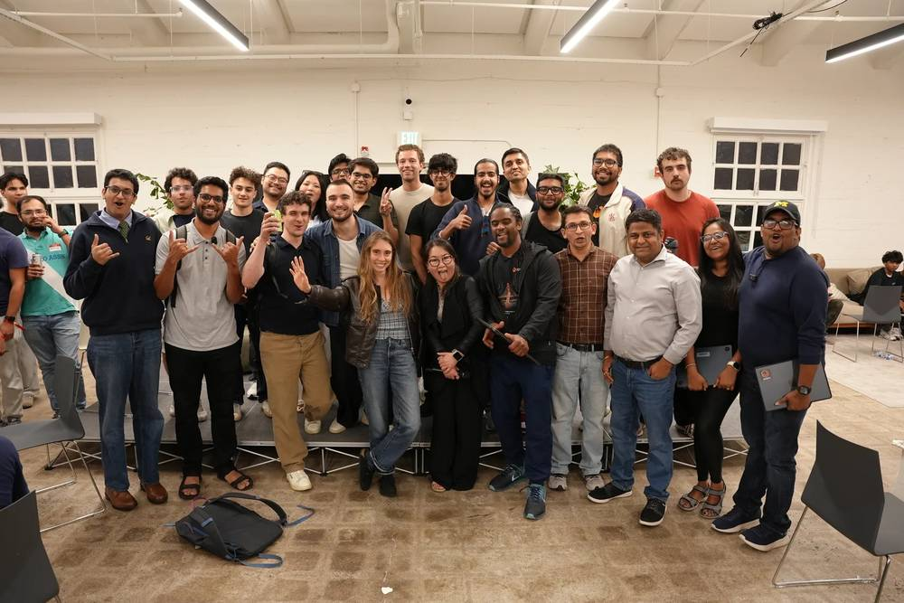
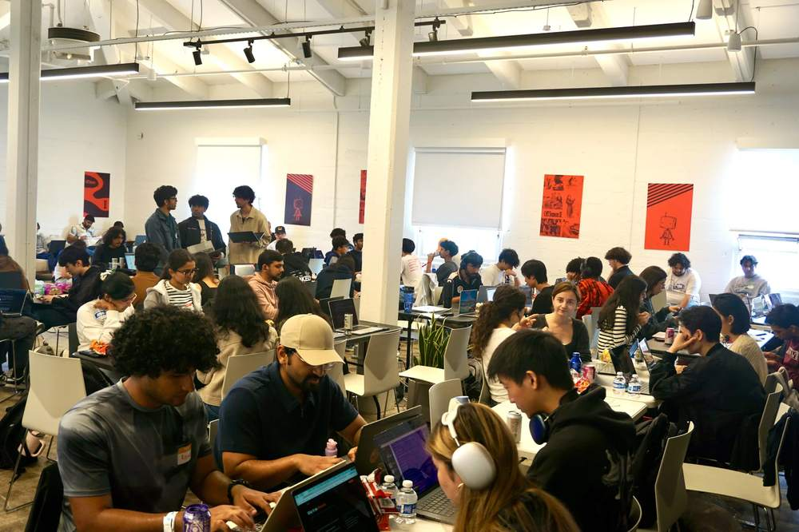
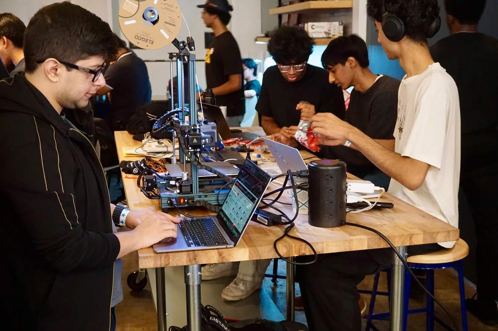
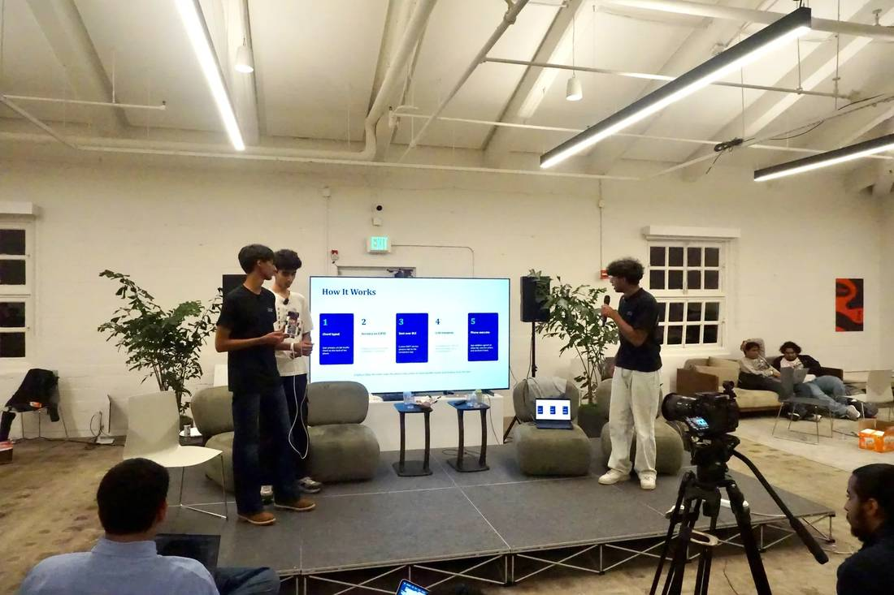

# JacHacks SF: 77 Projects in One Day at Founders Inc

[**JacHacks SF**](https://jachacks.org/) ran on Sunday, July 26, 2026, at Founders, Inc. in San Francisco. **200+ builders** showed up for a single day and shipped **77 projects**. Teams competed in three tracks, Agentic AI, Fintech/Open, and Social Impact, plus three special awards, for a $9,000 prize pool. Eight teams walked away with prizes.

<!-- more -->

## One Day, Start to Finish

JacHacks started at the University of Michigan, went global and online with JacHacks Spring, and landed in San Francisco for the third event in the series. SF was the first one built around a single day: doors at 8 AM, keynote at 10, and one hard deadline at the end of it.

The build window opened at 10:45 AM and hard-stopped at 7:15 PM. That is **eight and a half hours** from empty repo to submitted demo video, with a partial-submission checkpoint at 5:50 PM to keep teams honest about scope. Demos and judging ran straight after, and awards closed the night out at 9:30.

  
8.5 hrsof build time, start to hard stop

  
77projects submitted on Devpost

  
88%had never written a line of Jac

  
73%built with a coding agent

It was a young room, and a full one. Most respondents to the post-event survey were between 15 and 20, and they came in from Berkeley, Stanford, USC, Cal Poly and a good number of high schools.

## The Agent-Built Hackathon

The most striking thing about SF is how the code actually got written. **73% of survey respondents built their project with a coding agent driving Jac through the MCP server and `SKILL.md` files.** Another 12% used JacHammer's built-in agent only, and 12% started on JacHammer and migrated local. Almost nobody sat down and hand-wrote an unfamiliar language for eight hours, which is the only way a room that is 88% new to Jac ships 77 projects by 7:15 PM.

> "It was really seamless, the agent understood the language and architecture much easily and wrote better more streamlined code overall."

Another respondent put it more bluntly:

> "I didn't code anything by hand, Claude did all the work!"

That is the bet Jac makes: one language covering frontend, backend, database, and prompt layer means the agent holds the entire app in one context and never has to translate between a Python backend, a TypeScript frontend, and a prompt template. Builders named that consolidation as the best part of the stack by a wide margin.

**What builders liked most about the Jac stack**

<svg viewBox="0 0 680 252" width="100%" style="display: block; margin: 0.5em 0;" role="img" aria-label="Horizontal bar chart: one language for full stack 85%, graph-based programming 54%, byLLM for AI 46%, simplified database operations 23%, JacHammer 23%, built-in authentication 19%">
  <title>What builders liked most about the Jac stack</title>
  <g font-size="13.5" fill="currentColor" text-anchor="end">
    <text x="205" y="25">One language, full stack</text>
    <text x="205" y="65">Graph-based programming</text>
    <text x="205" y="105">byLLM for AI</text>
    <text x="205" y="145">Simplified database ops</text>
    <text x="205" y="185">JacHammer</text>
    <text x="205" y="225">Built-in authentication</text>
  </g>
  <g fill="#e8622c">
    <path d="M215,10 h370 a4,4 0 0 1 4,4 v14 a4,4 0 0 1 -4,4 h-370 z"/>
    <path d="M215,50 h234 a4,4 0 0 1 4,4 v14 a4,4 0 0 1 -4,4 h-234 z"/>
    <path d="M215,90 h198 a4,4 0 0 1 4,4 v14 a4,4 0 0 1 -4,4 h-198 z"/>
    <path d="M215,130 h97 a4,4 0 0 1 4,4 v14 a4,4 0 0 1 -4,4 h-97 z"/>
    <path d="M215,170 h97 a4,4 0 0 1 4,4 v14 a4,4 0 0 1 -4,4 h-97 z"/>
    <path d="M215,210 h80 a4,4 0 0 1 4,4 v14 a4,4 0 0 1 -4,4 h-80 z"/>
  </g>
  <g font-size="13" font-weight="600" fill="currentColor">
    <text x="598" y="25">85%</text>
    <text x="462" y="65">54%</text>
    <text x="426" y="105">46%</text>
    <text x="325" y="145">23%</text>
    <text x="325" y="185">23%</text>
    <text x="308" y="225">19%</text>
  </g>
  <line x1="214.5" y1="6" x2="214.5" y2="236" stroke="currentColor" stroke-opacity="0.3" stroke-width="1"/>
</svg>

<em style="font-size: 0.8em; opacity: 0.7;">Post-event survey, 26 respondents: "Which is the best part of the Jac stack that you liked?" Multiple selections allowed.</em>

> "I liked how I could do everything in one language and didn't have to move between frameworks."

A respondent with more than ten years of experience described the same thing in architectural terms:

> "The unified programming paradigm and the graph-based model make structuring full-stack AI workflows cleaner and more intuitive."

On day one with an unfamiliar language, **77% rated getting started a 4 or 5 out of 5**.

**How easy was it to get started with Jac?**

<svg viewBox="0 0 680 212" width="100%" style="display: block; margin: 0.5em 0;" role="img" aria-label="Column chart of ease-of-getting-started ratings on a 1 to 5 scale: 4% at 1, 4% at 2, 15% at 3, 50% at 4, 27% at 5">
  <title>How easy was it to get started with Jac?</title>
  <g fill="#e8622c">
    <path d="M88,168 v-6 a4,4 0 0 1 4,-4 h16 a4,4 0 0 1 4,4 v6 z"/>
    <path d="M208,168 v-6 a4,4 0 0 1 4,-4 h16 a4,4 0 0 1 4,4 v6 z"/>
    <path d="M328,168 v-35 a4,4 0 0 1 4,-4 h16 a4,4 0 0 1 4,4 v35 z"/>
    <path d="M448,168 v-126 a4,4 0 0 1 4,-4 h16 a4,4 0 0 1 4,4 v126 z"/>
    <path d="M568,168 v-66 a4,4 0 0 1 4,-4 h16 a4,4 0 0 1 4,4 v66 z"/>
  </g>
  <g font-size="13" font-weight="600" fill="currentColor" text-anchor="middle">
    <text x="100" y="146">4%</text>
    <text x="220" y="146">4%</text>
    <text x="340" y="117">15%</text>
    <text x="460" y="26">50%</text>
    <text x="580" y="86">27%</text>
  </g>
  <line x1="40" y1="168.5" x2="640" y2="168.5" stroke="currentColor" stroke-opacity="0.3" stroke-width="1"/>
  <g font-size="12.5" fill="currentColor" opacity="0.65" text-anchor="middle">
    <text x="100" y="188">1</text>
    <text x="220" y="188">2</text>
    <text x="340" y="188">3</text>
    <text x="460" y="188">4</text>
    <text x="580" y="188">5</text>
  </g>
  <g font-size="11" fill="currentColor" opacity="0.55" text-anchor="middle">
    <text x="105" y="206">very hard</text>
    <text x="580" y="206">very easy</text>
  </g>
</svg>

<em style="font-size: 0.8em; opacity: 0.7;">Post-event survey: "How easy was it to get started with Jac?"</em>

Productivity held up too: 69% felt more productive than they do in their usual stack, and the rest split evenly between feeling the same and feeling less productive. For a language most of them met that morning, coming out ahead is a strong result.

## Track Winners

**Agentic AI** went to [*TRACTION*](https://devpost.com/software/traction-6se7mr) by Elijah Umana and Becky Zhu: a beta-tester finder that runs five research lanes in parallel with Jac's `flow` and `wait`, then rewards convergence through graph traversal, so a prospect surfaced independently by several lanes rises to the top. Runner-up [*Trails*](https://devpost.com/software/trails-f0w8oc) by Harshith Sai Mannaru, Tirth Suba, and Aarnav Gutti puts five agents on an evidence graph that coordinate the way ants do, leaving pheromone weights on typed edges instead of talking to each other. Three `by llm()` calls score the fragments up front, then the search runs deterministically and replayable from a seeded hash, so judges could reproduce a finding exactly.

**Fintech/Open** went to [*Recall*](https://devpost.com/software/reminisense) by Aswath Jacob, Arshmeet Sodhi, Umang Sharma, and Likhith Ramesha: networking memory running on Meta Ray-Ban Display glasses. People, companies, intents, and conversations are nodes; walkers ingest new contacts and retrieve past ones; `by llm()` pulls structured detail out of raw speech, so you never take notes mid-conversation. Runner-up [*Lemons*](https://devpost.com/software/lemons-o42wrb) by Manit Guliani researches prediction-market questions and returns a Monte Carlo answer in 15 to 20 seconds, built after its author lost money on the 2026 FIFA final.

**Social Impact** went to [*SafeRelay*](https://devpost.com/software/saferelay) by Rishabh Bansal, Aditya Das, and one teammate: distress calls that hop phone to phone over Bluetooth Low Energy when the cell towers are gone. Jac encodes the whole thing, a 25-byte wire packet, the relay policy, the persistence, the endpoints, and the UI, with no adapter layer between them. Second place [*Brailed*](https://devpost.com/software/brailed) by Kaushik Chekka, Dhruv Gupta, and Yash Kathrani is a phone-mounted braille keyboard and OLED caption display for blind and deaf users, running an ESP32 and about $15 of parts against refreshable braille displays that start north of $1,000. byLLM maps free-form braille text like "text mom I'm running late" onto concrete phone actions.

## Special Awards

- [*MEDUSA*](https://devpost.com/software/medusa-8u9xmw) by Sidhant Parashar, Rohit Kancharla, and Sujay Kanakamedala: **Best Use of Jac**. Turns a defense team's existing inventory into an explainable initial hardware design. The graph is filtered deterministically first so incompatibilities and quantity limits are gone before the LLM reasons, which means the model can propose but never override a hard constraint, and every design carries its traversal path as the rationale.
- [*Blackstar*](https://devpost.com/software/blackstar) by Nityanth Maramreddy, Ryan Rana, Azra Bano, and Ayaan Faisal: **Best JacHammer** and **AI for Defense**. Stress-tests hospital power grids by modeling campus assets as nodes and electrical connections as edges, then cascading a failure until the grid breaks into islands. An LLM red team invents the attack chains; a deterministic rule-based blue team protects tier-one critical care, deliberately keeping the model out of the safety-critical decision.

The rest of the field is worth browsing too: a wildfire simulator on a photorealistic globe, a VR environment for voice-driven vibe coding, a graph of California relief laws that finds every path to a cleared conviction record including the cascades one law unlocks in another, and a vessel router that searches real ocean forecasts for a mission plan that survives the voyage. All 77 are in the [project gallery](https://jachacks-sf.devpost.com/project-gallery).

## What We Took Away

The event landed well: 88% of survey respondents rated it 4 or 5 out of 5, and the feedback came back as a clear punch list rather than a shrug.

Top of it is JacHammer, where deploy and redeploy speed was the main drag, and that matters more than usual when the clock is eight and a half hours long. Next is the agent-facing surface: with 73% of builders driving Jac through a coding agent, the MCP server and `jac guide` need to track the compiler exactly, because the agent's view of the language effectively *is* the language. And the venue was the good kind of problem, since more people turned up than the room comfortably held. All three are already in hand for the next one.

The appetite to keep going was the clearest signal of the day: 58% said yes to joining the Jac community and another 31% said maybe.

> "JacHacks x Founders Inc brought the most ambitious minds in tech and put them under one roof. The event was ran extremely well and the hosts were very organized. If you want to code a basic project, this hackathon isn't for you. But if you're willing to push yourself, grow, and set your mind to shipping something in one afternoon, this comp is perfect for you."

## What's Next

Congrats to all eight winning teams and to everyone who shipped something before the 7:15 hard stop. Thanks to Founders, Inc. for the space and to NVIDIA Inception, Base44, Koyal AI, Pieces, Mastra, the University of Michigan, and the NSF for backing the event.

Browse every project on [Devpost](https://jachacks-sf.devpost.com/project-gallery), start building with the [Jac docs](https://docs.jaseci.org/), and watch [jachacks.org](https://jachacks.org/) for the next one.
