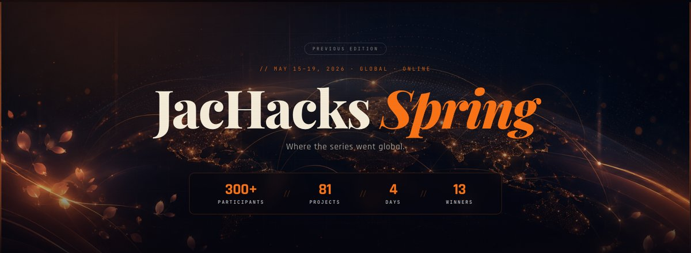

# JacHacks Spring 2026: 300+ Builders, 81 Projects, One Weekend of Jac

[**JacHacks Spring**](https://jachacks.org/spring/) ran May 15 to 19, 2026. **300+ builders** joined the global online hackathon and shipped **81 projects**, most built with Jac and the Jaseci stack. Teams competed in four tracks: Agentic AI, Consumer Healthcare, Fintech, and Social Impact. Sponsors Featherless.AI and Lovable gave out special awards too.

<!-- more -->

## The Kickoff

Jac creator Jason Mars opened the weekend. The recording below starts right at the keynote:

  <iframe style="position: absolute; top: 0; left: 0; width: 100%; height: 100%;" src="https://www.youtube.com/embed/JHBLmoU7zVk?start=310" title="Opening Ceremony and Keynote Speech | JacHacks Spring" frameborder="0" allow="accelerometer; autoplay; clipboard-write; encrypted-media; gyroscope; picture-in-picture; web-share" referrerpolicy="strict-origin-when-cross-origin" allowfullscreen></iframe>

## Real Problems, Real Agents
 
Almost every winning project had the same theme: not chatbots, but agents that *do* things. Teams shipped systems that triage medical cases, investigate fraud, fight insurance denials, and coordinate food deliveries, all running on their own. The other standout was speed: teams kept saying how fast they got there, and most credited Jac.
 
## Why Jac Made These Projects Easier to Build
 
A full agentic AI app needs a frontend, a backend, a database, and a prompt layer. That is a lot for one weekend, and Jac cuts most of it: graphs and language models are built into the language, agents are just Jac walkers moving over a graph, meaning-typed programming turns a type signature and a short description into the prompt, and one codebase compiles to both backend and frontend. That removes most of the setup tax, and it is a big reason 81 projects shipped in one weekend.

The event's Agentic AI workshop walks through building one of these apps end to end. It still works as a self-paced tutorial:

  <iframe style="position: absolute; top: 0; left: 0; width: 100%; height: 100%;" src="https://www.youtube.com/embed/V4MVTPspMVs" title="Agentic AI workshop | JacHacks Spring" frameborder="0" allow="accelerometer; autoplay; clipboard-write; encrypted-media; gyroscope; picture-in-picture; web-share" referrerpolicy="strict-origin-when-cross-origin" allowfullscreen></iframe>

## What Builders Told Us

From the post-event survey: **83% of respondents had never touched Jac before the hackathon**. Yet none of them felt less productive than in their usual stack.

  
83%were brand new to Jac

  
67%felt more productive than in their usual stack

  
8.2 / 10average likelihood to keep using Jac

  
100%want to join the Jac community

The favorite parts of the stack were the two core ideas of the language: graph-based programming, and one language for the whole app.

**What builders liked most about the Jaseci stack**

<svg viewBox="0 0 680 252" width="100%" style="display: block; margin: 0.5em 0;" role="img" aria-label="Horizontal bar chart: graph-based programming 75%, one language for the full stack 67%, byLLM for AI features 50%, simpler database operations 25%, Jac-builder 17%, authentication 8%">
  <title>What builders liked most about the Jaseci stack</title>
  <g font-size="13.5" fill="currentColor" text-anchor="end">
    <text x="205" y="25">Graph-based programming</text>
    <text x="205" y="65">One language, full stack</text>
    <text x="205" y="105">byLLM for AI features</text>
    <text x="205" y="145">Simpler database operations</text>
    <text x="205" y="185">Jac-builder</text>
    <text x="205" y="225">Authentication</text>
  </g>
  <g fill="#e8622c">
    <path d="M215,10 h374 a4,4 0 0 1 4,4 v14 a4,4 0 0 1 -4,4 h-374 z"/>
    <path d="M215,50 h332 a4,4 0 0 1 4,4 v14 a4,4 0 0 1 -4,4 h-332 z"/>
    <path d="M215,90 h248 a4,4 0 0 1 4,4 v14 a4,4 0 0 1 -4,4 h-248 z"/>
    <path d="M215,130 h122 a4,4 0 0 1 4,4 v14 a4,4 0 0 1 -4,4 h-122 z"/>
    <path d="M215,170 h80 a4,4 0 0 1 4,4 v14 a4,4 0 0 1 -4,4 h-80 z"/>
    <path d="M215,210 h38 a4,4 0 0 1 4,4 v14 a4,4 0 0 1 -4,4 h-38 z"/>
  </g>
  <g font-size="13" font-weight="600" fill="currentColor">
    <text x="598" y="25">75%</text>
    <text x="556" y="65">67%</text>
    <text x="472" y="105">50%</text>
    <text x="346" y="145">25%</text>
    <text x="304" y="185">17%</text>
    <text x="262" y="225">8%</text>
  </g>
  <line x1="214.5" y1="6" x2="214.5" y2="236" stroke="currentColor" stroke-opacity="0.3" stroke-width="1"/>
</svg>

<em style="font-size: 0.8em; opacity: 0.7;">Post-event survey: "Which is the best part of the Jaseci stack that you liked?" Multiple selections allowed.</em>

Productivity vs. their usual stack, on a 1–5 scale: nobody rated below the midpoint, in a language most had met four days earlier.

**Compared to their usual stack, how productive did builders feel?**

<svg viewBox="0 0 680 212" width="100%" style="display: block; margin: 0.5em 0;" role="img" aria-label="Column chart of productivity ratings on a 1 to 5 scale: 0% at 1 and 2, 33% at 3, 42% at 4, 25% at 5">
  <title>Compared to their usual stack, how productive did builders feel?</title>
  <g fill="#e8622c">
    <path d="M328,168 v-100 a4,4 0 0 1 4,-4 h16 a4,4 0 0 1 4,4 v100 z"/>
    <path d="M448,168 v-126 a4,4 0 0 1 4,-4 h16 a4,4 0 0 1 4,4 v126 z"/>
    <path d="M568,168 v-74 a4,4 0 0 1 4,-4 h16 a4,4 0 0 1 4,4 v74 z"/>
  </g>
  <g font-size="13" font-weight="600" fill="currentColor" text-anchor="middle">
    <text x="100" y="160" opacity="0.55" font-weight="400">0%</text>
    <text x="220" y="160" opacity="0.55" font-weight="400">0%</text>
    <text x="340" y="56">33%</text>
    <text x="460" y="30">42%</text>
    <text x="580" y="82">25%</text>
  </g>
  <line x1="40" y1="168.5" x2="640" y2="168.5" stroke="currentColor" stroke-opacity="0.3" stroke-width="1"/>
  <g font-size="12.5" fill="currentColor" opacity="0.65" text-anchor="middle">
    <text x="100" y="188">1</text>
    <text x="220" y="188">2</text>
    <text x="340" y="188">3</text>
    <text x="460" y="188">4</text>
    <text x="580" y="188">5</text>
  </g>
  <g font-size="11" fill="currentColor" opacity="0.55" text-anchor="middle">
    <text x="110" y="206">much less productive</text>
    <text x="570" y="206">much more productive</text>
  </g>
</svg>

<em style="font-size: 0.8em; opacity: 0.7;">Post-event survey: "Compared to your usual programming stack, how productive did you feel?"</em>

Two answers from the free-text responses:

> "My first time working with a new language in a hackathon environment. As a full-time quantum-control software engineer and part-time AI engineer, I loved this."

> "I didn't expect much when I first heard about it, but once I started using it in the project it shocked me how easy it is to implement. Going to use this language for future projects and hackathons."

The top improvement requests: documentation and examples (58%) and CLI error messages (42%). Noted.

## Track Winners
 
**Agentic AI** went to [*CivicMesh*](https://devpost.com/software/civicmesh-0ctxl5) by Anbuchelvan Ganesan: a multi-agent navigator that routes people in crisis to the housing, food, healthcare, and legal aid they qualify for, in multiple languages, with every decision showing its reasoning. Runner-up [*MediGraph*](https://devpost.com/software/medigraph) by Soujanya Chatti reasons through drug interactions biochemically instead of just looking them up, and flags dangerous combinations.
 
**Consumer Healthcare** went to [*CONSILIUM*](https://devpost.com/software/consilium-mqu6w3) by Tony Y: seven AI specialist agents debate a case and cross-examine the evidence, then settle on the three most likely diagnoses. Second place [*Persist*](https://devpost.com/software/persist-yindp5) by Patrick Wang files prior-authorization claims, and when they are denied, writes ERISA-compliant appeal letters on its own.
 
**Fintech** went to [*Sentinel*](https://devpost.com/software/sentinel-multi-agent-fraud-investigation-system) by Yash Patil: five Jac walkers traverse a Medicare claims knowledge graph and turn scattered fraud signals into fully cited investigations, flagging an estimated $50.6M in exposure across 200 providers at 98% precision. Runner-up [*Killbill*](https://devpost.com/software/killbill-wam45d) by Ibrahim Pima finds the subscriptions you never use and drafts the cancellation email.
 
**Social Impact** went to [*Nourish*](https://devpost.com/software/demo-wrtjkc) by Viktor Nedev: it matches surplus food with shelters and volunteer drivers in real time, before the food goes to waste. Second place [*Orion & Diana*](https://devpost.com/software/orion-eua8x9) by Pranav Rajesh Krishnan spots marine oil spills in satellite imagery using trained ML models, as they happen.
 
## Special & Sponsor Awards
 
Five more teams picked up special awards:

- [*Ori*](https://devpost.com/software/ori-4mscde) by Ahmed Hammad: **Best Use of Jac** and **Best Use of Featherless.AI**. A full-stack Jac template that lets vehicles talk to each other for safer, more efficient driving.
- [*FutureOS*](https://devpost.com/software/futureos-f03dgs) by Kshitij Kumrawat: **Best Use of Jac**. A graph-native "life OS" where six agents turn long-term goals into daily missions, with all data stored in Jac's graph store.
- [*PairUp*](https://devpost.com/software/pairup-qmjrke) by Harshith Nair and Anjika Singh: **Best Demo**. A swipe-based way to find technical co-founders and teammates.
- [*DepGraph*](https://devpost.com/software/depgraph) by Shailesh Hawale: **Best LinkedIn Post**. A security agent that traces dependency graphs, flags CVEs, and writes remediation plans, with an LLM picking which package to investigate next.
- [*Drowzie*](https://devpost.com/software/drowzie) by Shashank Shekhar: **Best Use of Lovable**. A sleep tracker that finds the habits linked to your sleep quality and nudges you to fix them.

## Beyond the Weekend Project

Between build sessions, Vatsal Shah shared his journey through Y Combinator and the startup world. Worth a watch if your project could be a company:

  <iframe style="position: absolute; top: 0; left: 0; width: 100%; height: 100%;" src="https://www.youtube.com/embed/E7KaxOKLcWQ" title="My journey through YC and startups" frameborder="0" allow="accelerometer; autoplay; clipboard-write; encrypted-media; gyroscope; picture-in-picture; web-share" referrerpolicy="strict-origin-when-cross-origin" allowfullscreen></iframe>

## What's Next
 
Congrats to every team that shipped, and thanks to Featherless.AI and Lovable for sponsoring. Browse all 81 projects on the [JacHacks Spring winners page](https://jachacks.org/spring/). To build your own, start with the [Jac docs](https://docs.jaseci.org/), and watch [jachacks.org](https://jachacks.org/) for the next hackathon.
