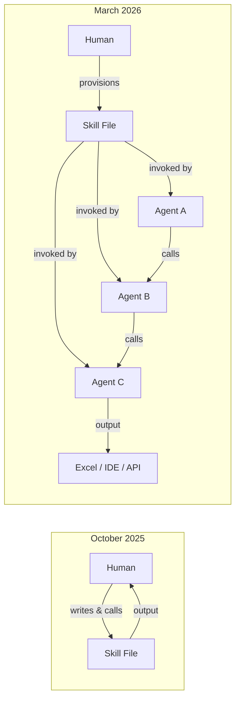
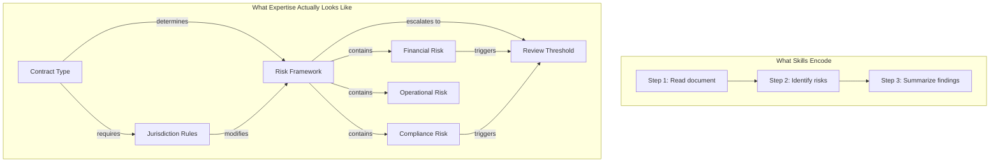
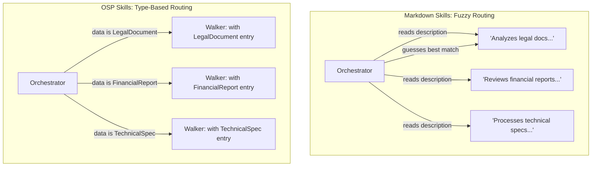
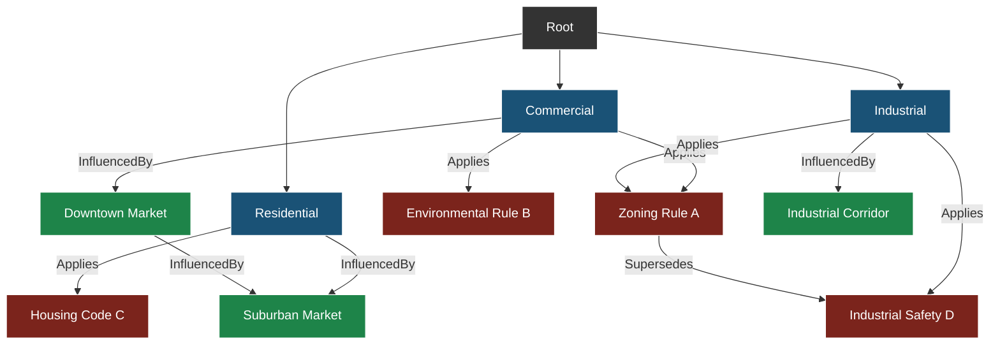
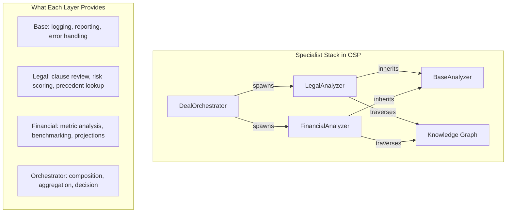
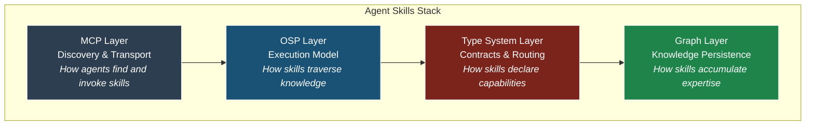

# 500,000 AI Skills Exist. They're Still Just Markdown Files.

*How Object-Spatial Programming gives agent skills the structure they've been missing.*

In five months, AI skills went from personal prompt shortcuts to organizational infrastructure running across every major platform. OpenAI, Microsoft, GitHub, Anthropic, Cursor — they all converged on the same idea: encode your methodology in a file, and let agents invoke it.

There are now over 500,000 of these skills in the wild. And almost all of them are flat Markdown files that break the moment a human stops watching.

This is the story of why that happens, what it actually takes to build skills that work unsupervised, and how a programming paradigm called Object-Spatial Programming might be the missing structural layer the skills ecosystem needs.

<!-- more -->

---

## The Skills Revolution Nobody Saw Coming

In October 2025, Anthropic introduced skills as a feature in Claude. The idea was simple: instead of re-explaining your methodology every session, encode it in a Markdown file. The agent reads it, follows it, and you skip the preamble.

It was a convenience feature. A prompt shortcut. And it worked well enough when you were the one calling the skill, sitting at your keyboard, watching the output and catching drift.

Then four things changed in rapid succession:

1. **Agents started calling skills autonomously.** Not just responding to human prompts, but invoking skills as part of their own reasoning chains. No human in the loop.
2. **Team admins started provisioning skills org-wide.** A single upload could deploy methodology to hundreds of agents across an organization.
3. **The format became a cross-platform standard.** The same Markdown skill file runs in Claude, Copilot, Cursor, and now Excel and PowerPoint sidebars.
4. **Skills moved from developer terminals to business tools.** The same file that helped a developer write code now helps a financial analyst model scenarios.



The problem? Almost everything built to the October standard is underspecified for the March reality. A skill that works when you're watching quietly fails the moment you leave.

---

## Where Skills Break

Let's be specific about the failure modes. They're not bugs — they're structural limitations of encoding expertise in flat text.

### The Description Problem

Every skill has a description field. In an agent-first world, this description is the **routing signal** — it's how an orchestrator agent decides which skill to invoke for a given task.

Here's what most descriptions look like:

```
description: "Analyzes documents for key information and provides summaries."
```

This is useless to an agent making a routing decision. What kind of documents? What constitutes "key information"? What's the output format? An agent reading this description has to guess, and guessing at scale means failing 10% of the time. When skills are invoked thousands of times a day across an organization, a 10% failure rate isn't a rounding error — it's a system-level defect.

### The Methodology Problem

Most skill bodies read like procedures: step 1, step 2, step 3. This works when a human is interpreting the steps with judgment. It fails when an agent follows them literally.

What skills actually need is **reasoning** — not "do X then Y" but "evaluate X in context, determine the appropriate Y based on constraints, validate the output against criteria Z." The difference is the difference between a recipe and a chef's understanding of food.

### The Output Contract Problem

Skills describe their outputs in natural language: "Returns a summary of the key findings." But an agent downstream needs to parse that output programmatically. Without a structured contract — what fields exist, what types they are, what's required vs optional — every agent-to-agent handoff is a parsing gamble.

### The Knowledge Structure Problem

This is the deepest issue. Domain expertise isn't flat. A legal analyst's knowledge of contract review isn't a list of steps — it's a **graph** of interrelated concepts: clause types, risk factors, precedent relationships, jurisdictional rules, escalation paths. Encoding this in Markdown means flattening a graph into a list, losing the structure that makes the expertise work.



The skills ecosystem has a structure problem. And you don't solve structure problems with better prose.

---

## Enter Object-Spatial Programming

Object-Spatial Programming (OSP) is a paradigm built into the [Jac programming language](https://docs.jaseci.org) that models data as graphs and computation as mobile agents called **walkers** that traverse those graphs. Instead of calling functions on objects, you send computation *to* the data.

Three primitives:

| Primitive | What It Is | Role |
|-----------|-----------|------|
| **Node** | A vertex in the graph, holding typed data | Domain concepts |
| **Edge** | A typed, directed connection between nodes | Relationships |
| **Walker** | A mobile agent that traverses the graph | Methodology / Skills |

If this sounds abstract, it won't in a moment. Because every structural problem with skills maps directly to an OSP solution.

---

## Walkers Are Skills

Let's start with the most direct mapping. A well-designed skill, according to the current best practices, needs:

- **A description** — routing signal for orchestrators
- **Typed inputs** — what the skill needs to operate
- **A methodology body** — the reasoning, not just the steps
- **Structured outputs** — the contract for downstream consumers

A Jac walker is exactly this:

```jac
walker AnalyzeContract {
    has document: str;           // Typed input
    has risk_tolerance: float;   // Parameter with semantic meaning
    has jurisdiction: str;       // Context that affects methodology

    can route with Root entry {
        // Start at the user's graph root, navigate to the right context
        visit [-->][?:ContractNode];
    }

    can assess with ContractClause entry {
        // Methodology: reason about each clause in spatial context
        if here.risk_score > self.risk_tolerance {
            report {
                "clause": here.text,
                "risk_level": here.risk_score,
                "category": here.risk_category,
                "recommendation": here.suggested_action
            };
        }
        visit [-->];  // Continue to next clause
    }
}
```

The `has` properties **are** the input contract — typed, named, with semantic meaning baked into the type system. The `can ... with NodeType entry` declarations **are** the routing signals — not free-text descriptions, but type-based dispatch. The `report` statements **are** the output contract — structured data, not prose.

And the methodology? It's spatial. The walker doesn't just "analyze a contract." It *traverses the contract's structure* — visiting clause nodes, evaluating risk in context, following edges to related precedents. The methodology is encoded in the traversal pattern, not in a paragraph of instructions.

### The Description Problem, Solved

In the current skills ecosystem, an orchestrator reads a description string and decides whether to invoke a skill. This is fuzzy matching at best.

In OSP, routing is type-based dispatch:

```jac
// These aren't descriptions. They're type contracts.
can analyze with LegalDocument entry { ... }
can analyze with FinancialReport entry { ... }
can analyze with TechnicalSpec entry { ... }
```

An orchestrator doesn't need to parse a description. The type system tells it: this walker handles `LegalDocument` nodes. If the data is a `LegalDocument`, invoke the walker. If it's not, don't. No ambiguity. No 10% failure rate.



---

## The Graph Is the Knowledge Structure

Here's where it gets interesting. The video and newsletter that inspired this article describe a "specialist stack" pattern — layered skill architecture where base skills, domain specialists, and orchestrators compose into a system. One real-world example: a real estate general partner with 50,000 lines of skills.

50,000 lines of Markdown. Think about that. That's a novel-length document encoding domain expertise in flat text. No cross-references that an agent can follow. No typed relationships. No way to traverse from one concept to a related concept without reading the whole thing.

In OSP, domain knowledge **is** a graph:

```jac
node PropertyType {
    has name: str;
    has risk_profile: str;
}

node Market {
    has region: str;
    has cap_rate: float;
    has trend: str;
}

node RegulatoryRule {
    has jurisdiction: str;
    has requirement: str;
    has penalty: str;
}

edge Applies {
    has conditions: list;
}

edge InfluencedBy {
    has weight: float;
}
```

A walker analyzing a real estate deal doesn't read 50,000 lines of text. It **traverses the knowledge graph** — following edges from the property type to applicable regulations, from the market to relevant trends, from the deal structure to historical comparables:

```jac
walker EvaluateDeal {
    has property_type: str;
    has deal_size: float;
    has findings: list = [];

    can start with Root entry {
        visit [-->][?:PropertyType];
    }

    can assess_property with PropertyType entry {
        if here.name == self.property_type {
            // Follow edges to applicable rules
            visit [->:Applies:->][?:RegulatoryRule];
            // Follow edges to market conditions
            visit [->:InfluencedBy:->][?:Market];
        }
        visit [-->];
    }

    can check_regulation with RegulatoryRule entry {
        self.findings.append({
            "type": "regulation",
            "jurisdiction": here.jurisdiction,
            "requirement": here.requirement,
            "risk": here.penalty
        });
    }

    can check_market with Market entry {
        self.findings.append({
            "type": "market",
            "region": here.region,
            "cap_rate": here.cap_rate,
            "trend": here.trend
        });
    }

    can summarize with Root exit {
        report self.findings;
    }
}
```

The knowledge graph grows over time. New regulations get added as nodes. New market data creates new edges. The walker doesn't need to be rewritten — it traverses whatever structure exists. **The skill compounds automatically** because the graph it operates on compounds.



---

## The Specialist Stack, Built In

The video describes a "specialist stack" — a layered pattern where orchestrators delegate to domain specialists, which delegate to base skills. Most teams implement this as a folder structure with naming conventions and hope.

In OSP, the specialist stack is a language feature:

### Layer 1: Base Skills (Walker Inheritance)

```jac
walker BaseAnalyzer {
    has findings: list = [];

    can log_entry with entry {
        // Base behavior: log every node visit
        print(f"Analyzing: {type(here).__name__}");
    }

    can compile_report with Root exit {
        report self.findings;
    }
}
```

### Layer 2: Domain Specialists (Inheritance + Typed Dispatch)

```jac
walker LegalAnalyzer(BaseAnalyzer) {
    can review_clause with ContractClause entry {
        // Domain-specific reasoning
        self.findings.append({
            "clause": here.text,
            "risk": here.risk_score,
            "type": "legal"
        });
        visit [-->];
    }
}

walker FinancialAnalyzer(BaseAnalyzer) {
    can review_metric with FinancialMetric entry {
        self.findings.append({
            "metric": here.name,
            "value": here.value,
            "benchmark": here.industry_avg,
            "type": "financial"
        });
        visit [-->];
    }
}
```

### Layer 3: Orchestrator (Composition)

```jac
walker DealOrchestrator {
    can evaluate with Root entry {
        // Spawn specialists on the same graph
        legal_result = root spawn LegalAnalyzer();
        financial_result = root spawn FinancialAnalyzer();

        report {
            "legal_findings": legal_result.reports,
            "financial_findings": financial_result.reports,
            "overall_risk": self.compute_risk(
                legal_result.reports,
                financial_result.reports
            )
        };
    }

    def compute_risk(legal: list, financial: list) -> str {
        // Aggregate specialist findings into a decision
        // ...
        return "moderate";
    }
}
```



The inheritance gives you behavior reuse. The typed dispatch gives you clean separation. The graph gives you shared context. And the `spawn` mechanism gives you composition without configuration files.

---

## Skills That Persist and Compound

There's a line from the original video that resonates: **"Skills compound. Prompts evaporate."**

In the Markdown world, compounding means a human curates the skill file over time, adding edge cases, refining methodology, expanding coverage. It's manual. It's slow. And the knowledge structure stays flat no matter how much you add.

In OSP, compounding is structural. Jac has built-in persistence: nodes connected to `root` auto-persist across sessions. No database. No ORM. No explicit save/load. The graph just... remembers.

This means a skill (walker) that builds knowledge as it works — adding nodes for new concepts it encounters, edges for relationships it discovers — automatically has a richer knowledge graph the next time it runs. The skill literally gets smarter through use.

```jac
walker LearnFromReview {
    can learn with ContractClause entry {
        // Check if we've seen this clause pattern before
        known = [here ->:SimilarTo:->][?:PriorReview];

        if len(known) > 0 {
            // We have history — use it
            for prior in known {
                if prior.outcome == "flagged" {
                    report {"clause": here.text, "warning": "Similar clause was previously flagged", "prior_context": prior.notes};
                }
            }
        } else {
            // New pattern — add it to the knowledge graph
            review = here ++> PriorReview(
                outcome="reviewed",
                notes=f"First encounter: {here.text[:100]}",
                timestamp=now()
            );
        }
        visit [-->];
    }
}
```

Each run enriches the graph. Future runs benefit from past runs. This is compounding in the structural sense — not just adding more text to a file, but building a navigable knowledge structure that walkers can traverse.

---

## Multi-User Isolation, for Free

One detail from the skills conversation that often gets overlooked: when skills run in organizations, different users need different contexts. A legal skill invoked by the M&A team needs to see M&A precedents, not the litigation team's cases.

In most skill frameworks, this requires explicit access control, separate skill instances, or environment variables.

In Jac, every user gets their own `root` node. Walkers marked `walker:priv` automatically run on the authenticated user's private graph. The same skill code, different knowledge contexts, zero configuration:

```jac
walker:priv AnalyzePortfolio {
    // This walker runs on the authenticated user's private root
    // User A's graph has their portfolio data
    // User B's graph has theirs
    // Same code, different contexts, enforced by the runtime

    can start with Root entry {
        visit [-->][?:Portfolio];
    }

    can analyze with Portfolio entry {
        report {
            "holdings": len([here -->][?:Asset]),
            "total_value": sum([a.value for a in [here -->][?:Asset]])
        };
    }
}
```

The skill is deployed once. It runs in the context of whoever invokes it. The per-user graph isolation that Jac provides at the language level is exactly the multi-tenant skill isolation that organizations need.

---

## The MCP Connection

There's an existing protocol for how agents discover and invoke tools: the [Model Context Protocol](https://modelcontextprotocol.io/) (MCP). Jaseci already has a `jac-mcp` plugin that exposes Jac tools through this protocol.

This creates a natural stack:



- **MCP** handles discovery and transport — agents find skills and invoke them through a standardized protocol.
- **The Jac type system** handles routing and contracts — no fuzzy description matching, just type-based dispatch.
- **OSP** handles execution — skills traverse typed knowledge graphs instead of following flat instructions.
- **The graph** handles persistence — knowledge compounds automatically across invocations.

Walkers already expose as REST APIs when you run `jac start`. Making them MCP-discoverable is a natural extension — the walker's `has` properties become the tool's input schema, the `report` output becomes the tool's response, and the type-based dispatch becomes the tool's capability declaration.

---

## What This Looks Like in Practice

Let's build a complete example. Imagine a skill for reviewing pull requests — one of the most common knowledge work tasks that current skill files handle poorly.

A Markdown skill might say:

```markdown
# PR Review Skill
## Description
Reviews pull requests for code quality, security, and best practices.
## Methodology
1. Read the diff
2. Check for security issues
3. Check for style violations
4. Provide a summary with recommendations
```

This is a checklist. It doesn't encode what "security issues" means in different languages, how severity relates to file location, or how past reviews should inform current ones.

Here's the OSP version:

```jac
node PRFile {
    has path: str;
    has language: str;
    has diff: str;
    has risk_level: str = "low";
}

node SecurityPattern {
    has name: str;
    has severity: str;
    has pattern_regex: str;
    has languages: list[str];
    has description: str;
}

node StyleRule {
    has name: str;
    has language: str;
    has check: str;
}

node ReviewHistory {
    has pr_number: int;
    has findings: list;
    has date: str;
}

edge AppliesTo {
    has relevance: float;
}

edge PriorFinding {
    has was_false_positive: bool = False;
}

walker ReviewPR {
    has files: list[dict];
    has review_findings: list = [];
    has severity_counts: dict = {"critical": 0, "high": 0, "medium": 0, "low": 0};

    can start with Root entry {
        // Create file nodes for this PR
        for file_info in self.files {
            new_file = here ++> PRFile(
                path=file_info["path"],
                language=file_info["language"],
                diff=file_info["diff"]
            );
        }
        visit [-->][?:PRFile];
    }

    can review_file with PRFile entry {
        // Find applicable security patterns for this file's language
        patterns = [root -->][?:SecurityPattern];
        for pattern in patterns {
            if here.language in pattern.languages {
                // Check for pattern match in diff
                if self.matches(here.diff, pattern.pattern_regex) {
                    // Check prior review history for false positives
                    priors = [pattern ->:PriorFinding:->][?:ReviewHistory];
                    false_positive_rate = self.calc_fp_rate(priors);

                    if false_positive_rate < 0.5 {
                        here.risk_level = pattern.severity;
                        self.review_findings.append({
                            "file": here.path,
                            "issue": pattern.name,
                            "severity": pattern.severity,
                            "description": pattern.description,
                            "confidence": 1.0 - false_positive_rate
                        });
                        self.severity_counts[pattern.severity] += 1;
                    }
                }
            }
        }
        visit [-->];
    }

    can summarize with Root exit {
        report {
            "findings": self.review_findings,
            "severity_summary": self.severity_counts,
            "recommendation": self.overall_recommendation(),
            "files_reviewed": len(self.files)
        };
    }

    def matches(diff: str, pattern: str) -> bool {
        import re;
        return bool(re.search(pattern, diff));
    }

    def calc_fp_rate(priors: list) -> float {
        if len(priors) == 0 { return 0.0; }
        fp = len([p for p in priors if p.was_false_positive]);
        return fp / len(priors);
    }

    def overall_recommendation(self) -> str {
        if self.severity_counts["critical"] > 0 {
            return "BLOCK: Critical security issues found";
        }
        if self.severity_counts["high"] > 2 {
            return "REQUEST_CHANGES: Multiple high-severity issues";
        }
        return "APPROVE: No critical issues found";
    }
}
```

This skill:

- **Routes by type** — it knows it handles `PRFile` nodes and `SecurityPattern` nodes, not "documents" generically.
- **Encodes knowledge as a graph** — security patterns, style rules, and review history are all nodes with typed relationships.
- **Reasons spatially** — it traverses from files to applicable patterns to historical findings, following edges that encode relevance.
- **Learns from history** — false positive rates from prior reviews adjust confidence scores.
- **Has structured output contracts** — the `report` output is typed and parseable, not prose.
- **Compounds over time** — every review adds to the history graph, making future reviews more accurate.

---

## The Compounding Advantage

The core insight from the skills revolution is that **skills compound and prompts evaporate**. But compounding requires structure. You can't compound a flat list — you can only make it longer.

OSP provides the structural foundation for real compounding:

| Dimension | Markdown Skills | OSP Skills |
|-----------|----------------|------------|
| **Knowledge format** | Flat text | Typed graph |
| **Routing** | Free-text description | Type-based dispatch |
| **Methodology** | Procedural steps | Spatial traversal |
| **Output contract** | Prose description | Typed `report` values |
| **Composition** | Folder conventions | Walker inheritance + `spawn` |
| **Multi-user** | Environment variables | Per-user `root` isolation |
| **Persistence** | Manual file updates | Auto-persist graph |
| **Compounding** | Human curation | Structural accumulation |

The practitioners who version, test, and share skills are pulling ahead every week. The ones who give those skills **structure** — typed graphs instead of flat files, spatial reasoning instead of procedural lists, compositional architecture instead of naming conventions — will pull ahead even faster.

---

## Where This Goes

The skills ecosystem is at an inflection point. The format is standardized, the platforms have converged, and agents are invoking skills faster than humans can review the outputs. The next challenge isn't adoption — it's reliability. Skills need to work unsupervised, at scale, across contexts.

That requires structure. Not just better Markdown files, but a fundamentally different way of encoding domain expertise — one where knowledge has shape, methodology has spatial semantics, and skills can compose, persist, and compound through use.

Object-Spatial Programming isn't the only way to solve this. But it might be the most natural one. When your data already lives in graphs (and increasingly, it does), sending computation to traverse those graphs is more intuitive than flattening everything into a prompt and hoping for the best.

The 500,001st skill might not be a Markdown file. It might be a walker.

---

*[Jac](https://docs.jaseci.org) is an open-source programming language with OSP built in. Get started at [github.com/Jaseci-Labs/jaseci](https://github.com/Jaseci-Labs/jaseci).*

*Inspired by [Nate B Jones](https://www.youtube.com/@NateBJones)' analysis of the evolving AI skills ecosystem.*
