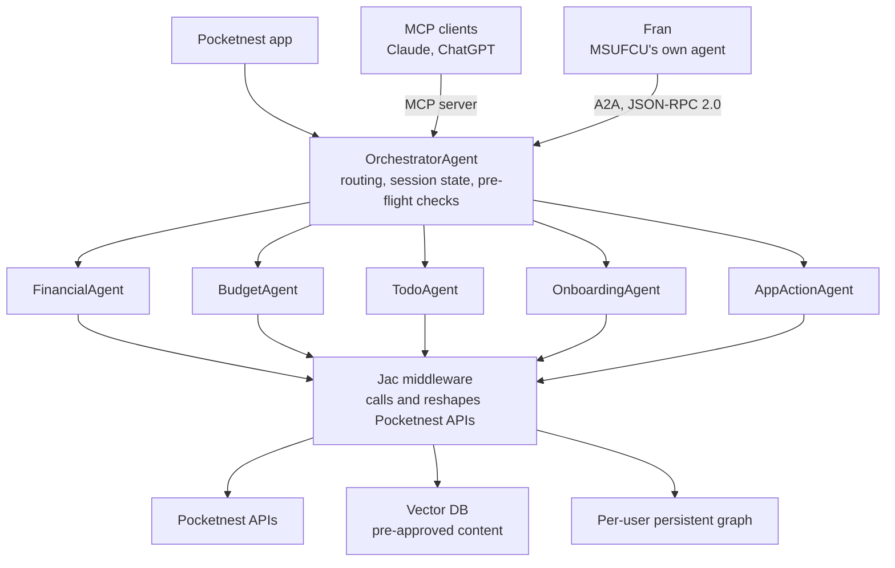

# How Pocketnest Built a Personalized AI Financial Assistant on Jac in 3 Months

Built with [Jaseci](https://www.jaseci.org/), **[Pocketnest](https://www.pocketnest.com/)** turned its financial wellness app into an agentic AI product in **3 months**. Birdie, its assistant, runs on **six coordinated agents**, answers only from pre-approved content, and now talks agent to agent with a credit union's own AI.

<!-- more -->

3 monthsfrom concept to a production agentic assistant

6specialized agents under one orchestrator

2external interfaces: an MCP server and an A2A tier

4,579members active in a three-month, five-credit-union pilot

53%rise in member financial wellness at MSUFCU in month one

$9Mraised, backed by Barclays and Lloyds Banking Group

"They really are at the forefront of the space from a technology standpoint and ideation standpoint... The experience was phenomenal. The unique ability to have the vision, have the collaboration, and being able to execute on that is unique as a partner."

Chris Wascha, CTO, Pocketnest, on partnering with Jaseci Labs

<figure class="device" markdown="1">

<figcaption>Birdie answering "is debt bad" with guidance grounded in the user's own numbers, and a receipt showing which approved documents it drew from.</figcaption>
</figure>

## The Company

Pocketnest is a Michigan-based fintech on a mission to democratize financial planning. It offers a **white-label AI platform** that banks, credit unions, and employee wellness programs deploy under their own brand.

<dl class="company-facts">

<dt>Founded by</dt>
<dd>Jessica Willis, a former wealth manager who co-managed over <strong>$1 billion</strong> for more than <strong>300 families</strong></dd>

<dt>Backed by</dt>
<dd>Roughly <strong>$9M</strong> from investors including <strong>Barclays</strong> and <strong>Lloyds Banking Group</strong></dd>

<dt>Model</dt>
<dd>White-label AI financial wellness, deployed under the partner's own brand</dd>

<dt>In the field</dt>
<dd><strong>4,579</strong> members active in three months across five credit unions in a Filene Research Institute pilot</dd>

</dl>

The results are measurable. In that Filene pilot, MSUFCU saw a **53% increase in member financial wellness** within the first month.

What makes Pocketnest different is **the depth of the user profile it builds**. The app doesn't just track transactions. It maps a user's behavioral tendencies, whether they are a "mover and shaker" always thinking ahead or someone who needs steady reassurance, then layers that on top of their financial data to deliver guidance that actually fits the person receiving it. *That depth was exactly what made building their AI assistant hard.*

## The Challenge

Pocketnest wanted a conversational interface, an assistant called Birdie, that could let users do the things the app does **just by asking**. Check a budget, add a to-do, get personalized financial guidance, walk through onboarding. All through conversation, with agents carrying out tasks on the user's behalf.

The hard part was **the seam between the AI and the existing product**. Pocketnest's APIs were built for an app: designed for directional, tap-through interactions, where the interface controls the flow and the user follows predictable paths. A conversational agent works the opposite way. Users ask for things in any order, in their own words, and expect the system to figure out what they mean and which underlying capability to invoke.

> Making app-oriented APIs serve an open-ended conversational agent was the central engineering problem.

On top of that sits the constraint every fintech shares. In a regulated financial context, the system **cannot hallucinate**, and every action it takes on a user's behalf needs to be **traceable**. Accuracy and auditability were non-negotiable.

## The Solution: Birdie, Built on the Jaseci Stack

Pocketnest partnered with Jaseci Labs, the professional services arm of the Jaseci ecosystem, to build Birdie on [Jac](https://www.jac-lang.org/), the open source AI-native programming language at the ecosystem's core. The collaboration ran in two phases.

**Version 1** established the foundation: a retrieval-augmented generation (RAG) system over Pocketnest's own library of pre-approved financial education content. Pocketnest's vetted material was embedded into a vector database, so Birdie could answer general financial questions grounded only in sources the company trusted, **directly addressing the hallucination problem**. Each user also got their own persistent graph holding personal state, so answers could be tied to the individual rather than served generically.

**Version 2** turned Birdie from a knowledge assistant into an agentic system that can act inside the product. This is where the bulk of the technical work lives.

### An orchestrated multi-agent architecture

Rather than one chatbot, Birdie is **a set of specialized agents coordinated by an orchestrator**. Each one is an ordinary, typed Jac construct rather than a configuration layered on top of an external framework.

OrchestratorAgentRoutes each query to the right agent, manages session state, and runs pre-flight checks before anything executes.

FinancialAgentThe version 1 capability, now one agent among many: account data, personal goals, and RAG-based financial education.

BudgetAgentBudget creation and edits, spending analysis, recommendations, tracking actuals against plan, and end-of-month planning.

TodoAgentViewing and completing the user's to-dos.

OnboardingAgentDeterministic question-and-answer flows for setting up the user and each budget theme.

AppActionAgentKnowledge of the app's features, and how-to guidance for using them.

Each agent can run independently or be invoked by the orchestrator, which keeps the system modular. New capabilities can be added as new agents without reworking the whole.

### A three-model pipeline

Under the hood, Birdie runs on three distinct LLM roles rather than a single model.

Routerclassifies each query and directs it

Mainhandles reasoning and responses

HTMLgenerates the rich response cards the user sees

Because Jac's AI integration is model-agnostic by design, any provider's keys can be configured, and the team tested several models to find the right fit for each role, **without changing a line of agent logic**.

## Why Jac

Jac wasn't chosen because it could call an LLM. Plenty of frameworks do that. The reason was that Jac is **both an AI framework and a general-purpose logic layer in the same language**.

Because Pocketnest's APIs were built for an app rather than for an AI, the data coming back from them wasn't in a shape an LLM could use directly. Often a single conversational request meant calling multiple APIs, then transforming and reshaping their responses into something a model could reason over and respond to coherently. That required writing **real programming logic, not just prompt orchestration**, wrapped around the AI calls.

This is where pure AI frameworks fall short. They give you the model layer, but the moment you need substantial custom logic to bridge messy upstream systems, you are stitching together a second toolchain. In Jac, that middleware logic and the AI agents live in the same language. The team could write the transformation logic and the `by llm()` agent definitions side by side, without leaving the stack, with one type system checking both.

> Two Jac capabilities anchored the build. [`by llm()`](https://byllm.jaseci.org/) is Jac's native construct for turning a function or agent definition into an LLM-backed capability, and it was used to build every one of Birdie's agents. The per-user persistent graph, a first-class primitive of the stack's [object-spatial model](https://docs.jaseci.org/reference/language/osp/), held each user's personal state so agents always operated against the right individual context.

Together they let a small team build a six-agent system with custom middleware in a single, coherent codebase.

## Beyond the Chatbot: Agent-to-Agent Interoperability

The most distinctive part of the build lies in how Birdie talks to the outside world. Birdie's entire agent layer is exposed through two external interfaces. The first is an MCP server, which makes every agent available as tools to any MCP-compatible AI client, such as Claude or ChatGPT, all mediated by the orchestrator. The second is an agent-to-agent (A2A) interface built on the JSON-RPC 2.0 standard.

The A2A interface was piloted with MSUFCU, the Michigan State University Federal Credit Union, whose own conversational agent, "Fran," was able to reach Birdie's capabilities directly, agent to agent. *One organization's AI calling another organization's AI, with provable trust.*

That trust is **engineered, not assumed**. The implementation rests on three ideas.

Zero-Trust "Lite"Authority is delegated through token passthrough, so no persistent personally identifiable information is stored on the far side of the boundary. Two organizations can interoperate without merging their customer data.

The "Recorder" patternEvery reasoning step, tool call, and raw API response is captured, giving full traceability of what the system did and why. This is the audit trail regulated entities are required to keep.

A standardized A2A tierJSON-RPC 2.0 messaging lets agents across affiliated companies discover and transact with one another reliably.

This pattern recurs whenever related companies **share customers but not a single data store**, which is exactly the situation a credit union and its portfolio companies find themselves in. There aren't many production implementations of cross-organization agent interoperability with this level of built-in observability, which is what makes it a standout part of the build.

## The Outcome

Version 1 shipped into Pocketnest's live product, giving the company a credible, differentiated AI narrative grounded in real personalization and compliance-conscious design. Shortly after, Pocketnest was [acquired by Reseda Group, MSUFCU's credit union service organization, together with Maps Credit Union](https://www.resedagroup.com/reseda-group-maps-credit-union-acquire-pocketnest/), and the AI experience built on Jac was part of the value Pocketnest brought to the table.

Just as telling is what happened after delivery. Pocketnest's own developers continued making independent contributions to the codebase. What was built on the stack became **a foundation they could iterate on themselves, not a black box they depended on**. That arc, from services engagement to self-sufficient adopter, is the open source ecosystem's sustainability model working as designed: professional services fund continued development of the open stack, and every engagement grows the community of teams who can build on it independently.

As CTO Chris Wascha put it, they didn't want the cookie-cutter AI chatbot. They wanted to push the envelope, and Jac is the stack that let a small team get there in **three months**.

---

Birdie is built on [Jac](https://www.jac-lang.org/), the open source AI-native programming language, and the Jaseci ecosystem's typed LLM integration ([byLLM](https://byllm.jaseci.org/)), persistent graphs, and agent interoperability tooling, all MIT licensed and developed in the open. Jaseci Labs, the professional services arm of the ecosystem, partners with teams to build production AI experiences on the stack; these engagements help sustain development of the open source core.

Building an assistant that has to act inside a real product, not just talk about it? That is the seam [Jaseci](https://www.jaseci.org/) was built for.

[Explore Pocketnest](https://www.pocketnest.com/){ .cta-button }

