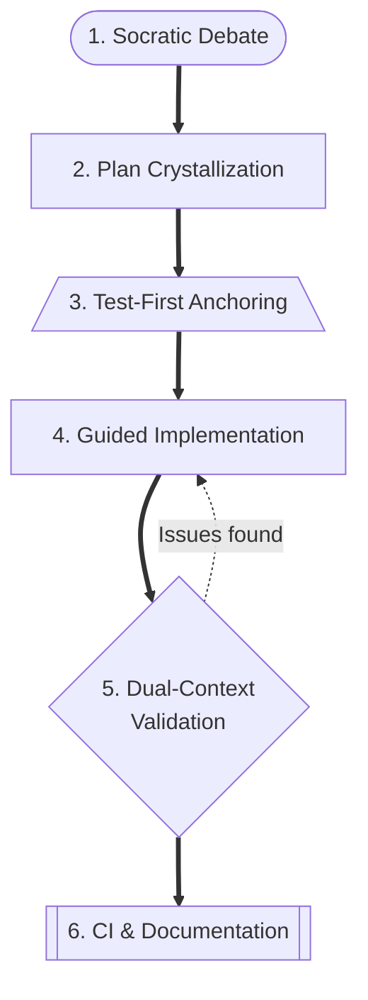
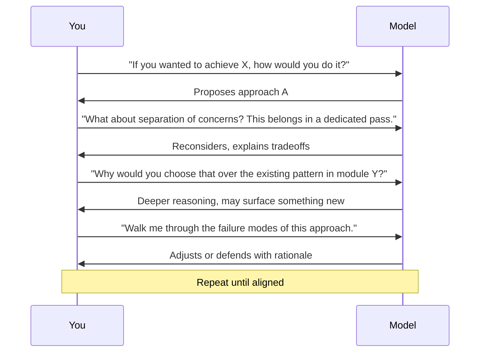
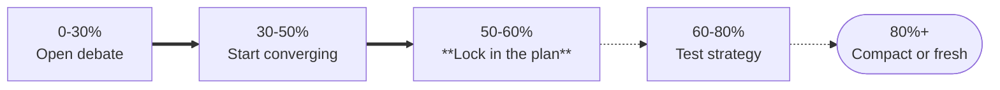
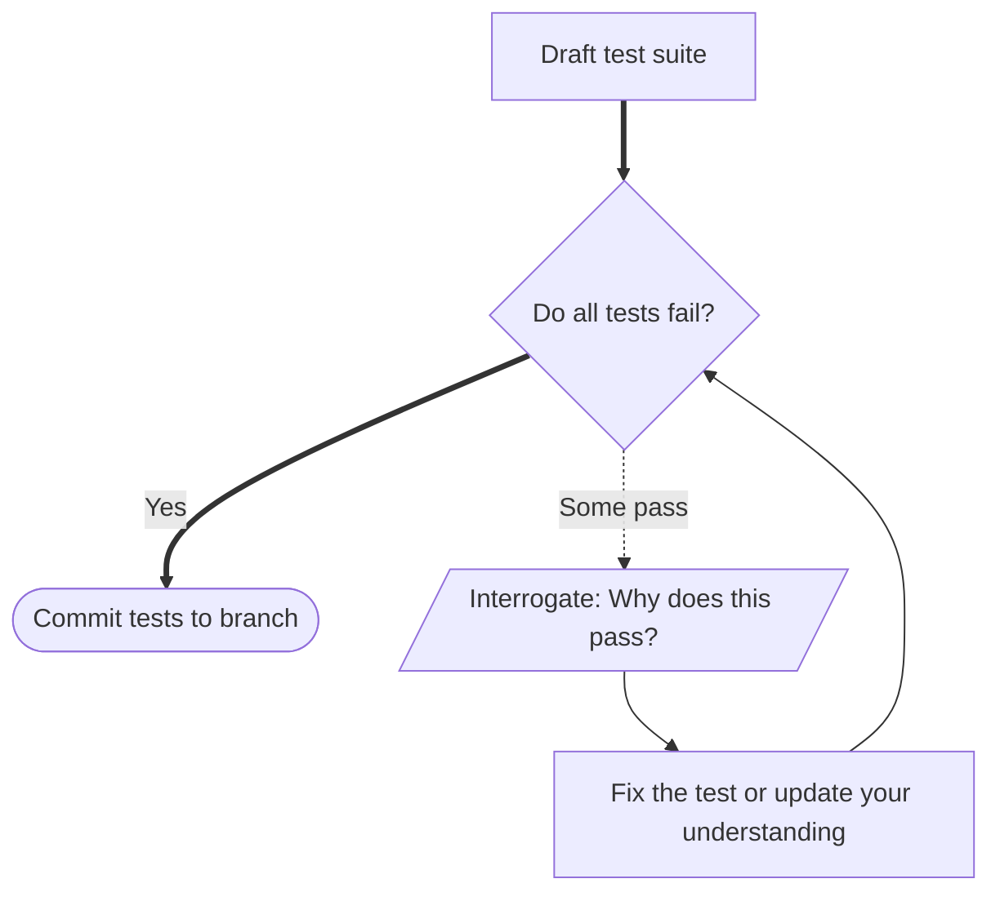
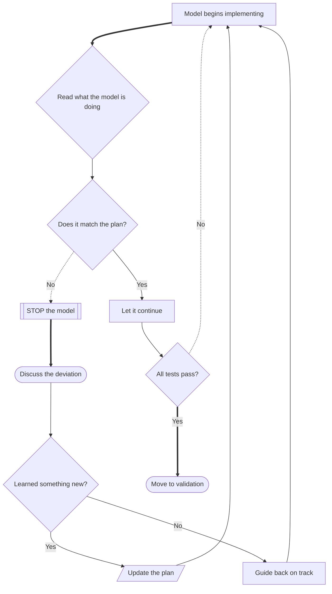
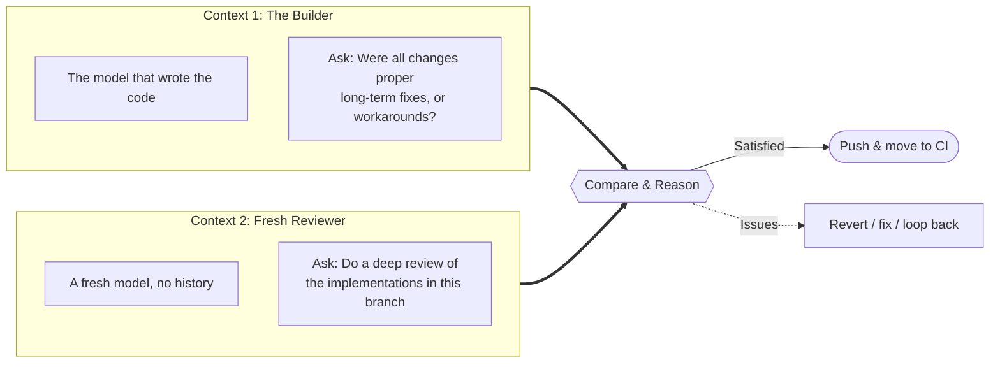
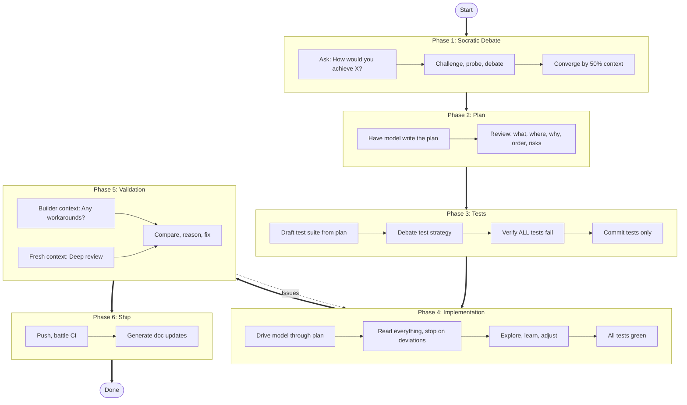

# The Socratic Prompt Method: A Framework for AI-Assisted Development

Every model demo you've ever watched -- Anthropic, OpenAI, whoever -- follows the same script. Someone types a request, the model produces something impressive, the audience applauds. It's a compelling showcase for the model. It's a terrible workflow for an engineer.

I've spent years in compilers, language runtimes, and distributed systems -- the kind of work where handwaving doesn't survive contact with reality. When AI coding assistants arrived, I fell into it like everyone else. The demos make it look so clean.

It took longer than I'd like to admit to recognize the pattern: it's the same thing you see when a developer copies from Stack Overflow without understanding the code. The demo format trains passivity. It optimizes for throughput at the expense of understanding. That tradeoff doesn't hold up in production.

<!-- more -->

So I developed something different. I call it the **Socratic Prompt Method** -- a structured workflow that treats the AI as a collaborator you interrogate, not an oracle you defer to. The core principle: **don't tell the model what to do. Interrogate it until you're both aligned, then hold it accountable with tests.** This isn't a collection of prompt tricks. It's a full development methodology -- and it compounds. Every session sharpens the design, surfaces assumptions, and leaves a test suite that proves the implementation is correct.

## The Full Workflow at a Glance

Here's each phase, and the engineering rationale behind it.

---

## Phase 1: The Socratic Debate

The instinct is to start giving instructions. I've learned it's worth resisting. Open with a question:

> "If you want to achieve [insert specs], how would you do it?"

I already know how I'd approach it -- that's the point. I'm not asking because I'm lost. I'm probing the model's reasoning to **find the gap** between its understanding and mine. Sometimes that gap reveals a blind spot in the model. Sometimes it reveals one in me. Both are worth finding.

### The Art of the Socratic Question

Certain question types consistently produce the most useful conversations:

| Question Type | Example | What It Exposes |
|---|---|---|
| **Challenge the location** | "Is this the ideal file for this? What about the transform layer?" | Whether the model grasps your architecture |
| **Challenge the approach** | "Why this over the visitor pattern we already use?" | Depth of reasoning, awareness of existing patterns |
| **Introduce context** | "Have you considered how this interacts with the import resolver?" | Whether the model missed key dependencies |
| **Probe failure modes** | "What happens when this encounters a circular reference?" | Edge cases and robustness of thinking |

The key is to **lead** rather than dictate. I usually know the correction I want -- but by asking rather than telling, I force the model to reason through the problem, which often surfaces considerations I hadn't thought of. More than once, the model has pushed back on my instinct and been right. That doesn't happen when you just give orders.

### Watch Your Context Window

The Socratic debate is high-value but token-expensive. Pace yourself.

Converge by 50-60% context consumption. I've lost productive sessions by burning the entire window on a fascinating tangent. The debate serves the plan -- not the other way around.

---

## Phase 2: Plan Crystallization

Once aligned, have the model **write the plan down**. Non-negotiable. A plan in the context is a persistent reference that keeps both parties honest -- and it survives context compaction far better than a sprawling conversation.

The plan must capture:

- **What** changes are being made and **where**
- **Why** this approach was chosen (the debate should have surfaced this)
- **Implementation order** and dependencies
- **Key risks** and mitigation strategies

This is the same artifact you'd produce in a design review with another engineer. The model needs a spec to execute against, and you need one to hold it accountable.

---

## Phase 3: Test-First Anchoring

This is where the method gets its teeth. Before any implementation, draft the tests:

> "What would a test suite look like for this plan?"

Then debate the test strategy. Push on coverage gaps, challenge assumptions, probe edge cases. If this spills into the next context window, that's fine -- the tests exist in the codebase and survive any reset.

### The Critical Rule: Every Test Must Fail

This is red-green-refactor, applied to human-AI collaboration. **Every test must fail before implementation begins.** If a test passes with no implementation:

- The test is trivially true -- it's testing nothing
- The behavior already exists somewhere you didn't know about
- The test has a bug that makes it vacuously pass

When this happens, I interrogate the model: "Why does this test pass? There's no implementation yet." I've caught subtle architectural misunderstandings this way -- the model might reveal "this behavior already exists in module X," and suddenly I understand a part of the system better than I did five minutes ago.

Once all tests fail and align with the plan, **commit just the tests**. This is the contract. Everything from here is about making them green.

---

## Phase 4: Guided Implementation

Drive the model through the plan. The operative word is **drive**.

### Do Not Slot Machine It

When the model does something unexpected, **stop it immediately**. Don't let it run and hope it figures itself out -- that's the demo-driven passivity creeping back in. Every deviation is a conversation:

- "Why did you change this file? That wasn't in the plan."
- "This approach differs from what we discussed. Walk me through your reasoning."
- "This looks like a workaround. What's the proper fix?"

Here's what makes this phase productive rather than frustrating: you have your tests as a safety net. They define "done." So you're free to explore. I've had sessions where a 20-minute tangent taught me more about the problem domain than the original task. That's not wasted time -- that's compounding returns on understanding the system deeply.

When you're done exploring, guide the model back to the plan -- or revise the plan based on what you learned.

### Context Window Strategy

Don't worry about context consumption during implementation. The tests are committed -- they survive any reset. If context runs out, start fresh:

> "Here's the plan: [plan]. Here are the failing tests: [test file]. Continue implementing."

The tests are the anchor. Everything else is recoverable.

---

## Phase 5: Dual-Context Validation

All tests pass. Now validate the work -- and this is the technique worth spending time on.

Use **two separate contexts** to cross-examine the implementation:

### Why Two Contexts?

The model that wrote the code has **sunk cost bias baked into its context**. It spent an entire session building something -- it will tend to defend its decisions. A fresh context has no such bias. It evaluates the code purely on its merits.

In the **builder context**, ask:

> "Were all the changes you made the proper long-term fix, or were there any workarounds?"

This leverages the model's full session history. It *knows* where it cut corners -- it was there when the decision happened. It's surprisingly candid when asked directly.

In the **fresh context**, ask:

> "Can you do a deep review of the implementations in this branch?"

This is the unbiased second opinion. Look for disagreements between the two reviews. Those disagreements are exactly the spots that need attention. Roll back to any prior state as needed and loop until the branch meets your standards.

---

## Phase 6: CI and Documentation

Push and battle CI failures. CI is the final arbiter -- no shortcuts, no "it works on my machine."

For documentation, use the model as an analyst after the PR is green:

> "Analyze the changes in this branch and investigate all locations in documentation that need updating. Make those improvements."

This works well as a separate pass. The model can trace the full diff across the codebase and find stale documentation -- often more thorough at this than a manual search.

---

## The Complete Flow

---

## Why This Works

### 1. You Stay in the Driver's Seat

The model is a collaborator, not an autopilot. You interrogate, guide, and learn at every step. You understand every line of code that gets committed because you were part of the conversation that produced it. There's no "I don't know what this does but the AI wrote it."

### 2. Tests Are the Contract

By committing tests first, there's an objective definition of "done" that survives context resets, model hallucinations, and your own evolving understanding. The tests don't care about the conversation -- they care about behavior. That's the anchor that makes everything else possible.

### 3. Every Interaction Compounds

Most AI workflows optimize for speed. This one optimizes for **understanding**. The Socratic questioning, the test interrogation, the dual-context review -- they all create moments where something gets learned that wasn't known before.

The demo-driven approach is faster per-session. This compounds. Every session sharpens architectural instincts, every debate deepens knowledge of the codebase, and over time the gap between thinking with AI and deferring to AI becomes the most important skill distinction in the field.

---

## Quick Reference Card

| Phase | Key Action | Key Question |
|---|---|---|
| 1. Debate | Challenge the model's approach | "If you wanted to achieve X, how would you do it?" |
| 2. Plan | Write it down, make it concrete | "Put the plan down now." |
| 3. Tests | Red-green-refactor: all must fail | "What would a test suite look like for this plan?" |
| 4. Implement | Stop on deviations, interrogate | "Why did you deviate from the plan?" |
| 5. Validate | Two contexts, cross-examine | "Were any of these changes workarounds?" |
| 6. Ship | CI is the final arbiter | "What documentation needs updating?" |
