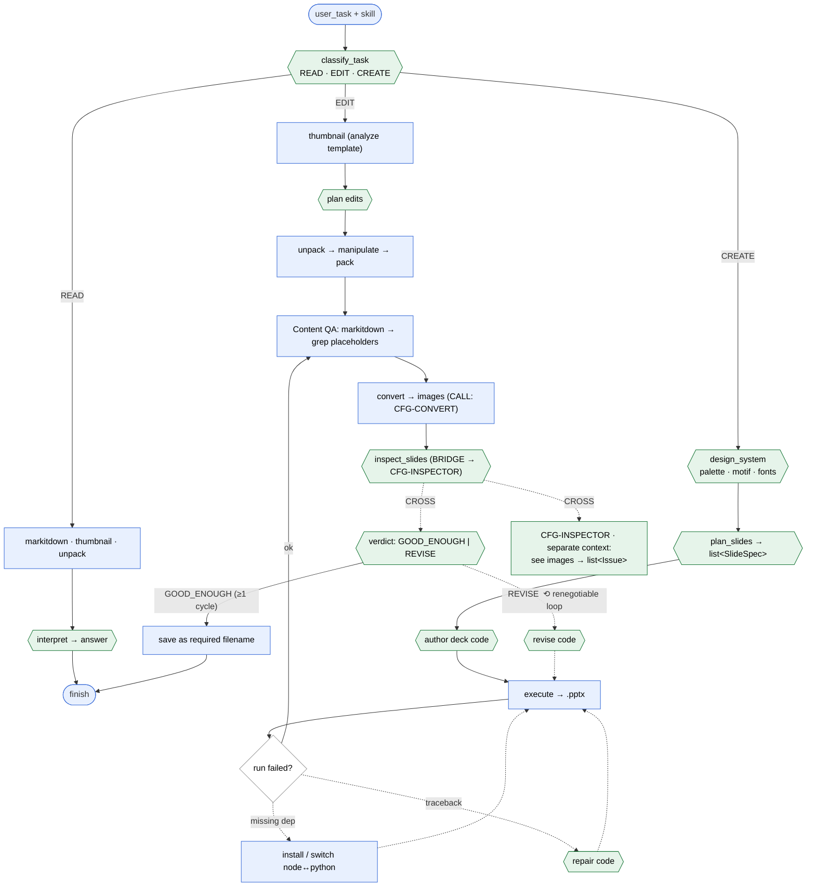

# test-1

This is a test blog

```jac
glob string:str = "str";
```

ha ha edited

ooh again edited.

```mermaid
flowchart TD
    T(["user_task + skill"]) --> D0{{"classify_task<br/>READ · EDIT · CREATE"}}

    D0 -->|READ| R0["markitdown · thumbnail · unpack"]
    R0 --> R1{{"interpret → answer"}} --> DONE

    D0 -->|EDIT| E0["thumbnail (analyze template)"]
    E0 --> E1{{"plan edits"}} --> E2["unpack → manipulate → pack"] --> QA

    D0 -->|CREATE| C1{{"design_system<br/>palette · motif · fonts"}}
    C1 --> C2{{"plan_slides → list&lt;SlideSpec&gt;"}}
    C2 --> C3{{"author deck code"}}
    C3 --> C4["execute → .pptx"]
    C4 --> ERR{"run failed?"}
    ERR -. "missing dep" .-> DEP["install / switch node↔python"] -.-> C4
    ERR -. "traceback" .-> FIX{{"repair code"}} -.-> C4
    ERR -->|ok| QA

    QA["Content QA: markitdown → grep placeholders"] --> CV["convert → images (CALL: CFG-CONVERT)"]
    CV --> INS{{"inspect_slides (BRIDGE → CFG-INSPECTOR)"}}
    INS -. CROSS .-> J{{"verdict: GOOD_ENOUGH | REVISE"}}
    J -. "REVISE  ⟲ renegotiable loop" .-> REV{{"revise code"}}
    REV -.-> C4
    J -->|"GOOD_ENOUGH (≥1 cycle)"| SAVE["save as required filename"] --> DONE(["finish"])

    INSPECTOR["CFG-INSPECTOR · separate context:<br/>see images → list&lt;Issue&gt;"]
    INS -. CROSS .-> INSPECTOR

    classDef cog fill:#e6f4ea,stroke:#137333,color:#000;
    classDef basic fill:#e8f0fe,stroke:#3367d6,color:#000;
    classDef gate fill:#fff,stroke:#999,color:#000;
    class D0,R1,E1,C1,C2,C3,FIX,INS,J,REV,INSPECTOR cog;
    class R0,E0,E2,C4,DEP,QA,CV,SAVE basic;
    class ERR gate;
```
