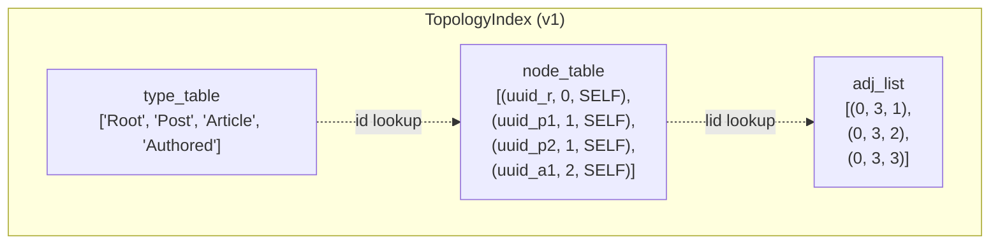
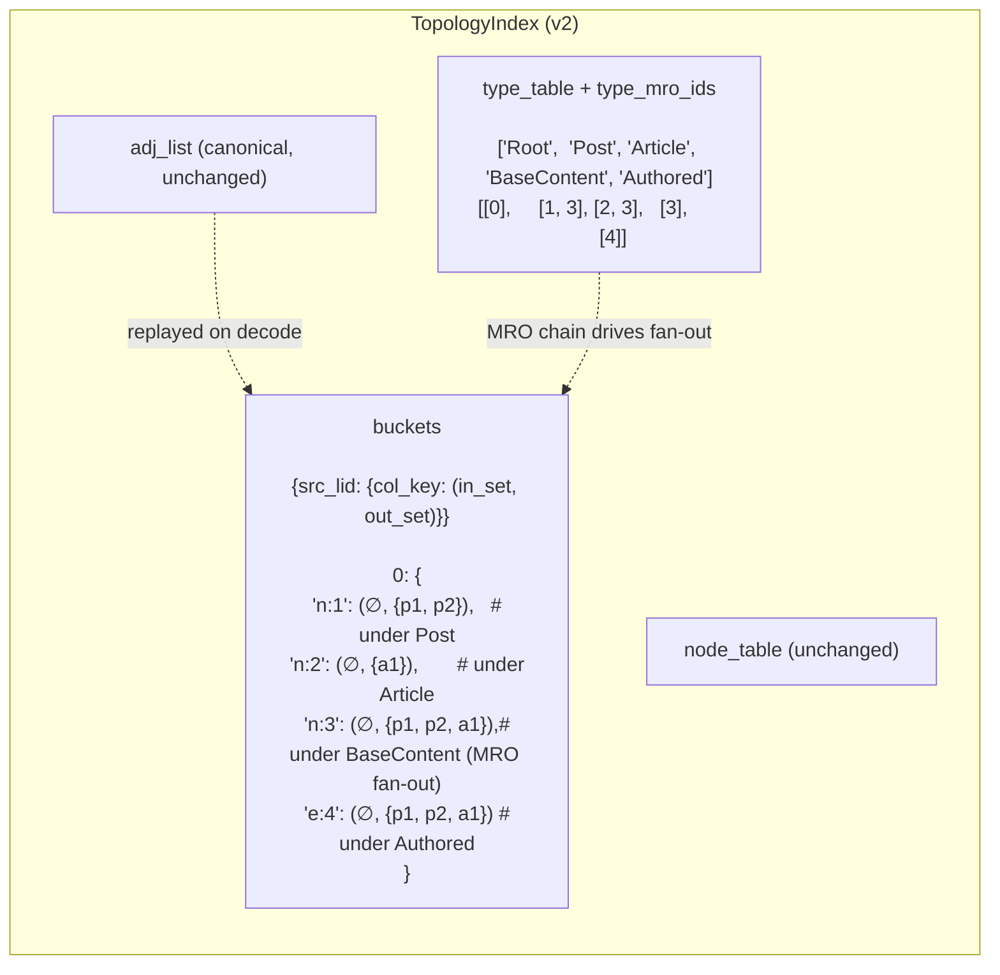
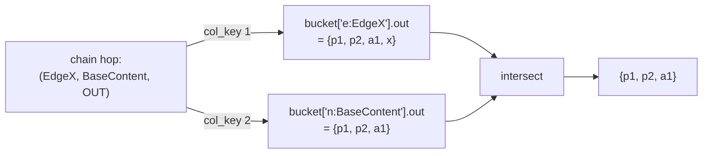
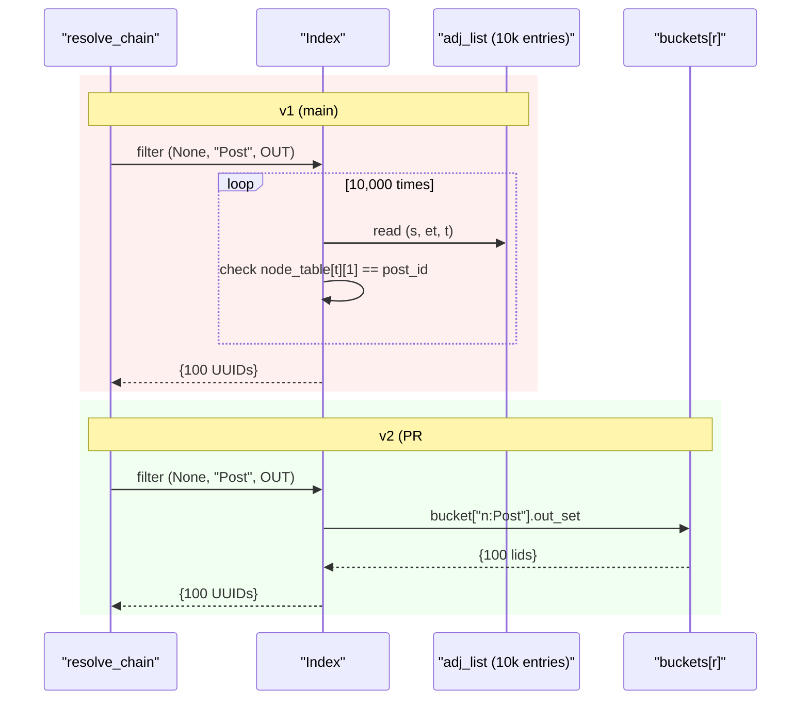
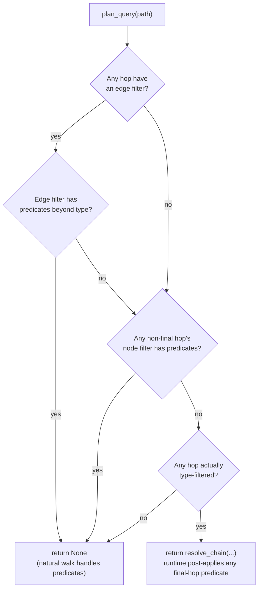
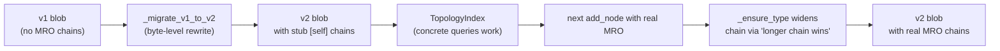

# Rebuilding Jac's TopologyIndex: from O(N) scans to type-keyed buckets

Jac runs a lot of graph queries. They show up everywhere in Object-Spatial code, from `[root --> [?:User]]` to multi-hop walks like `[r ->:Authored:-> [?:Post] ->:Tagged:-> [?:Topic]]`. The naïve way to answer them is to walk every edge from the origin, load the targets, and check the filters. The TopologyIndex was added in [PR #5205](https://github.com/jaseci-labs/jaseci/pull/5205) to skip that work for type-filtered queries -- store enough metadata on the root node to resolve the survivors without ever touching the database.

The original implementation worked, but it had two problems we couldn't ignore. It scanned a flat adjacency list on every query, so cost was independent of selectivity (a query that matched 1% of the graph cost the same as one that matched 99%). And it had a quiet correctness bug for inheritance hierarchies: parent-type queries silently returned the empty set instead of all subtype instances.

[PR #5784](https://github.com/jaseci-labs/jaseci/pull/5784) rebuilds the index around a type-keyed lookup map with MRO-aware fan-out. Same canonical wire format. Same API surface. But typed reads now scale with match count, parent-type queries do the right thing, and the planner knows when to skip the index entirely. This post walks through what changed, why, and what the measured numbers look like.

<!-- more -->

## What the TopologyIndex actually does

To set the stage: a Jac graph query like

```jac
[r ->:Authored:-> [?:Post]]
```

means "from `r`, follow outgoing `Authored` edges, return targets that are `Post` instances." Without help, the runtime walks `r.edges`, loads each target anchor (potentially from disk), and checks the type. With a million edges and 99% of them not being `Post`, you've done a million pointless DB fetches.

The TopologyIndex sits on the root anchor and answers the typed-survivors question locally. It carries:

- A **type table** mapping type names to small integer ids.
- A **node table** mapping each persisted node to a local id, its type id, and (for foreign-owned nodes) its owner root.
- An **adjacency list** of `(src_local_id, edge_type_id, tgt_local_id)` triples.

When you query, the runtime asks the index "which UUIDs survive these type filters?", then `batch_get`s those nodes in one round-trip ([more on that here](making-jac-scale-traversals-faster.md)). The index doesn't replace the database -- it tells the runtime which subset of UUIDs is worth fetching.

The index is encoded as a compact binary blob on the root anchor and decoded back on read. That blob is the source of truth; everything else is derived.

## The original design

Here's the structure on `main` before the rebuild:



Three flat structures. Adding a node appends to `node_table`. Adding an edge appends a triple to `adj_list`. Encoding is a tight `struct.pack` of all three. Decoding rebuilds them. Simple, tight, easy to reason about.

The trouble is `resolve_chain`, which walks the index to answer a query. Here's the core loop in pseudocode:

```
for each (edge_type, node_type, direction) in chain:
    next_lids = empty
    for each (s, et, t) in adj_list:                    # full scan
        if edge_type matters and et != edge_type_id: continue
        if direction is OUT and s in current_lids:
            if node_type matters and node_table[t][1] != node_type_id: continue
            next_lids.add(t)
        ...
    current_lids = next_lids
```

Every hop is a **full scan of the entire `adj_list`**. If the graph has 50,000 edges and the query matches 100 of them, you still walked all 50,000. The cost is `O(edges)` regardless of how selective your filter is.

This was acceptable in the original design because the wire format dictated the structure: `adj_list` is what gets serialized, so derived indexes felt like cheating. But "scan everything every time" makes the worst case unavoidable, and for typed queries, the worst case is also the common case -- you're filtering for exactly the kind of selectivity that should benefit from an index.

## The bug we missed

Here's a Jac snippet that looked completely reasonable:

```jac
node BaseContent {
    has val: int = 0;
}
node Post(BaseContent) {}
node Article(BaseContent) {}

with entry {
    for i in range(5) {
        root +>: Authored :+> Post(val=i);
    }
    for i in range(5) {
        root +>: Authored :+> Article(val=100 + i);
    }
    posts_and_articles = [root ->:Authored:-> [?:BaseContent]];
    print(len(posts_and_articles));   # expected 10, got 0 with the index on
}
```

`[?:BaseContent]` should match all 10 subtype instances. With the index off, the natural walk does an `isinstance(target, BaseContent)` check and returns 10. With the index on, it returned 0.

Why? The hooks called `_type_name(node.archetype)`, which is just `type(obj).__name__`. So only `"Post"` and `"Article"` were ever registered in the type table. When the query asked for type id of `"BaseContent"`, the index dutifully looked it up, found nothing, and returned the empty set. Strict type id equality. No notion of inheritance.

The natural walk silently masked the bug because everyone tested with the toml flag off in development. But in production, with the index doing its job, parent-type queries returned an empty set instead of every subtype instance. **Quiet wrong answer**. Worst kind of bug.

## The redesign: type-keyed buckets

Two things had to change at the same time. The data structure had to support O(1) per-type lookups, and the indexing logic had to know about type hierarchies. Here's what the rebuilt index looks like:



The flat `adj_list` is still the source of truth. Encoded blob, multi-edge multiplicity, deterministic ordering -- all canonical, all preserved. The new piece is the `buckets` map, a derived index that lives in memory only:

```
buckets[src_lid][col_key] = (in_set, out_set)
```

`col_key` is one of:

- `"n:<type_id>"` -- targets reachable from this source by node type
- `"e:<edge_type_id>"` -- targets reachable from this source by edge type

The "by node type" column is the trick: when an edge `r -[Authored]-> Post(BaseContent)` is added, the target gets fanned out under **every ancestor in its MRO**. So `p1` ends up in the `"n:Post"` column AND the `"n:BaseContent"` column under `r`'s bucket. Parent-type queries become exactly as fast as concrete-type queries.

Each type's MRO chain is stored alongside its name in the type table (`type_mro_ids: list[list[int]]`) and serialized into the v2 wire format. We capture the user-defined MRO -- the chain stops at the runtime base archetypes (`NodeArchetype`, `EdgeArchetype`, `WalkerArchetype`, `Archetype`, `object`) so we don't pollute the index with framework types that nobody filters on.

`resolve_chain` becomes a sequence of dict lookups instead of a scan:

```
for each (edge_type, node_type, direction) in chain:
    for each origin_lid in current_lids:
        bucket = buckets[origin_lid]
        candidates_out, candidates_in = None, None
        for each col_key in (n:<ntype>, e:<etype> if filtered):
            col = bucket[col_key]                  # O(1) dict lookup
            candidates_out &= col.out_set          # O(set intersection)
            candidates_in  &= col.in_set
        next_lids |= candidates_out (or in, depending on direction)
    current_lids = next_lids
```

Two dict lookups (one for the edge type, one for the node type) and a set intersection per origin per hop. The cost scales with `|matches|` rather than `|graph|`.

Here's the same multi-filter query as a flow:



When a hop has both an edge filter and a node filter, the survivors are the intersection of the two columns -- a single set operation, not a per-edge predicate evaluation.

## Walking the contrast

It's worth seeing both implementations side by side on a concrete case. Imagine a star graph: one root, 10,000 outgoing edges, 100 of the targets are `Post` instances and the rest are `Comment`. The query is `[r --> [?:Post]]`.



v1 does 10,000 reads from `adj_list` plus a node-table lookup on each. v2 does one dict lookup. Same answer, totally different work envelope.

## Knowing when not to use the index

A subtler win in this PR is the **planner bypass**. Not every query benefits from going through the index. Consider an unfiltered traversal:

```jac
all_neighbors = [r -->];
```

There's no type filter on either the edge or the node. With the index off, the runtime does its natural edge walk. With the index on, what should happen? It can answer the query, but it has to enumerate every column in `r`'s bucket and union the results -- which is **more** work than just walking `r.edges` once. So engaging the index here is a regression even though it produces the right answer.

`plan_query` makes the call before any index work happens:



The four cases:

1. **Edge filter has predicates** like `:weight>=5:`. The index can't express attribute predicates, so bail to the natural walk where `lambda e: isinstance(e, Weighted) and e.weight >= 5` runs at full fidelity.
2. **Non-final hop's node filter has predicates**. Same reason, except the runtime can post-apply a predicate on the final set, so the final hop alone gets a pass.
3. **No hop has any type filter at all**. The natural edge walk wins; bail.
4. **Otherwise**: engage the index. If a final-hop filter has predicates beyond type, the runtime evaluates the predicate on the planned UUID set after `resolve_chain` returns.

Predicate detection happens via Python bytecode inspection of the lambda:

```jac
impl _filter_has_predicates(filt: (Callable | None)) -> bool {
    ...
    opcodes = {instr.opname for instr in dis.get_instructions(filt)};
    return bool(opcodes & {'LOAD_ATTR','COMPARE_OP','CONTAINS_OP','IS_OP'});
}
```

`isinstance(x, T)` compiles to `LOAD_GLOBAL isinstance + LOAD_FAST x + LOAD_GLOBAL T + CALL_FUNCTION` -- nothing in the predicate set. Anything more complex (`x.foo`, `x > 5`, `x is None`) introduces one of those opcodes and triggers the bypass. Cheap, robust, conservative on inspection failure.

## Migrating existing on-disk indexes

We had to handle one more thing: every persisted root in production had a v1 blob on disk, and the new query path needs MRO chains. Discarding the index and rebuilding from scratch wasn't an option because there's no easy way to enumerate "every persisted node and its type" without loading the whole graph.

The migration is a **pure byte-level rewrite of the type table header**. On decode, if the version byte is 1, we splice a stub `[self]` MRO chain into each type entry and bump the version byte to 2. No graph data loaded; we only read and rewrite the type table. The result is a v2 blob that decodes normally.

Concrete-type queries work immediately on the migrated index. Parent-type queries need the real MRO chain, which gets installed lazily: the next mutation that calls `_ensure_type` with a real chain (via `add_node(... mro_chain=[...])`) replaces the stub.



The "longer chain wins" check inside `_ensure_type` makes this safe:

```jac
if mro_chain and len(mro_chain) > len(self.type_mro_ids[tid]) {
    chain_ids: list[int] = [];
    for anc in mro_chain {
        chain_ids.append(self._ensure_type(anc));
    }
    self.type_mro_ids[tid] = chain_ids;
}
```

Stubs are length 1 (`[self]`). Real chains are length 2+. The check upgrades stubs to real chains on contact and never downgrades. Migration warm-up is per-type, not per-edge; once a type is touched once, every future edge under that type gets the full fan-out.

One trade-off worth flagging: pre-migration edges aren't retroactively fanned out under the freshly-discovered ancestor types. So immediately after migration, parent-type queries may return partial results until the graph churns enough for `add_node` to be called with the real MRO for each type. We tracked this in [issue #5886](https://github.com/jaseci-labs/jaseci/issues/5886) along with two related robustness gaps in the migration path -- a ~30-line follow-up either way.

## Performance

The headline win is for low-selectivity typed queries on big graphs -- which is the realistic regime for typed graph queries. Star graph, n=10,000 edges, query is `resolve_chain({root}, [(None, "NodeB", 2)])`. Brute-force reference runs alongside on every case to assert correctness.

### 1-hop selectivity

| sel | matches | main µs | new µs | speedup |
|---:|---:|---:|---:|---:|
| 1% | 100 | 471 | **11** | **43×** |
| 10% | 1,000 | 486 | **89** | **5.5×** |
| 50% | 5,000 | 878 | **529** | **1.7×** |
| 99% | 9,900 | 1,242 | **1,000** | **1.2×** |

Main is roughly flat -- it scans the full `adj_list` regardless of selectivity. The new impl scales with match count, so the win compounds at low selectivity. At 1% selectivity, the typed-graph-query sweet spot, it's a **43× speedup** measured end-to-end.

### 1-hop fanout at 10% selectivity

| n | main µs | new µs | speedup |
|---:|---:|---:|---:|
| 100 | 5.1 | 1.5 | 3.5× |
| 1,000 | 50.4 | 10.2 | 4.9× |
| 10,000 | 547 | 91 | 6.0× |
| 50,000 | 2,688 | 568 | 4.7× |

### 2-hop chains compound

The selectivity advantage compounds across hops. Bench: `[root -E1-> [?:MidA] -E2-> [?:LeafX]]`.

| edges | sel | main µs | new µs | speedup |
|---:|---:|---:|---:|---:|
| 1,100 | 10% | 58 | 18 | 3.2× |
| 10,100 | 10% | 525 | 154 | 3.4× |
| 50,500 | 10% | 2,893 | 737 | 3.9× |
| 50,500 | 1% | 2,399 | **97** | **24.7×** |

At each hop, only the surviving frontier participates in the next lookup; main scans the full graph at every hop regardless. The 1%-selectivity 2-hop case is where the architectural change pays off most -- the new impl is doing real work proportional to the answer size.

### Memory and encoded size

| | main | new | ratio |
|---|---:|---:|---:|
| In-memory at n=10k, 10% sel | 3,027 KB | 10,044 KB | 3.3× |
| Encoded blob | 391 KB | 391 KB | **1.0×** |

The lookup map adds memory roughly linearly in `edges × MRO_depth`. The encoded blob stays the same size as main -- the wire format only carries canonical edges and rebuilds the lookup map on decode.

## The mutation cost we didn't see at first

The PR description estimated mutations to be "~6× the per-edge work" of main, due to the type-keyed fan-out. That holds for **sparse graphs**, where each source has at most a handful of outgoing edges. But for **hub nodes** -- one source with thousands of outgoing edges, which is a pretty common shape (think `User` connected to many `Post` instances) -- the cost was much worse than that.

The original implementation of the bucket helpers was:

```jac
def _list_add(lst: list[int], lid: int) {
    if lid not in lst {     # O(n) scan!
        lst.append(lid);
    }
}

def _list_drop(lst: list[int], lid: int) {
    try {
        lst.remove(lid);    # O(n) scan!
    } except ValueError {
        ;
    }
}
```

Buckets were `tuple[list[int], list[int]]`, so deduping each new edge against the existing list cost O(N) where N is the current bucket size. For a hub node accumulating N edges, total `add_edge` cost was O(N²).

Measured per-edge cost on a single-hub star graph:

| n | main µs/edge | new (PR as-is) µs/edge |
|---:|---:|---:|
| 100 | 0.58 | 2.5 |
| 1,000 | 0.44 | 5.4 |
| 10,000 | 0.30 | 34.9 |
| 20,000 | 0.31 | **75.8** |

Per-edge cost grew roughly linearly with N. The PR description called this out as acceptable because the per-hook encode/decode round-trip (~3-5 ms at 50k edges) dominates the write path today. That's true now, but the planned follow-up is to drop encode/decode with a live in-memory cache. After that, the in-memory mutation cost is the cost.

The fix is small: the lists were never used for ordering (they got materialized via `set(col[1])` on every read anyway), so swapping them for actual `set[int]` made `add` and `discard` both O(1):

```diff
- buckets: dict[int, dict[str, tuple[list[int], list[int]]]] = {};
+ buckets: dict[int, dict[str, tuple[set[int], set[int]]]] = {};
```

After the fix, per-edge cost is flat:

| n | main µs/edge | new (after set fix) µs/edge |
|---:|---:|---:|
| 100 | 0.58 | 2.0 |
| 1,000 | 0.44 | 1.7 |
| 10,000 | 0.30 | 1.8 |
| 20,000 | 0.31 | 1.7 |
| 50,000 | -- | **1.7** |

Linear total scaling restored. The remaining ~5-6× per-edge gap to main is the genuine cost of MRO fan-out plus bidirectional bucket maintenance, which is what the PR description was estimating in the first place. Read path is unchanged: `set(col[1])` was already a copy, just a cheaper one now (set→set instead of list→set).

## Tradeoffs

The new index is unconditionally faster for typed reads. It's slower than main in two narrow regimes:

- **Tiny graphs (<30 edges).** Dict-lookup constant factors > linear scan. Sub-µs either way.
- **Mutation throughput.** ~5-6× the per-edge work of main due to MRO fan-out. The planner bypass eliminates the regression for unfiltered queries; the set fix eliminates the regression for hub-shaped writes.

Memory is ~3× main at MRO depth 1 (one fan-out entry per ancestor type). Growth is `O(edges × MRO_depth)` -- linear in both terms, no quadratic blow-up. Encoded blob is the same size as main because the wire format only stores canonical edges.

## What we learned

**A flat adjacency list is the obvious shape, but it pays the same cost regardless of selectivity.** Switching to type-keyed buckets meant accepting more memory and more write cost in exchange for read costs that scale with match count. For a system that's read-heavy and where most queries are type-filtered, that trade is straightforward.

**The bug we missed taught us something about silent failures.** The natural walk and the index code path produced the same results for concrete-type queries, so every test we had passed. Parent-type queries silently dropped to empty, but the test suite didn't have a parent-type case until we added one. The lesson: when an optimization path and a fallback path are supposed to produce identical results, test the equivalence explicitly. Don't trust that "same answer on the cases we tried" generalizes.

**Always have a planner bypass.** An optimization that adds 100 µs to every query that the natural walk does in 5 µs is a regression even when "engaged." `plan_query` returning `None` is a feature, not a fallback.

**Defer expensive work in migrations.** v1→v2 ran in O(num_types) bytes, not O(num_nodes × MRO_depth). The actual MRO chains warm up lazily on the first mutation that supplies them. This pushed the cost out of the hot path (decode runs constantly) and into a path that runs at most once per type per session.

**The worst failure mode hides behind the next bottleneck.** O(N²) writes weren't visible because the hook-level encode/decode round-trip is currently the dominant cost. Removing the upstream bottleneck -- the planned in-memory cache -- would have exposed the underlying scaling problem in production. Worth probing the second-order cost when the first-order cost is about to disappear.

The PR is [#5784](https://github.com/jaseci-labs/jaseci/pull/5784). The set-backed buckets fix went in as a follow-up. Issue [#5886](https://github.com/jaseci-labs/jaseci/issues/5886) tracks the remaining robustness gaps in the migration path. Next up on the roadmap: a live in-memory cache to drop the per-hook encode/decode round-trip, and predicate pushdown so attribute filters can reach the index instead of bailing to the natural walk.
